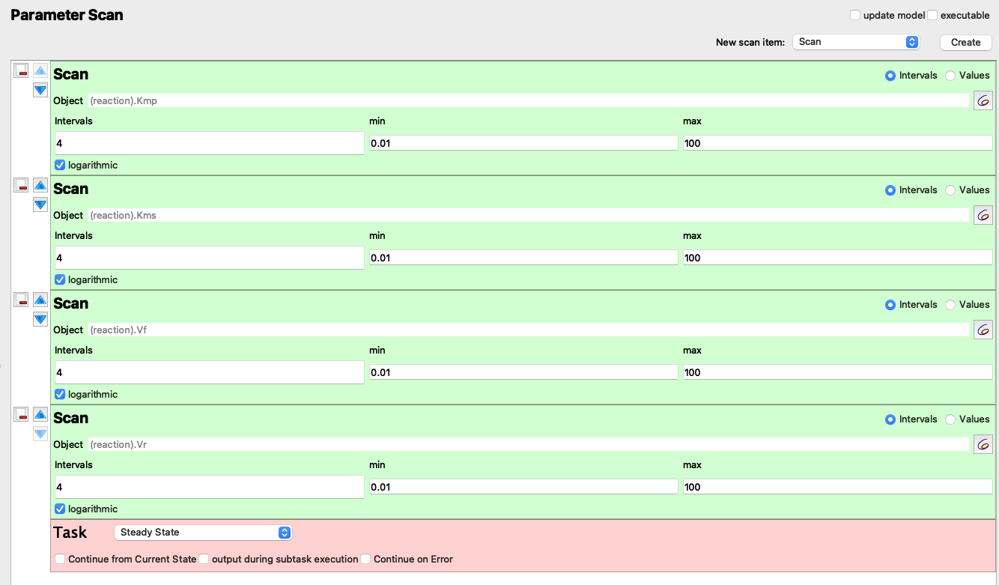
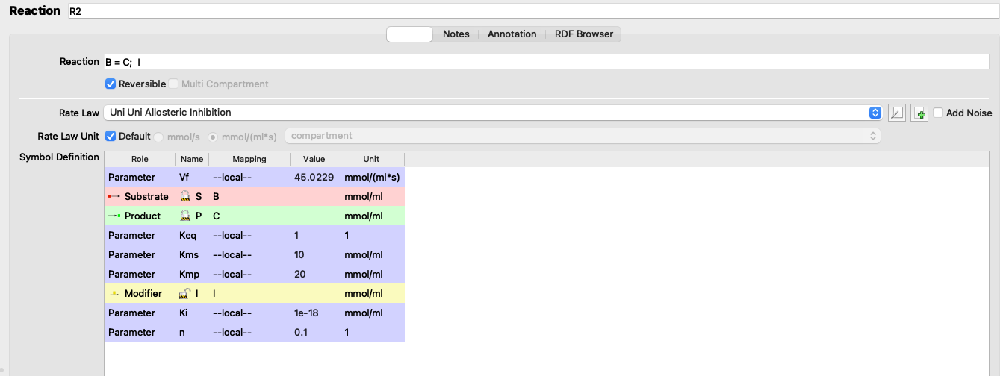

```{r setup, include=FALSE}
library(tidyverse)
plain <- function(x,...) {
  format(x, ..., scientific = FALSE, drop0trailing = TRUE)
}
theme_set(
  theme_bw()+
    theme(
      plot.title = element_text(hjust = 0.5)
    )
)
```

* **Model 112 was used.**

# The Haldane Relationship

Using the "Parameter Scan" utility in Copasi (Figure \@ref(fig:copasi-q1-scan)), I collected steady state concentrations of 'A' and 'B' in $5^4 = 625$ combinations of $V_{max(f)}$, $K_{m(p)}$, $V_{max(r)}$, and $K_{m(s)}$, where each parameter vary from $1\times10^{-2}$ to $1\times10^{2}$ in a logarithmic scale.

```{r copasi-q1-scan, echo=FALSE, fig.cap='"Parameter Scan" setup', out.width="100%"}

```

Here I read the data, and add two columns, where `keq` represents the experimental $K_\text{eq}$:

$K_\text{eq} = \dfrac{\text{[B]}}{\text{[A]}}$

and `keq_calc` represents the $K_\text{eq}$ calculated from the Haldane relationship:

$K_\text{eq} = \dfrac{V_{max(f)}\cdot K_{m(p)}}{V_{max(r)}\cdot K_{m(s)}}$

```{r message=FALSE}
q1 <- read_tsv('metabolic modelling/q1.txt', col_names = c('vf', 'kmp', 'vr', 'kms', 'A', 'B'))
q1 <- q1 %>% mutate(
  keq = B/A,
  keq_calc = (vf * kmp) / (vr * kms),
  keq_diff = keq - keq_calc
)
q1
```

[^srccode]: only a few rows are shown here, but you can check the full table by downloading and running the source code at /https://tianyishi2001.github.io/lab/2020-11-26-metabolic-modelling.Rmd

Plotting `keq_calc` against `keq` shows that $K_\text{eq}$ calculated in these two ways are equal, as the linear regression line has a gradient of 1 and passes through the origin.

```{r message=FALSE}
q1 %>% ggplot(aes(keq, keq_calc)) +
  geom_point() +
  geom_smooth()+
  scale_x_log10()+
  scale_y_log10()
```

```{r}
mod <- lm(q1$keq ~ q1$keq_calc)
summary(mod)
```

The Haldane relationship shows that $K_\text{eq}$ is proportional to $V_{max(f)}$ and $K_{m(p)}$, and inversely proportional to $V_{max(r)}$ and $K_{m(s)}$, and this can be illustrated using a facetted heatmap:

(ref:r) Variation of $K_\text{eq}$ with $V_{max(f)}$, $K_{m(p)}$, $V_{max(r)}$, and $K_{m(s)}$

```{r q1, message=FALSE, fig.cap="(ref:r)"}
q1 %>% ggplot(aes(x = vf, y = kmp, fill = log10(keq))) +
  geom_tile()+
  facet_grid((1/vr)~(1/kms), as.table = FALSE, labeller = label_both)+
  scale_x_log10(labels = plain, expand = c(0, 0))+
  scale_y_log10(labels = plain, expand = c(0, 0))+
  scale_fill_gradient2(low = 'blue', mid = 'yellow', high = 'red')+
  labs(title = "Variation of Keq with vf, kmp, vr, and kms")+
  theme(axis.text.x = element_text(angle = 90))
```

The pattern in each grid shows that $K_\text{eq}$ is proportional to $V_{max(f)}$ and $K_{m(p)}$, and the pattern across the grids shows that it is inversely proportional to $V_{max(r)}$ and $K_{m(s)}$.

# Control Points in A Simple Linear Pathway

I use the "Parameter Scan" function to vary the $K_\text{eq}$ of reaction 3 (that catalyses the reversible conversion between C and D) in the range $10^{-6}$ to $10^6$ in a logarithmic scale (13 samples). The variables being recorded are $K_\text{eq}$ and $J$ (flux control coefficient) of reaction 3, and the concentrations of C and D. Then, the reaction quotient, $Q$ (a.k.a. mass action ratio), of each row is calculated as:

$$Q = \dfrac{\text{[D]}}{\text{[C]}}$$


```{r message=FALSE}
q2_scan_r3 <- read_tsv('metabolic modelling/Q2.txt')
q2_scan_r3 <- q2_scan_r3 %>% mutate(q = d/c)
q2_scan_r3
```

Figure \@ref(fig:q2-keq) shows the variation of the flux control coefficient, $J$, of reaction 3, with its $K_\text{eq}$. The plot shows that a high  $K_\text{eq}$, i.e. high irreversibility, is correlated with a high $J$, and in the intermediate range $J$ varies linearly with $\ln(K_\text{eq})$, i.e. varies linearly with $\Delta G = -RT\ln(K_\text{eq})$

(ref:q2-keq-cap) Variation of the flux control coefficient, $J$, of reaction 3, with its $K_\text{eq}$

```{r q2-keq, fig.cap="(ref:q2-keq-cap)"}
q2_scan_r3 %>% ggplot(aes(log(keq), j)) +
  geom_point()
```

Figure \@ref(fig:q2-displacement) shows the variation of the flux control coefficient, $J$, of reaction 3 with $Q/K_\text{eq}$, which is a measure of displacement of the reaction from the equilibrium. A $Q/K_\text{eq}$ close to 1 indicates the reaction is close to equilibrium. 
The plot shows that when reaction is further displaced from the equilibrium, the its flux control coefficient is higher.

(ref:q2-displ) Variation of the flux control coefficient, $J$, of reaction 3, with $Q/K_\text{eq}$

```{r q2-displacement, message=FALSE, fig.cap="(ref:q2-displ)"}
q2_scan_r3 %>% ggplot(aes(q/keq, j)) +
  geom_point()+
  geom_smooth(method = 'lm', size = 0.5)
```

A linear regression analysis shows that there is a strong linear correlation between $J$ and $Q/K_\text{eq}$, with $p = 4.02\times10^{-6} < 10^{-5}$

```{r}
mod <- with(q2_scan_r3, lm(j ~ q/keq))
summary(mod)
```

In order to vary $Q/K_\text{eq}$ without directly varying $K_\text{eq}$, and to see the effect not only on reaction 3 but also on all other reactions, I vary $V_f$, not $K_\text{eq}$, of reaction 3 from $10^{-6}$ to $10^6$ with 1000 intervals, and collected the flux control coefficients of all 6 reactions, the  $K_\text{eq}$ of reaction 3, as well as concentrations of all species, which are then used to calculate the mass action ratio of each reaction. Then, the displacement of each reaction is calculated. The resulting dataframe contains three columns: 1) the reaction number; 2) the flux control coefficient and 3) displacement from equilibrium of this reaction

```{r message=FALSE}
q2_scan_r3_vf <- read_tsv('metabolic modelling/Q2-1.txt')
q2_scan_r3_vf <- q2_scan_r3_vf %>% 
  mutate(
    d1 = (B/A) / 10,
    d2 = (C/B) / 1,
    d3 = (D/C) / 0.5,
    d4 = (E/D) / 5,
    d5 = (F/E) / 2,
    d6 = (G/F) / 10,
    c1 = A + B,
    c2 = B + C,
    c3 = C + D,
    c4 = D + E,
    c5 = E + F,
    c6 = F + G,
  ) %>% select(!(1:7))
q2_scan_r3_vf_cleaned <- tibble(
  reaction = integer(),
  displacement = double(),
  j = double()
  )
for (i in 1:6) {
  q2_scan_r3_vf_cleaned <- add_row(
    q2_scan_r3_vf_cleaned, 
    reaction = i, j = q2_scan_r3_vf[[paste0('j', i)]], displacement = q2_scan_r3_vf[[paste0('d', i)]])
}
q2_scan_r3_vf_cleaned 
```

Then, for all reactions, $J$ versus displacement from equilibrium is plotted:

```{r q2_2}
q2_scan_r3_vf_cleaned %>% ggplot(aes(displacement, j)) + 
  geom_point()+
  facet_wrap(~reaction, scales = 'free', labeller = label_both)+
  xlab("MAR/Keq")
```

The plots shows that, when disturbing $V_{max(f)}$ of reaction 3, the disequilibrium ratio of all reactions are also altered. Not only reaction 3 but also all other reactions follow the rule that, the flux control coefficent of a reaction increases with the extent of displacement from the equilibrium. However, it is hard to predict $J$ given only the value of $Q/K_\text{eq}$, as different reactions show different patterns of variations, so $Q/K_\text{eq}$ (displacement from equilibrium) is not a robust indicator of $J$.

# Linear Pathway with Negative Feedback

I chose reaction 2 to be the one sensitive to the inhibitor, and varied $K_i$ from $10^{-18}$ to $10^{18}$ with 1000 intervals, and recorded it along with flux control coefficients of all reactions. The results are shown in Figure \@ref(fig:q3).

(ref:q3-lab) Effect of changing $K_i$ of reaction 2 on the flux control coefficient of all reactions. Lower $K_i$ means higher binding affinity to the inhibitor.

```{r q3, message=FALSE, fig.cap="(ref:q3-lab)"}
q3 <- read_tsv('metabolic modelling/Q3.txt')
q3 <- q3 %>% gather(reaction, "j", -ki)
q3 %>% ggplot(aes(ki, j)) +
  geom_point()+
  facet_wrap(~reaction, labeller = label_both)+
  scale_x_log10()
```

The plots show that, the flux control coefficient ($J$) of reaction 2 increases as the binding affinity (i.e. sensitivity) to the inhibitor of the enzyme involved in this step increases (i.e. as $K_i$ decreases).  $J$ of the upsteam reaction 1 also inceases slightly. For all downstream reactions, $J$ decreases.


## Re-analyse the effect of $K_i$ with constant flux

The flux and values of $J$ when $K_\text{i} = 10^{-18}$ and when $K_\text{i} = 10^18$ are shown below:

```{r}
ki_low = 1e-18
flux_low = 0.476572
j_low = c(0.203839,	0.717872,	0.0342001,	0.0340061,	0.00278022,	0.007302)
ki_high = 1e18
flux_high = 1.07393
j_high = c(0.110937,	0.0822319,	0.278976,	0.319753,	0.0478304,	0.160271)
```

$V_f$ of reaction 2 are optimised so that the flux when $K_\text{i} = 10^{-18}$ is 1.07393 (the same as when $K_\text{i} = 10^{18}$)

```{}
Optimization Result:

    Objective Function Value:	1.07393
    Function Evaluations:	248
    CPU Time [s]:	0.061
    Evaluations/Second [1/s]:	4065.57

    (R2).Vf: 45.0229
```

```{r copasi-q32, echo=FALSE, fig.cap="Adjusting Vf", out.width="100%"}

```

I adjusted the $V_f$ of reaction 2 from 5 to 45.0229 (\@ref(fig:copasi-q32)), verified that the flux is 1.07393 (the same as in the state with negligible inhibition), and the values of $J$ are:

```{r}
j_low <-	c(0.144048,	0.0858949,	0.266261,	0.30518,	0.0456503,	0.152966)
```

which can be directly compared to the $J$ values in the uninhibited state:

```{r}
tibble(
  ki =c(rep("low (1e-18)", 6), rep("high (1e18)", 6)),
  reaction = rep(as.character(1:6), 2),
  j = c(j_low, j_high)
) %>% ggplot(aes(reaction, j, fill = ki)) +
  geom_col(position = 'dodge')
```

The plot shows that, when the flux is made constant, a lower $K_i$ (higher affinity of inhibitor binding) increases the flux control coefficent of reaction 2 and the upstream reaction 1, and decreases that of downstream reactions, which is consistent with the previous experiment. However, the amount of change is not as much as previously modelled.

### Repeat with Model 212

I repeat the last analysis with model 212, this time choosing reaction 1 as the one to be affected by the inhibitor.

```{r}
ki_low = 1e-16
j_low = c(0.982287,	0.0109131,	0.00433655,	0.00237021,	6.9396e-05,	2.40539e-05)
flux_low = 0.091902
ki_high = 1e16
flux_high = 0.807846
j_high = c(0.437942,	0.31832,	0.104533,	0.12481,	0.0105218,	0.00387277)
```

```{}
Optimization Result:

    Objective Function Value:	0.807846
    Function Evaluations:	82
    CPU Time [s]:	0.018
    Evaluations/Second [1/s]:	4555.56

    (R1).Vf: 25.7611
```

I adjusted the $V_f$ of reaction 1 from 5 to 25.7611 (\@ref(fig:copasi-q32)), verified that the flux is 0.807846 (the same as in the state with negligible inhibition), and the values of $J$ are:

```{r}
j_low <-	c(0.479732,	0.294652,	0.0967611,	0.11553,	0.00973947,	0.00358483)
```

comparing to the $J$ values in the uninhibited state:

```{r}
tibble(
  ki =c(rep("low (1e-16)", 6), rep("high (1e16)", 6)),
  reaction = rep(as.character(1:6), 2),
  j = c(j_low, j_high)
) %>% ggplot(aes(reaction, j, fill = ki)) +
  geom_col(position = 'dodge')
```

This time only reaction 1 has an increased $J$, and all other downstream reactions have an lowered $J$, which is consistent with previous observations.