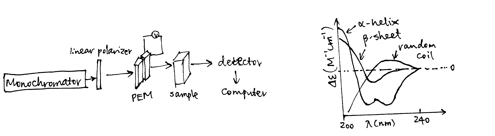
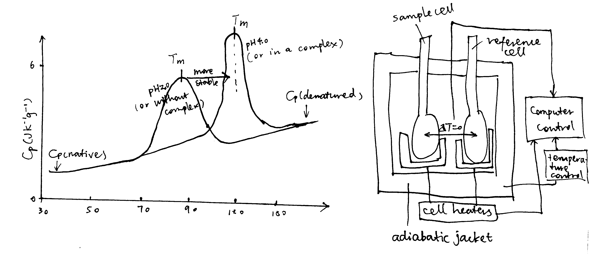
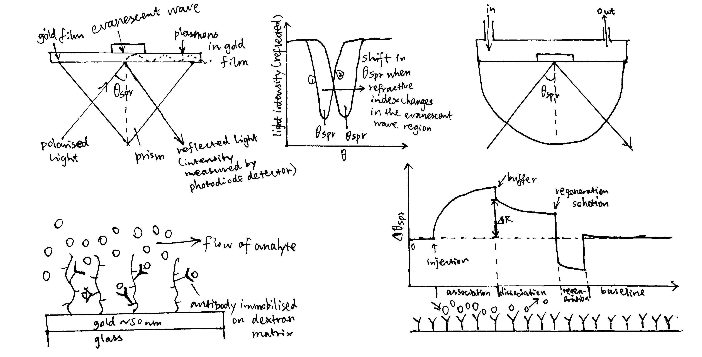
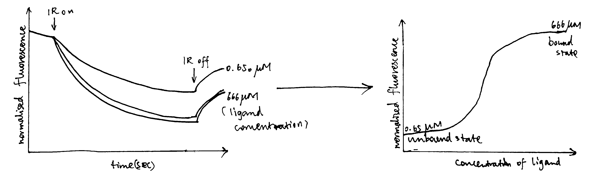

```{r include=FALSE}
knitr::opts_chunk$set(fig.align = 'c', out.width = '100%')
```

# Confirmation of DNA Sequence

## ESI-MS (Electrospray Ionization Mass Spectrometry)

In mass spectrometry, the analytes are first ionised in vacuum and these charged molecules are passed into a electric/magnetic field, and their path through the field can be used to deduce their mass/charge (m/z) ratio (using deflection, TOF, quadrupole, or other analyzers).

Traditional ionisation methods were not suitable for biological macromolecules because the need for heating (or other treatment) to achieve gas phase would cause rapid decomposition of the molecules. Later, MALDI (matrix-assisted laser desorption/ionisation) and ESI (Electrospray Ionization) techniques were deveoped and they are suitable for this purpose. In MALDI, proteins are placed in a light-absorbing matrix, then ionisation and desorption is triggered by a short pulse of laser light. In ESI, a solution of analytes is passed through a charged needle kept at a high electrical potential, dispersing the solution into a microdroplets. The solvent around macromolecules rapidly evaporates, leaving charged molecules in gas phase. ESI can directly accept inputs from many other purification methods such as SDS-PAGE and chromatography and in addition it is good for detecting native states and different conformations. 

The sequence of a protein is often too long to be obtained by MS at one time, so protease can be used to break peptides into small fragments which are sequenced individually. In addition, tandem MS (MS/MS) is can be used, in which one peptide is first analysed by one mass analyzer (MS1), and then further fragmented by a 'collision gas' such as He and Ar, and the m/z ratios of these fragments are analysed by MS2. This produces a spectrum with many peaks (greater m/z correspond to longer fragments), and the successive peaks differ by the m/z of a particular amino acid in the original peptide. This information can be used to deduce the original sequence. 

# Assess Protein Folding and Solubility

## CD (Circular Dichroism)

Plane-polarized light is the sum of two circularly polarized beams, L and R, which are rotating in opposite directions. CD arises from differential absorption of L and R component beams in a smaple of chiral molecules. 

CD is detected by a double beam instrument with separate L and R paths (which are usually produced by high frequency modulation of a photoelastic modulator (PEM) device). The high intensity light source is produced by synchrotron. 

The CD spectrum shows the variation of $\Delta\epsilon$ (difference between the extinction coefficient of the L and R beams) with wavelength ($\lambda$).

Because of the chiral nature of amino acids (except glycine), peptides are optically active. The CD spectra in the 170-250 nm region are distinct for proteins with different structure. Standard curves for different secondary structures ($\alpha$-helix, $\beta$-sheet, $\beta$-turn, and random coil) are available (Figure \@ref(fig:cd)) and the proportion of different secondary structures of a protein is calculated by linear combination of the standard curves.

```{r cd, echo=FALSE, fig.cap='CD components and standard curves'}

```

## DSC (Differential Scanning Calorimetry)

DSC determines the heat capacity (the difference between the heat capacity in the sample cell and in the reference cell), C~p~, of a molecule in aqueous solution, as a function of temperature. This is done by increasing cell temperatures while keeping the two cells at the same temperature and recording the power supply throughout the experiment. The variation of $C_\text{p}$ with temperature is plotted. On such a curve, there is a peak if the sample molecule undergoes state changes within the temperature (Figure \@ref(fig:dsc)). For a protein, the peak corresponds to the melting temperature, $T_\text{m}$, which occurs when the concentrations of its native state ([N]) and the denatured state ([D]) are equal. Stabilization of protein, for example by altering the pH and forming complexes, increases $T_\text{m}$

```{r dsc, echo=FALSE, fig.cap='Principles of DSC'}

```

## DLS (Dynamic Light Scattering)

Random motion of macromolecules in a suspension causes fluctuations in local concentration and thus local variarions in refractive index and intensity of the scattered light. These time-dependent fluctuations can be analyzed by a coherent laser source. The observed fluctuations give rise to diffusion coefficients, $D$, which is related to the size of the molecules (large particles diffuse more slowly). DSL can measure polydispersity and the presence of aggregates in protein samples. 

## AUC (Analytical Ultracentrifuge)

An AUC is a specialised ultracentrifuge equipped with absorbance and interference detection systems. Each cell contains a sample meniscus and a reference cavity, allowing the absorbance of the solvent to be corrected.

Two types of experiments are typically performed by AUC: sedimentation velocity and sedimentation equilibrium. Sedimentation velocity is performed at high speed, which depletes particles from the centrifuge cell and creates a pellet at the bottom of the cell. It can give information on molecular shape, mass, and interactions with themselves and with other components. 

Sedimentation equilibrium is perfomed at low speed and does not create a pellet, and the sedimentation of molecules down the centrifuge cell is balanced by their diffusion back up the cell. The main application of sedimentation equilibrium is the detection of complexes and self-association and the quantification of binding between species

# Determining K~d~

## Fluorimetry/Fluorescence anisotropy

If fluorophores are excited with plane polarized light and the fluorescence is observed through analyzing polarizers, the fluorescence is also polarised. 

The fluorescence anisotropy is defined as $A=\dfrac{I_\parallel - I_\bot}{I_\parallel+2_{\bot}}$, where $I_\parallel$ and $I_{\bot}$ are the fluorescence intensities polarised parallel and perpendicular to the direction of the excitation beam. $A$ is a direct measure of the molecular rotation in solution and can be used to study complex formation, as a macromolecule will rotate more slowly when it is in a complex thatn when it is alone. 

## Surface Plasmon resonance

Surface plasmon resonance (SPR) is used for measuring molecular interactions between a pair of molecules.

A surface plasmon is an electron oscillation generated at a surface interface between a metal and a dielectric. A plasmon resonance occurs when EM wave in visible light couples optimally with the oscillating electrons in the metal, and this results in a maximal reduction in the reflected light intensity. The resonance angle, $\theta_\text{spr}$, is found by changing the angle of incidence of the light beam, giving a dip in a plot of intensity against angle. $\Delta\theta_\text{spr}$ is sensitive to changes in the refractive index of the medium near the metal surface and this is a measure of the mass change at the sensor surface (in the evanescent region). 

In an SPR experiment, one type of ligand is immobilised at the sensor surface, and a the analyte is passed through the cell. If the ligand binds to any binding partner in the analyte, $\Delta\theta_\text{spr}$ would increase. Then, non-specific binding is washed off by buffer, and $\Delta\theta_\text{spr}$ would decrease and $\Delta\theta_\text{spr}$ due to specific binding can be found. Finally, regeneration solution is applied to remove all binding and reset $\Delta\theta_\text{spr}$ to zero. (Figure \@ref(fig:spr))

```{r spr, echo=FALSE, fig.cap='Principles of SPR'}

```

SPR can be used to determine $K_d$ of complex formation, which equals $\dfrac{k_{-1}}{k_1}$ where $k_1$ is the rate of association and $k_{-1}$ is the rate of dissociation. $k_1$ and $k_{-1}$ can be deduced from the plot. 

## Isothermal titration calorimetry (ITC)

ITC measures heat changes when a complex is formed at constant temperature.

In ITC, an insulated reaction cell containing protein is kept at a temperature (usually 8$^\circ\text{C}$ above the environment) which is equal to the temperature of a reference cell, and the reference cell is kept at a constant temperature by a thermostat. Then, increasing amounts of ligand is added into the chamber, and they form complexes with the protein, which can be exothermic or endothermic. The heat change is compensated by a power supply, which can be converted to $\Delta H$ of the reaction. As more ligands are added, proteins become saturated and $\Delta H$ approaches zero. The raw data obtained (power supplied to compensate the heat change caused by each addition of ligands) can be integrated and corrected to give a plot of $\Delta H$ against the molar ratio of the ligand and the protein, and $\Delta H$, K~d~ and stoichiometry can be inferred from the curve. Subsequently, $\Delta G$ and $\Delta S$ can also be calculated (Figure \@ref(fig:itc)).

```{r itc, echo=FALSE, fig.cap='ITC data manipulation'}
knitr::include_graphics('../img/itc.jpg')
```

## MST (Microscale Thermophoresis)

MST is a relatively new method for analysing interactions of proteins or small molecules in complex bioliquids such as blood serum or cell lysate. The technique depends on the phenomenon that molecules move within temperature gradients (thermophoresis). 

The instrument uses an IR laser to create a temperature gradient, and the movement of the molecules within this gradient is monitored by fluoresence. The fluoresence can either be intrinsic (due to tryptophan) or extrinsic (attached dye or fluorescent protein).

Compared with traditional methods for studying protein interactions, MST has several advantages:

- A minuscule amount of sample (a few $\mu$l) is needed, 
- no limitations on size and affinity
- no limitations on buffer; tolerates impurity; can be used in in complex bioliquids such as blood serum or cell lysate
- no need for immobilization

```{r mst, echo=FALSE, fig.cap='Sample data produced by MST'}

```

# References


