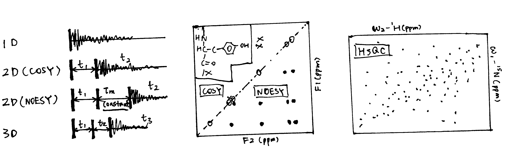

# SAQ

**Write brief notes on the chemical shift, the nuclear Overhauser enhancement effect (NOE), the relaxation times T1 and T2, and the spin-spin coupling constant (J) with an emphasis on how these can provide information about the structure and dynamics of biological molecules.**

- Chemical Shift: NMR applies RF wave to induce resonance with the precession frequency, $\omega=\gamma (B_0-B_S)$, where $B_0$ is the constant magnetic field strength on the $z$ axis, $B_S$ is the magnetic field strength shilded by electrons around the nucleus and $\gamma$ is the magnetogyric ratio (depending of the identity of the nucleus). Nuclei in different chemical environment have different $B_S$ and thus different $\omega$, and the chemical shift, $\delta$, is defined as $$\delta=\dfrac{\nu - \nu_\text{reference}}{\nu_\text{o}}\times10^6$$ When a protein is folded, the chemical environment of protons is highly variable and the NMR signal is noisy and has many peaks. In contrast, when a protein is unfolded, the chemical shift tend to be less variable, and fewer peaks with greater intensities are observed.
- NOE: When two nuclei are close (< 5-6 angstroms) to each other, selective irradiation of one spin by $B_1$ field causes intensity changes of the other spin. Two dimensional methods detect NOE more easily. NOE is the main source of information for macromolecular structure determination by NMR. 
- T~1~ & T~2~ relaxation: The applied RF wave creates $B_1$ field which transiently reorient the net magnetisation, $M$. The decay rate of $M_{xy}\propto\dfrac{1}{\text{T}_2}$; decay rate of $M_z\propto\dfrac{1}{\text{T}_1}$. T~1~ relaxation is along the $B_0$ field (longitudinal) and T~2~ relaxation is in the $xy$ plane (transverse). Relaxation rates give information about molecular dynamics and distances. T2 can be measured from the decay rate of the FID and linewidths and T1 can be measured by an inversion-recovery experiment.
- Spin-spin coupling constant: The spin states of two protons on two covalently bonded atoms affect the nuclear energy levels of each other, so the peak split in a neighbour-dependent way ($n$ adjacent protons give $n+1$ multiplets). Coupling strength gives bond-angle information for biomolecules. For example, splitting of H^N^ due to H$^\alpha$ ($^3J_{\text{NH}\alpha\text{CH}}$) depends on $\Phi$ angle. 

**Describe how NMR can be used to measure the pK values of ionizable groups in proteins.  Why is chemical shift sensitive to ionization state? How can ^31^P NMR be used to measure intracellular pH? Over what pH range is this effective?**

- The chemical shift a proton depends on its chemical environment, which includes the protonation state of adjacent acidic or basic sites. Therefore, gradual alteration of pH causes changes in the chemical shifts that can be plotted against pH. The p$K_\text{a}$ is the pH that corresponds to the inflection point of the resulting sigmoidal curve. 
- *In vivo* phosphate concentration is about constant. In pH range 5-8, the two dominant forms of phosphate, $\text{H}_2\text{PO}_4^-$ and $\text{HPO}_4^{2-}$ have different chemical shifts for ^31^P in NMR, so the chemical shift can be related to pH: at higher pH, the $\text{HPO}_4^{2-}$ form is dominant, and its phosphate is more deshielded, leading to larger chemical shift

**How does multidimensional NMR differ from basic 1-D NMR?  What type of information is contained in the 2-D NMR experiments known as NOESY, TOCSY and HSQC?**

As shown in Figure \@ref(fig:2d3dnmr):

- The 1D spectrum is obtained by Fourier transformation of a single transient decaying signal. By collecting a series of transients separated by incrementing lengths of 'evolution time', $t_1$, a 2D spectrum can be obtained. Similarly, 3D spectra are made with an additional period of 'evolution time', $t_2$. Multidimensional NMR clearly shows connections (either *J*-coupling or NOE) between nuclei as 'cross peaks'.
- COSY (correlated spectroscopy) spectra detect through-bond correlations (*J*-couplings)
- NOESY spectra has an extra 90$^\circ$ pulse and a fixed delay, $\tau_m$ inserted in the sequence and this allows detection of nuclear Overhauster effect (NOE).
- HSQC (heteronuclear single quantum coherence spectroscopy) gives a 2D spectrum with one axis for ^1^H and another for a heteroatom (usually ^15^N or ^13^C).

```{r 2d3dnmr, echo=FALSE, fig.cap='Schematic of 1D, 2D and 3D NMR, and sample '}
knitr::opts_chunk$set(out.width = '100%')

```

**Outline the application of NMR spectroscopy to the determination of protein 3-D structure in solution.  What are the advantages and disadvantages of this technique compared to X-ray crystallography?**

- Application of NMR
  - Experimental restraints: structure-related data derived from NMR spectra
    - ^1^H-^1^H NOEs: each NOESY cross peak gives a specific pairwise distance information
    - coupling constants $J$ values can help to determine some dihedral angles
    - chimical shifts: can be used to search in the database
    - residual dipolar coupling: gives information about the direction of specific groups with respect to B~0~; gives long-range order information which complements the short-range information given by NOEs.
    - solvent H-exchange: slow H-D exchange suggests that the proton is in a defined region of secondary structure
  - Calculation of structures is done by incorporating various experimental restraints into a molecular dynamics (MD) simulation protocol. MD calculates position and velocity of atoms in a series of small steps using Newtonian mechanics. Extra energy terms are added to take account of observed constraints
- Compared to X-ray crystallography:
  - Disadvantages:
    - NMR is relatively laborious and slow
    - restricted to small proteins
  - Advantages:
    - No need for crystallization; only a pure solution is needed. Can be used on proteins that do not crystallize (e.g. those containing intrinsically unstructured regions)
    - can be used to study dynamics
    - site-specific info on ligand binding

# Essay

**Describe methods to monitor protein-folding pathways during the formation of a globular protein from an extended chain. Place particular emphasis on the role of NMR but also show how other methods provide complementary information. **

## NMR

Protein folding is a multistep process that proceeds through intermediate states and studying these intermediates is difficult due to their transient nature, low populations under non-denaturing conditions, and difficulty of their isolation.

Over the past two decades, many NMR methods have been developed and some became invaluable tools in studying molecular details of protein folding. Tansverse relaxation optimized spectroscopy (TROSY) is the first method developed for probing of dynamics and interactions of large (up to 1MDa) protein assemblies. Relaxation dispersion (RD) and saturation transfer (ST) methods provide a detailed look into the pathways of biomolecular processes, allowing studies of transient intermediates during protein folding.

RD and ST methods allow studying the minor nonnative conformations during protein folding with short lifespans (often $\mu$s-ms). The two major types of RD experiments include (1) Carr-Purcell-Meiboom-Gill (CPMG) methods that exploit modulation of R~ex~ by a sequence of evenly spaced refocusing pulses, and (2) rotating frame $\text{R}_{1\rho}$ relaxation experiments that use modulation of R~ex~ by an on- or off-resonance continuous wave (CW) RF field. The ST experiments exploit modulation of R~ex~ by a weak RF field, and are conceptually similar to off-resonance $\text{R}_{1\rho}$ measurements. Transient nonnative protein states can be studied by other NMR experiments, such as paramagnetic relaxation enhancement. 

Dynamics of protein folding, on the time scale of seconds, can be studied by other methods. Changes in NMR spectra can be monitored in real-time. Logitudinal magnetization (ZZ) exchange experiments can probe interconversions between states with comparable populations. Hydrogen exchange measurements detect evanescent populations of disordered nonnative states transiently sampled by proteins under native-like conditions. 

## Other Methods

There are some methods that can assess the extent of folding qualitatively, but they do not give as much quantitative information as NMR does. 

### CD (Circular Dichroism)

Plane-polarized light is the sum of two circularly polarized beams, L and R, which are rotating in opposite directions. CD arises from differential absorption of L and R component beams in a smaple of chiral molecules. CD is detected by a double beam instrument with separate L and R paths (which are usually produced by high frequency modulation of a photoelastic modulator (PEM) device). The high intensity light source is produced by synchrotron. 

The CD spectrum shows the variation of $\Delta\epsilon$ (difference between the extinction coefficient of the L and R beams) with wavelength ($\lambda$). Because of the chiral nature of amino acids (except glycine), peptides are optically active. The CD spectra in the 170-250 nm region are distinct for proteins with different structure. Standard curves for different secondary structures ($\alpha$-helix, $\beta$-sheet, $\beta$-turn, and random coil) are available (Figure \@ref(fig:cd)) and the proportion of different secondary structures of a protein is calculated by linear combination of the standard curves.

```{r cd, echo=FALSE, fig.cap='CD components and standard curves'}
knitr::include_graphics('../img/cd.jpg')
```

## DSC (Differential Scanning Calorimetry)

DSC determines the heat capacity (the difference between the heat capacity in the sample cell and in the reference cell), C~p~, of a molecule in aqueous solution, as a function of temperature. This is done by increasing cell temperatures while keeping the two cells at the same temperature and recording the power supply throughout the experiment. The variation of $C_\text{p}$ with temperature is plotted. On such a curve, there is a peak if the sample molecule undergoes state changes within the temperature (Figure \@ref(fig:dsc)). For a protein, the peak corresponds to the melting temperature, $T_\text{m}$, which occurs when the concentrations of its native state ([N]) and the denatured state ([D]) are equal. Stabilization of protein, for example by altering the pH and forming complexes, increases $T_\text{m}$

```{r dsc, echo=FALSE, fig.cap='Principles of DSC'}
knitr::include_graphics('../img/dsc.jpg')
```

# References

