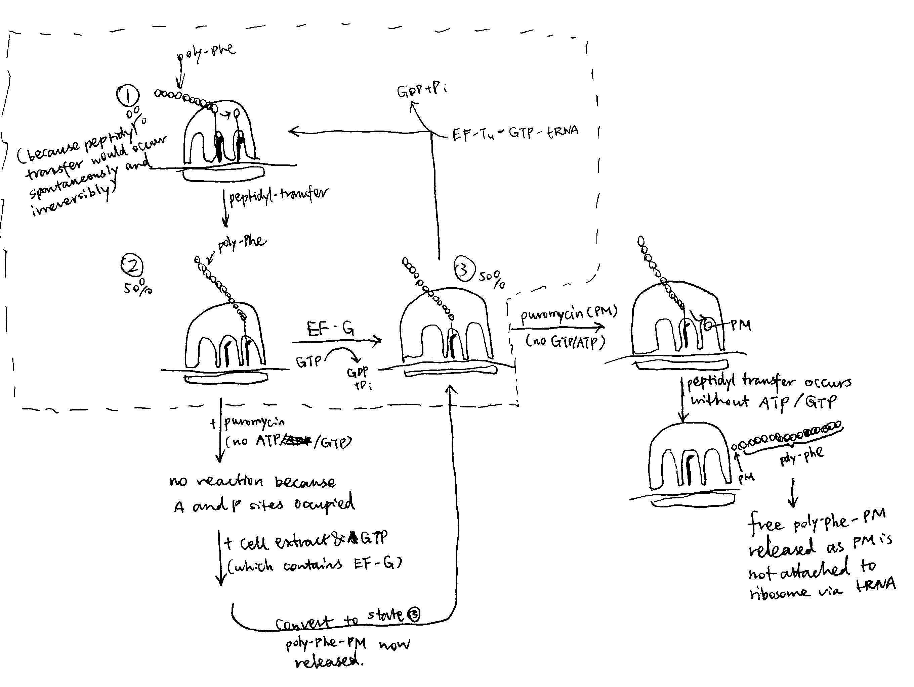

```{r include=FALSE}
knitr::opts_chunk$set(out.width = '100%')
```

**Explain how antibiotics and genetic mutations have helped in our understanding of the mechanism of protein synthesis on the ribosome.**

# Introduction

Protein synthesis occurs in ribosomes and involves 3 phases: initiation, elongation (which is subdivided into 4 steps)  and termination. Each phase depends on the correct conformation and/or catalytic activity of different domains of the ribosomal complex and soluble protein factors (IFs, EFs and RFs). The identities and mechanisms of these critical RNA/protein domains (in bacterial cells) can be investigated by genetic mutation and antibiotics, which hinder their normal functions, along with recent advances in biophysical methods, which allows high resolution structures to be determined for ribosomes in different contexts. 

# Background information

## The Ribosome

The bacterial 70S ribosome comprises two subunits, the 50S (large) and the 30S (small) subunit. The 30S subunit mediates selection of cognate aminoacyl tRNAs and the 50S subunit contains the peptidyl-transferase centre (PTC), which catalyses addition of new amino acids to the elongating polypeptide chain.

## The process of protein synthesis

The 3 phases of protein synthesis are initiation, elongation and termination. 

During initiation, the 3' end of the 16S rRNA of the 30S subunit base-pairs with the Shine-Dalgarno sequence, which positions the start codon (usually AUG) in the P site for the binding of the initiator tRNA (usually fMet-tRNA) and IF1, 2, 3. Joining of the 50S subunit and dissociations of IFs primes the elongation phase. 

The elongation phase, where new amino acids are appended to the growing polypeptide, involves 4 steps:

1. **Decoding.** An aminoacylated tRNA (aa-tRNA) is delivered to the A-site of the ribosome by elongation factor EF-Tu complexed with GTP. GTP hydrolysis facilitates discrimination between cognate and non-cognate tRNAs.
2. **Peptidyl transfer.** The peptidyl-transferase centre (PTC) on the 50S subunit catalyses the formation of peptide bond between the amino acids attached to the tRNAs in the A- and P-sites by transferring the polypeptide chain from the P-site tRNA to the aa-tRNA in the A-site. 
3. **Translocation.** EF-G catalyses the movement tRNAs from the A and P sites to the P and E sites
4. the growing polypeptide chain passes through an exit tunnel 

Finally, when the stop codon (UAA/UAG/UGA) is encountered, it is recognised by release factors (RF1/RF2) that forces hydrolysis of the peptidyl-tRNA bond in the P-site, thus releasing the polypeptide chain from the ribosome. 

# Mutations

Mutation in different components of protein synthesis (tRNA, ribosomal proteins, rRNAs) can all lead to decreased fidelity of this process. 

The tRNA needs to undergo a structual transition that involves a 30$^\circ$ bend in order to achieve the A/T (decoding) conformation. Mutagenesis studies showed that two mutations in the D-stem, A9C and G24A, promote miscoding and these two bases are critical for distortion of the cognate tRNA that is required for decoding. 

Mutagenesis studies also help to identify ribosomal proteins that are critical in the decoding process. The mutations can be classified into two types according to their implication on the speed and accuracy/robustness of translation: *ram* (ribosome ambiguity) mutations improve speed but has a higher frequency of failure in rejecting non-cognate tRNAs; in contrast, ribosomes with *str* (stringency) mutations are slower and more accurate, but they reject some cognate aa-tRNAs and thus waste GTP. Most of such mutations are found in the ribosomal proteins S12, S5 and S4, which are close to the decoding site, and these proteins have an important effect on codon/anticodon interactions.

# Antibiotics 

The antibiotic puromycin can be used to demonstrate the existence of A and P sites in the ribosome and the ATP/GTP-independent nature of the peptidyl transfer reaction. 

Puromycin (PM) is an aa-tRNA analogue which is composed of an nucleoside and an bound amino acid. Unlike the normal aa-tRNA where the 5' OH of the nucleoside (adenosine) is linked to the rest of the tRNA, PM has a free 5' OH. Therefore, PM can fit into the peptidyl transfer centre (PTC) and accept the polypeptide chain in the peptidyl tranfer reaction, but the new peptide with PM attached is released immediately because PM does not have an attached tRNA to anchor it to the ribosome. 

The details of the experiment is shown below and in Figure \@ref(fig:puromycin):

- Take a cell free system containing: ribosomes, Mg^2+^-containing buffer, poly-U mRNA, ^14^C-Phe-tRNA, ATP/GTP-regenerating system and add varying concentrations of soluble cell extract. 
- This yields ribosomes carrying polyPhe-tRNA (not free polyPhe or poly-Phe-tRNA unbound to ribosomes). [with prior knowledge, this is because there are no stop codons on the mRNA and hence RFs are not recruited to terminate translation]
- the ribosomes are washed to remove soluble proteins and ATP/GTP.
- then they are incubated with puromycin (PM)
- about 50% of the ribosomes release ^14^ labelled polyPhe as polyPhe-PM [As shown in Figure \@ref(fig:puromycin), the convertion from state 2 to 3 and from state 3 to 1 requires GTP, and the convertion from state 1 to 2 (peptidyl transfer) does not. Therefore, when GTP is removed, protein synthesis is either trapped in state 2 or 3]
- without a tRNA, PM cannot bind to the ribosome (at A/P sites) so the compound with polyPhe is released

Conclusion: ribosome itself catalyses the formation of the peptide bond without energy supplying molecules (ATP/GTP).

- now wash the ribosomes to remove the PM
- add soluble cell extract and GTP, then more PM
- the remaining 50% ribosomes release polyPhe-PM

Conclusion: 

1. ribosomes have a 'PM-reactive' site (P site) and a 'PM-unreactive site' (A site)
2. soluble cell extract can translocate from RM-unreactive to PM-reactive site (driven by EF-G)

```{r puromycin, echo=FALSE, fig.cap='The puromycin experiment.'}

```

# Summary

Mutagenesis and ribosome-targeting antibiotics are valuable tools for studying the mechanisms of protein synthesis in the ribosome. These methods are usually aided by cryo-EM and X-ray crystallography to probe into the 3D molecular details. 

Mutations in tRNA, rRNA and associated proteins give information on their specific roles and behaviours during protein synthesis. Antibiotics with various (and usually predictable) chemical properties is another way of studying the mechanisms of protein synthesis. Apart from the puromycin (which targets the peptidyl transfer centre) mentioned in this essay, there is a wide range of antibiotics that target different steps of protein synthesis. For example, streptomycins interferes with the delivery of tRNAs to the A-site and neomycin hinders translocation following peptidyl transfer. High resolution crystal structures were obtained for many of these antibiotics in complex with the ribosome (or part of ribosome). These structures are indicative of functionally important sites in the ribosome and they often shed light on the mechanisms. 
