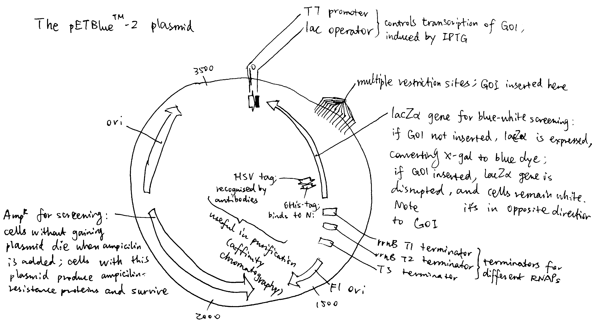
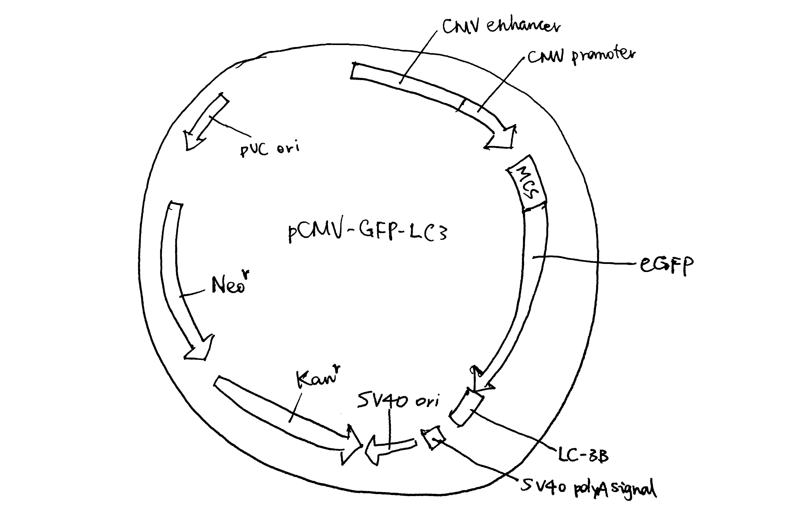
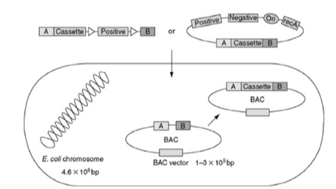
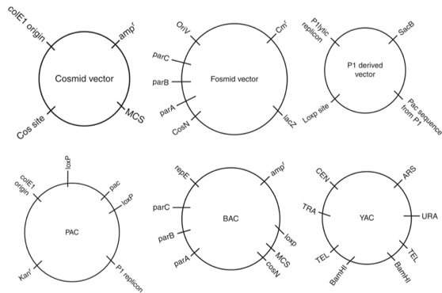
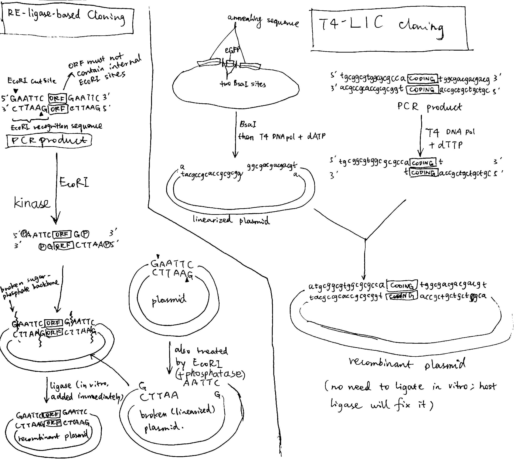
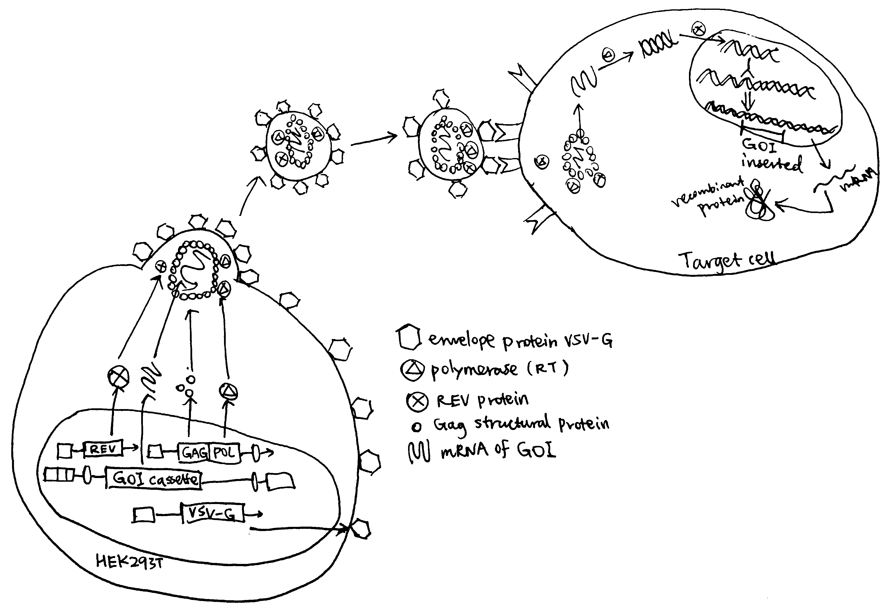
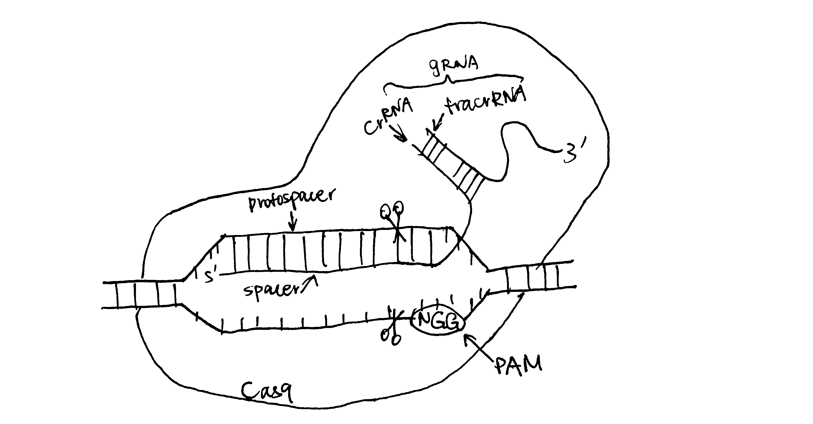

```{r include=FALSE}
knitr::opts_chunk$set(out.width = '100%')
```

**What are the key similarities and differences between vectors used in bacterial and eukaryotic host cells? What can such vectors be used for?**

There are various ways by which genes can be introduced into a host organism and expressed. The choice of source genetic material, vector, and the method of transformation/transfection for a particular experiment are largely dependent on the physiology of the host organism, the size of the transgene, and the purpose of the study. However, it is useful to catagorise these strategies into bacteria-compatible ones and eukaryote-compatible ones.

Most molecular cloning experiments begin with the production of a recombinant plasmid containing the gene of interest (GOI). For bacterial hosts, the recombinant plasmid is directly introduced into the cells. Bacteria naturally possess the machinary for replicating plasmids, which allows inheritance of the GOI in their progenies. Eukaryotic cells cannot reliably replicate plasmids, therefore introducing plasmids into eukaryotic cells normally results in *transient transfection*, which means the GOI is expressed in successfully tranfected cells but not in their progenies. In order to produce a *stable cell line*, the GOI must be integrated into the genome of the host cell (by homologous recombination), which is an extremely rare event in nature but can be induced artificially, for example by viral/bacterial infection or by designer nucleases such as TALEN, ZFN and CRISPR-Cas9. In order to be compatible with the different transformation/tranfection strategies and the physiology of the host cells, the molecular structure of the plasmids (or vectors of other kinds) vary.

# The structure of the vectors

## Simple plasmids

Plasmids are extrachromosomal self-replicating cytoplasmic (usually circular) DNA elements found in prokaryotes and, less commonly, in eukaryotes. They come in various forms, from simple plasmids used for direct transformation and fosmids for phage transduction. Plasmids optimised for expressing recombinant proteins share several features, as illustrated in Fig. \@ref(fig:pet) and \@ref(fig:pcmv-gfp-lc3b):

- An origin of replication (*ori*), which allows it to be duplicated in bacterial cells. The type of origin of replication affects the copy number. Eukaryotic vectors generally carry two *ori*s, one bacterial (e.g. pUC *ori*) and one viral (e.g. SV40 *ori*). The bacterial *ori* is for amplifying the plasmid in bacteria before transfection, and the viral *ori* allows for episomal amplification of plasmids in the eukaryotic host.  
- A cloning site where the GOI is inserted. Typically it is crowded with restriction enzyme cutting sites (compatible with RE/ligase dependent cloning), but it can also be made compatible with other cloning methods, such as the LIC-compatible pBLIC-puro[^pBLIC] plasmid developed by @Patel-2012.
- A promoter and associated operator/enhancer. The promoter sequences for bacteria and eukaryotes are different (-35/-10 consensus sequence v.s. TATA box) For a bacterial vector, the promoter is usually controlled by an inducible operator so that protein expression is induced manually only when the optimal bacterial density is reached (e.g. *lac* operator induced by IPTG). In contrast, for a eukaryotic vector, the promoter is usually made as processive as possible, because the natural rate of transcription is generally low, and cell growth and division are not important (they do not serve to amplify the plasmid but to express the protein). For example, the pEF-BOS vector developed by @Mizushima-1990 contains the promoter of EF-1$\alpha$ (EF-1$\alpha$ is one of the most abundant proteins in eukaryotic cells, so its promoter is highly processive). Recently, promoters of viral origin (e.g. CMV, SV40) are gaining popularity. 
- A transcription terminator/polyA signal. The mechanisms of transcription termination in bacteria and eukaryotes differ. In bacteria, the terminator sequence consists of a symmetric DNA sequence, and its transcribed product folds into a hairpin structure, releasing RNA polymerase (RNAP) from DNA. In eukaryotes, CstF and CPSF bound on RNAP C-terminal domain recognise 3'-end processing (polyadenylation) sequence (AAUAAA and GU-rich sequence) and induce cleavage and polyadenylation.
- A selectable marker. Usually an antibiotic resistance gene (bacteria and eukaryotes are sensitive to different antibiotics). Fluorophore genes are also common in eukaryotic vectors.
- Some plasmids possess a start codon and associated Shine-Dalgarno sequence (for bacteria) or Kozak sequence (for eukaryotes).
- Some plasmids have tag sequences near the start or end of the ORF for easy purification of the recombinant protein by affinity chromatography (e.g. hex-His, GST, HSV) and associated cleavage sequence (e.g. TEV) for easy removal of the tag. 

[^pBLIC]: pBLIC-puro was a gift from Priyamvada Rai (Addgene plasmid # 45197 ; http://n2t.net/addgene:45197 ; RRID:Addgene_45197)


```{r pet, echo=FALSE, fig.cap='The bacterial expression vector pETBlue-2'}

```

```{r pcmv-gfp-lc3b, echo=FALSE, fig.cap="The eukaryotic expression vector pCMV-GFP-LC3", out.width="100%"}

```

## Other bacterial vectors {#others}

There are other forms of circular DNA, each with different disirable properties (larger insertion size, low copy number, phage-compatibility, etc.). They are sometimes called 'high capacity vectors' because their insertion sizes are greater than simple plasmids.

Bacterial artificial chromosomes (BACs) contain some regions derived from a special plasmid called the F (fertility) factor: the region containing the origin of replication as well as genes that ensured its precise segregation during bacterial cell division. A great advantage of BAC vectors is the large insertion size (100-200 kb). But the very large insertion can be a problem, in that it cannot be manipulated by restriction enzymes. Instead, in vivo homologous recombination-based strategies are used to insert DNA fragments into BACs. (Fig. \@ref(fig:bac-mech))

```{r bac-mech, echo=FALSE, fig.cap="Making a BAC", out.width="50%"}

```

Fosmids are hybrids of $\lambda$ phage DNA and bacterial F plasmid DNA. Fosmids are packaged into $\lambda$ phage particles, which delivers them into bacterial cells. Due to the presence of the F plasmid origins of replications, fosmids are maintained at a very low copy number (normally single copy). 

Fig. \@ref(fig:plasmid-derivatives) is a schematic of 6 high capacity vectors [@Saraswathy-2011a].

```{r plasmid-derivatives, echo=FALSE, fig.cap="Schematic of 6 high capacity vectors.", out.width="50%"}

```

## Other Eukaryotic Vectors 

Yeast artificial chromosome (YAC) has a cloning capacity up to 3000 kbp. It is introduced into the yeast cells by electroporation, then it is maintained as a linear DNA-like chromosome. It is replicated along with other chromosomes in yeast and its copy number of one is maintained after cell divition.

Some viruses (e.g. Adenovirus, Lentivirus and Baculovirus) and bacteria (e.g. *Agrobacterium tumefaciens*) are reliable vectors for stable transfection of eukaryotic cells (see section \@ref(stab-tf))

# Vector Construction

## Simple plasmids (for both bacteria and eukaryotes)

Traditionally, restriction endonucleases and T4 ligase are used to insert GOI into pladmids. This method has several drawbacks:

- the association between the short 2-4 nt overhangs (sticky ends) is weak
- each DNA insert has to be inspected for any internal restriction sites
- due to the above two reasons, it has very limited capability of constructing multi-fragment plasmids
- incomplete DNA digestion and poor ligation yields 
- unwanted amino acids can be introduced to the expressed protein
- the GOI can only be cloned in the vector position where the selected restriction site is present

Ligation-independent cloning (LIC) overcomes many of the problems described above. In a T4 DNA polymerase-dependent approach, the sticky sequences are made by the 3'-to-5' exonuclease activity of T4 polymerase. These sequences are long, allowing formation of stable recombinant plasmid without *in vitro* ligase treatment. The nicks in sugar-phosphate backbone are later fixed by the host's ligase. As T4 polymerase (exonuclease activity) always proceeds from 3' ends, any internal sticky sequences will not be disrupting and thus the custom stiky sequence can be used for any DNA inserts.

Fig. \@ref(fig:lic) compares the mechanisms of the traditional RE/ligase-based cloning and the T4 polymerase-dependent LIC approach.

```{r lic, echo=FALSE, fig.cap='Left, traditional cloning based on restriction endonuclease and ligase; right, ligase-independent cloning based on T4 polymerase'}

```

There are also other alternatives to the traditional method:

- the Gateway cloning system exploits the site-specific recombination system utilized by bacteriophage lambda to shuttle sequences between plasmids bearing flanking compatible recombination attachment (att) sites
- Gibson assembly is a molecular cloning method which allows for 'stitching' multiple overlapping DNA fragments together in a single, isothermal reaction, using exonuclease, polymerase, and ligase. 
- TOPO cloning expoits Taq polymerase's feature that adds non-specific A to the 3' end, and uses topoisomerase I to hold vectors open and to promote ligation

## Other vectors for bacteria

BACs and fosmids: see section \@ref(others)

## Viral vectors for eukaryotes

See section \@ref(lenti)

# Transformation/Transfection

## Transformation of bacterial cells

### Heat-shock transformation

Heat-shock transformation is used for small vectors such as plasmids. The general procedure is as follows:

1)	Host cells are incubated in a solution containing divalent cations (typically CaCl~2~) on ice.
2)	CaCl~2~ partially disrupts the cell membrane, which allows the recombinant DNA enter the host cell. Such cells are called competent cells.
3)	Cells are exposed to a heat pulse (heat shock), and the thermal imbalance causes the entry of DNA through disrupted plasma membrane.

### Electroporation

Electroporation can be used for larger vectors such as BAC and PAC[^PAC]. The general procedure is as follows:

[^PAC]: P1-derived artificial chromosome

1)	Host cells are placed into a cuvette, together with the vector. The cuvette is connect to electrodes. 
2)	The cuvette containing the mixture is subjected to intense electric pulses (2500 V/cm for bacteria, lower for animal and plant cells) each lasting for only a few milliseconds 
3)	Most cells would die under such treatment, but for those survived, their membranes are polarised by the electric field and are disrupted, and DNA enters through the pores. Finally, the membrane reseals after the treatment.

### Other methods

Cosmid, fosmid and PAC vectors are introduced into bacterial cells via bacteriophages. (See section \@ref(others))

## Transfection of Eukaryotic Cells

Transfection of eukaryotic cells can be transient or stable. Transient gene expression is generally used in academic settings, when the product of the GOI (usually a protein) is used for short-term research purposes. Stable transfection is usually used in indusdries, but it is also used in academia for specific purposes. 

### Physical methods

In general, physical methods work by briefly pushing holes through the memrbane. The three specific methods are:

- electroporation, which is described above as a transformation method for bacteria, can also be applied to eukaryotic cells. The mechanism is the same but the voltage used for eukaryotic cells are lower.
- microinjection entails injection of recombinant DNA (or RNA) into the cytoplasm or nucleus. This is method particularly convinient for large eukaryotic cells, such as the syncytial gonadal cell of *Caenorhabditis elegans* and the fertilised egg of *Mus musculus*.
- biolistic delivery of tungsten- or gold-coated DNA (or RNA) by gene gun is mostly used with plant cells. 

### Chemical methods

In general, chemical methods work by sheding the negative charge on DNA so as to apprach and cross the plasma membrane, which is also negatively charged. 

- CaPO~4~ co-precipitation involves mixing DNA with CaCl~2~ in a phosphate solution to generate a CaPO~4~-DNA co-precipitate, which is then added to cultured cells. DNA enters the cell by endocytosis.
- the cationic diethylaminoethyl(DEAE)-dextran work similarly by associating and neutralising negatively charged DNA
- cationic lipids work similarly by forming DNA-lipid complexes (DNA is not encapsulated in liposomes)
- By far, the most cost-effective chemical carrier is polyethylenimine (PEI), which works similarly by forming DNA-PEI complexes [@LAbbe-2018]

### Biological methods {#stab-tf}

The physical and chemical methods described above are generally used for transient transfection. Although they may produce stably transfected cells (when the rare homologous recombination events occur), the probability is very low and the GOI is inserted randomly and is thus not expressed with greatest efficiency (the chances are low that the GOI is inserted into a highly 'transcriptionally open' region).

Biological methods significantly improve the chance of integration of GOI into the host's genome, and can even direct the site of insertion. 

#### Lentiviral transduction as an example of viral transfection [@Merten-2016] {#lenti}

Lentiviruses (LV) carry a genome made of (+) strand RNA. Upon infection, the viral RNA genome is reverse-transcribed and the cDNA is stably integrated into the host's genome. Unlike $\gamma$-retroviruses, LVs exploit active nuclear transport and thus do not rely on cell division to access the nucleus. Fig. \@ref(fig:lentivirus-3-gen) is an example of the third generation HIV-1 vector system. 

```{r lentivirus-3-gen, echo=FALSE, fig.cap="Production of recombinant LV particles and their infection. Production of recombinant LV particles is usually accomplished by transfection of HEK293T cells with a set of three helper plasmids and additionally a LV vector plasmid that encodes the GOI as well as optional reporter (e.g resistance, fluorophore) genes. LV particles released from HEK helper cells infect target cells and integrate the GOI into their genome.", out.width='100%'}

```

```{r include=FALSE}
# LV vector systems have the following advantages:
# 
# - transduction of hard-to-transfect cells, including nonproliferating cells
# - possibility to influce the transgene copy number and/or the percentage of infected cells by adjusting the ratio of virus/cell (multiplicity of infection)
# - integration of transgene into transcriptionally open chromatin resulting in high expression levels
```

#### Ti plasmid and *Agrobacterium tumefaciens* infection

*Agrobacterium tumefaciens* is the bacterium that causes crown gall disease in plants. When the it infects a plant cell, a part of its Ti plasmid, called T-DNA, is transferred and inserted (at random) into the genome of the plant cell. Thus, the T-DNA can be replaced with any GOI for stable transfection of plant cells. 

#### CRISPR-Cas9 Transfection

The CRISPR-Cas9 system comprises a short guide RNA (gRNA) and the Cas9 nuclease. The gRNA guides Cas9 to a specific gene locus that is complementary to its crRNA portion, then Cas9 makes a double strand break, which is dependent on the PAM (protospacer adjacent motif) sequence immediately downstream of the recognition sequence. 

Following DNA cleavage, the break is repaired by either non-homologous end joining (NHEJ) or homology directed repair (HDR). It is the HDR mechanism that may cause integration of GOI into the cleavage site. 

```{r crispr, echo=FALSE, fig.cap="gRNA directed DNA cleavage by Cas9", out.width="100%"}

```


# References


