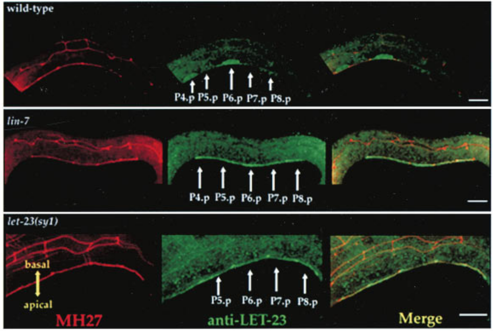

# Introduction

The *Caenorhabditis elegans* vulva is one of the best studied models of organogeneis. Genetic screening revealed three signalling pathways, EGFR-Ras-MAPK, Notch and Wnt[^trans], that are critical to the fate determination of the 6 vulval precursor cells (VPCs), P(3-8)p.

VPCs adopt either 1$^\circ$ or 2$^\circ$ fate upon receiving appropriate signals, or 3$^\circ$ fate if undinduced. The 8 descentdents of the 1$^\circ$ VPC and the 14 descendents (7 each) of the 2$^\circ$ VPCs give rise to the vulva, while 3$^\circ$ VPCs produces epidermal cells which fuse with the syncytial epidermis hyp7. 

In the L1 stage, a Wnt signal form the posterior body region selects the six Pn.p cells to become the VPCs and form the vulval competentce group. Then in the L2 stage, LIN-3 (EGF) signal from the anchor cell (AC) in the somatic gonad selects P6.p to be the single 1$^\circ$ VPC [@Hill-1992; @Sternberg-1989], and contact-dependent LIN-12 (Notch) signalling causes the flanking P5.p and P7.p to become 2$^\circ$ VPCs. These precise signalling events always results in an invariant spatial pattern of VPCs in wild-type (WT) *C. elegans*, namely 3$^\circ$-3$^\circ$-2$^\circ$-1$^\circ$-2$^\circ$-3$^\circ$.

This essay illustrates how the LET-60 (Ras) signalling has been studied in *C. elegans* vulval development, specifically the 1$^\circ$ fate determination, according to these selected work and reviews: @Beitel-1990; @Thomas-1990; @Sternberg-1998; @Kornfeld-1997; @Sundaram-2004; @Yoo-2004. A recent review article by @Schmid-2015 and a book chapter by @Gauthier-2017 are also taken into account (the latter was the most helpful).

[^trans]: In this essay, the names of the actual *C. elegans* proteins and their (more commonly known) vertebrate/*Drosophila* homologues are used interchangeably. Here is a translation between them: (*Drosophila*: *C. elegans*) EGF: LIN-3; EGFR: LET-23; Grb2: SEM-5; Ras: LET-60; Raf: LIN-45; MEK: MEK-2; MAPK/Erk: MPK-1; Notch: LIN-12; Frizzled and Ryk (WNT-receptors): LIN-17 and LIN-18. *C. elegans* protein naming follows the [WormBase convention](https://wormbase.org//about/userguide/nomenclature#634c2j7f9gi1e05kabmlh8d--10)

# The Big Picture: Components of the *C. elegans* EGF-Ras-MAPK Pathway Involved in Vulva Induction

Figure \@ref(fig:c-ele-valva-big) gives an overview of the pathways by which EGF-Ras-MAPK signalling leads to the 1$^\circ$ fate in P6.p and 2$^\circ$ fate in flanking P5.p and P7.p cells.

```{r c-ele-valva-big, echo=FALSE, fig.cap="(ref:big-pic)", out.width="100%"}

```


(ref:big-pic) P6.p is the VPC closest to the AC, and it also expresses the highest levels of LET-23 on its basolateral membrane. Thus, P6.p receives most LIN-3 signalling and commits to the 1$^\circ$ fate. Downstram of the LET-23 (EGFR) RTK, a canocical Ras-MAPK pathway transduces the signal into the nucleus. The scaffold proteins LIN-2 (CASK), LIN-7 (Veli), and LIN-10 (Mint-1) form a complex which helps to maintain basolateral localisation of LET-23. The SEM-5 (Grb2) adaptor protein [@Clark-1992] uses its SH2 domain to anchor to LET-23 at phosphorylated tyrosines. The guanine exchange factor (GEF) SOS-1  [@Chang-2000] then binds to SEM-5 (at SEM-5's  two SH3 domains), and it activates the membrane-anchored LET-60 (Ras) [@Beitel-1990]. GTP-bound LET-60 then activates the LIN-45 (Raf) [@Han-1993], MEK-2 [@Kornfeld-1995] and MPK-1 (MAPK) kinase cascade, which is facilitated by the scaffold protein KSR. LIN-1 and *forkhead* LIN-31 transcription factors are the targets of MPK-1 [@Lackner-1994]. In their unphosphorylated state, LIN-1 and LIN-31 forms a complex which represses 1$^\circ$-specific transcription of *lin-39* and *egl-17* [@Leight-2005]. Phosphorylation makes the complex to dissociate, and phospho-LIN-31 is turned into an transcriptional activator. The 1$^\circ$ P6.p also produces LAG-2 (Delta), which is the ligand for LIN-12 (Notch), thus transducing lateral signals to P5.p and P7.p. Notch signalling inhibits MAKP, and LET-60 in P5.p and P7.p cells uses a RAL-1 dependent pathway to commit to 2$^\circ$ fate. A number of modifiers and negative regulators of the EGFR pathway has been identified, which include the tyrosine kinase Ark-1 [@Hopper-2000], the RTK phosphatase Dep-1 [@Berset-2005]. Adapted from @Gauthier-2017 with reference to @Alberts-2014 and @Sternberg-2005.

# Techniques for Studying EGFR-Ras-MAPK Signalling and Vulva Induction

## Forward Genetics and Reverse Genetics

### In Early Experiments, Forward Genetics Methods were Used Entensively

Studies on the molecular mechanisms of *C. elegans* development date back to the 1980s, when genetic manipulating techniques, especially gene cloning, were emerging, but the complete genome sequencing (of *C. elegans* and other model organisms) had yet to start. Therefore, those pioineering studies relied heavily on forward genetics, where worms were subjected to mutagens, and abnomal phenotypes were identified, isolated, amplified (by self-fertilisation) and the respective genotypes were determined. Differential interference contrast (DIC)/Nomarski microscopes were commonly used to examine the phenotypes because of their superior imaging quuality for live and unstained samples. There were also cellular methods for manipulating gene expression (which especially aided in eludidating cell-cell interactions). First, observing fates of the cells among varying individuals. Second, using laser beams to ablate cells suspected to interact with the cell of interest. Third, isolation of cells of interest, or rearrangement of their surrounding cells. 

These extensive genetic screens led to identification of a number of genes that cause abormal cell lineage (the *lin#* genes) phenotypes, notably vulvaless (Vul)/Egg-laying defective (Egl) or multivulva (Muv) (Figure \@ref(fig:egl-muv-c-ele-vulva)). Epistasis analyses of these phenotypes grouped these genes into distinct pathways (notably EGFR-Ras-MAPK and Notch) and helped elucidating where each component functions in the respetive pathway. The general idea is that, if the phenotype of gene A masks the phenotype of gene B, then gene A is likely to act downstream of gene B. 

(ref:phenotypes) Egg-laying defective (Egl) and Multivulva (Muv) phenotypes caused by LET-23 EGFR-Ras-MAPK signalling mutants. (a): Wild type. Eggs are neatly arranged in the uterus. (b) and (c): Defective LIN-10 (which helps to localise LET-23) can lead to disorganisation of eggs (b) and the bag-of-worms phenotype (c), in which self-fertilised eggs hatch and larvae fills up their mother's carcass. (d): *let-60* gain-of-function results in Ras signalling in all VPCs, resulting in a Muv phenotype. Reproduced from @Gauthier-2017.

```{r egl-muv-c-ele-vulva, echo=FALSE, fig.cap="(ref:phenotypes)", out.width="100%"}

```

Figure \@ref(fig:vul-Muv-simplest) shows the earliest expetiments that demonstrated the role of the AC and the LET-60 protein in vulval induction.

(ref:simplest) (a) in wild-type cells, signals from the AC results in the invariant VPC pattern 3$^\circ$-3$^\circ$-2$^\circ$-1$^\circ$-2$^\circ$-3$^\circ$; (b) ablation of the AC renders a Vul phenotype, where all 6 VPCs adopts the 3$^\circ$ fate, this shows that the AC positively regulates vulval induction; (c) inactive LET-60 (Ras) also renders a Vul phenotype even in the presence of the AC, therefore LET-60 should be downstream of the signal from the AC; (d) LET-60 hyperactivity leads to a Muv phenotype, further demonstrating LET-60 as a positive regulator of vulval induction.

```{r vul-Muv-simplest, echo=FALSE, fig.cap="(ref:simplest)", out.width="100%"}

```

### RNAi and Reverse Genetics Since 1998

Early mutagenesis studies relied on chance to generate individuals with mutations for certain genes, which is laborious and not specific—usually some genes/DNA regions other than the genes of interest are also mutated, and studies on them can lead to confounding results. 

Reverse genetics in *C. elegans* has become much more prevalent since 1998, when *C. elegans* became the first multicellular eukaryote to have its genome sequenced [@Stein-1999], and it was shown that introdcution of dsRNA into worms results in inactivation of an endogenous gene with corresponding sequence [@Fire-1998]. This technique, known as RNA interference (RNAi), enables rapid, site-specific gene inactivation and has been rapidly embraced as a reverse-genetic tool and has dramatically accelerated the pace at which new gene functions are discovered.

## Observing Cell Fates

### Microscopic Analysis

Observing Val and Muv phenotypes is generally sufficient for ordering the components of the Ras pathway, but cell-cell interaction analyses require the ability to identify differentiated or undifferentiated individual VPCs. The boundaries between cells are not visible by DIC optics and thus cells are identified by the location, size, and morphology of the nucleus and nucleoli. Undifferentiated VPCs at the Pn.p stage each have a characteristic oblong nucleus with a round nucleolus. 

### Transcriptional Reporters

Several transcriptional targets of LET-23 (EGFR) signalling in P6.p, such as *egl-17* and *lag-2*, have been identified and can be used as transcriptional reporters to identify vulval cell fates. By using a highly sentitive Ras-responsive reporter gene, *egl-17::CFP*, @Yoo-2004 showed that the Ras pathway is transiently activated in P5.p and P7.p, and that LIN-12 (Notch) activation in these two cells antagonises Ras signalling.

Single molecule fluorescence *in situ* hybridisation (smFISH) can also be used to monitor expression of cell fate determinants. It reveals subtle changes in gene expression and has been used, for example by @Zon-2015, to visualise the dynamics of Ras-induced *lag-2* expression, which demonstrates the cellular control of EGF-Ras induced gene expression by changing sensitivity to the EGF gradient .

## Cross-Species Genomic Analysis Reveals Homology and Helps to Elucidate Roles of Proteins with Greater Accuracy

As sequencing techniques mature, complete genome sequences of more organisms are becoming available. This is accompanied by advance in computing power and bioinformatic algorithms, and they allow identification of a significant amount of homology among species. 

The studies on *C. elegans* Ras signalling also benefitted from these developments. For example, MPK-1 was initially identified as a suppressor of Ras and was named SUR-1 before being identified as an Erk1/2 homologue. The scaffold protein KSR-1 was originally named SUR-3 due to the same reason. With homology available, one can easily guess the function of a novel gene/protein identified in one organism, if its sequence is found homologous with another gene with known functions. 

## Studying EGFR Localisation and Trafficking 

The LET-23 EGFR upstream of LET-60 Ras has a polarised localisation in VPCs: vuval induction requires that EGFR to be expressed on the basolateral membrane. Immunostaining and live imaging can be used to monitor LET-23 trafficking and identify regulators involved. 

### Immunostaining

Immunostaining can be used to visualise subcellular localisation of components of regulators of the EDGR-Ras-MAPK pathway. This technique was used by @Kaech-1998 to establish the role of LIN-2/7/10 complex binding to LET-23 C-terminuc in regulating LET-23 basolateral localisation (Figure \@ref(fig:c-ele-vulva-immunostaining)).

(ref:imst) Top: LET-23 are localised to the basolateral membrane of VPCs in wild-type *C. elegans*; Middle: *lin-7* mutant shows mislocalisation of LET-23 to the apical membrane; Bottom: *let-23(sy1)* mutant, in which a premature stop codon removes 6 C-terminal amino acids of LET-23, similarly resulted in mislocalisation of LET-23. LET-23 staining is shownin green, and staining for the cell junctions using the monoclonal antibody MH27 is shown in red. Reproduced from @Kaech-1998.

```{r c-ele-vulva-immunostaining, echo=FALSE, fig.cap="(ref:imst)", out.width="100%"}

```

### Live Imaging

Modern imaging techniques, notably confocal and epifluorescence microscopy, allow the subcellular localisation and trafficking of LET-23 to be observed *in vivo*, in real time. These studies often involve fusion proteins with fluorescence tags. For example, @Haag-2014 used time-lapse imaging and fluorescence recovery after photobleaching to identify ERM-1 (the Ezrin homologue) as a temporal regulator of LET-23 localisation.

# Conclusion

The understanding of the EGFR-Ras-MAPK signalling pathway is importnat because of its involvement in many human diseases, especially cancer. Vulva induction in *C. elegans* has been a valuable *in vivo* model for elucidating the identities and mechanisms of the components and regulators in this pathway. Studies on *C. elegans* traditionally relied on forward genetics, but new experimental techniques and bioinformatic are now solving previously unanswered questions in this field.

# References


