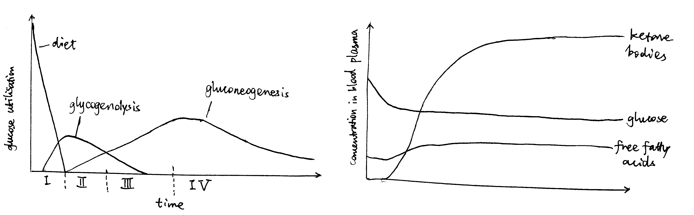

<!--nocite: |
  @Altarejos-2011, Bezaire-2009, Chakravarty-2005, Elia-1991, Frayn-2010, Fukao-2004, Holness-2003, Hue-2009, Hutton-2009, Lass-2011, Nuttall-2008, Okar-2001, Randle-1998, Rider-2004, Rufer-2009, Saggerson-2008, Soeters-2012, Stanley-2006, Sugden-2006, Thomson-2009, Yang-2009-->

**Title: As starvation proceeds, how does the supply of fuels to the brain change? How is this change related to a requirement to conserve body protein?**

Due to the blood-brain barrier, The human brain can only harness energy from catabolising either glucose or ketone bodies. Under normal circumstances, glucose of dietary origin is the predominant source of fuel for the brain. As starvation begins (during the postabsorptive phase), astrocytes in the brain break down their stored glycogen to supply fuel in the form of lactate to neurons, which is followed by hepatic glycogenolysis that continue to provide glucose for the brain for a short period.  As starvation proceeds, upon depletion of glycogen, muscle protein is broken down for liver gluconeogenesis, which continues to provide glucose for the brain. Meanwhile, triacylglycerol-derived ketone bodies synthesised by the liver will represent an increasingly larger proportion of fuel for the brain.

As shown in Figure \@ref(fig:starve-stages), starvation can be divided into 4 stages, each having a different strategy for supplying energy to the brain.

```{r starve-stages, echo=FALSE, fig.cap="Left: Origin of blood glucose and rate of glucose utilisation at different stages of starvation. Right: Concentrations of fuel molecules in blood plasma as starvtion proceeds.", out.width="100%"}

```

# Stage I (Absoption) and II (Post-absorption): Glycogenolysis

Soon after a meal, glucose obtained from food is absorbed from the gut into the bloodstream. The abundant glucose is the exclusive fuel used by the brain. The high blood glucose level also stimulates the $\beta$ cells in the islets of Langerhans in the pancreas to release insulin, which in turn promotes uptake and storage of glucose (as glycogen, in liver, muscle, actrocytes, and other tissues) and triacylglycerol (in lipid droplets in adipocytes).

During the post-absorptive phase, blood glucose concentration drops. Islets of Langerhans respond by reducing production of insulin in $\beta$ cells and increasing production of glucagon in $\alpha$ cells.

The principal effect of glucagon is to promote glycogenolysis in liver.

On the plasma membrane of hepatocytes, glucagon binds to its receptors, which are G-protein coupled receptors (GPCR), on hepatocyte cell surface membrane. Upon glucagon binding, the receptor acts as a guanine nucleotide exchange factor and replace GDP bound to the G protein with GTP. The activated heterotrimeric G protein dissociates into $\beta\gamma$ and $\alpha$ subunits.

Some glucagon receptors are associated with G~s~, and their $\alpha$ subunit activates adenylyl cyclase, which produces cAMP, which in turn activates protein kinase A (PKA). PKA phosphorylates phosphorylase kinase, thus activating it. Other glucagon receptors are associated with G~q~, and their $\alpha$ subunit activates phospholipase C, which converts PIP2 (phosphatidylinositol bisphosphate) to IP3 (inositol trisphosphate) and DAG (diacylglycerol). IP3 stimulates Ca^2+^ release from the smooth endoplasmic reticulum, then Ca^2+^ binds to phosphorylase kinase, also activating it.

Activated phosphorylase kinase phosphorylates glycogen phosphorylase _b_ (inactive form), converting it to glycogen phosphorylase _a_ (active form). Then, with help from the debranching enzyme, glycogen phosphorylase _a_ break down glycogen into glucose 1-phosphate, which can be converted by phosphoglucose mutase to glucose 6-phosphate, which is then dephosphorylated by glucose 6-phosphatase. The resulting glucose is released into the bloodstream via GLUT2 transporter down the concentration gradient.

Glycogenolysis occurs not only in liver but also in astrocytes. Unlike liver glycogenolysis, however, 1-phosphoglucose in astrocytes are converted to lactate instead of glucose. Lactate is transported via monocarboxylate transporter (MCT) and supplied to neurons.

During this period, the brain still uses glucose-derived fuel (glucose and lactate) as the sole fuel at the same rate, so do other parts of the body.

# Stage III (Early Starvation): Gluconeogenesis

As the glycogen storage become depleted, most tissues start to use fatty acids released by white adipose tissue as the fuel, but the brain continue to use, almost exclusively, glucose, which are now derived from gluconeogenesis.

In the human body, the principal substrates for gluconeogenesis are lactate, glucogenic amino acids and glycerol. During starvation, lactate is not an important gluconeogenic substrate for net gain of glucose, because it is produced mostly by anaerobic glycolysis of glucose itself.

During starvation, body protein is the only source of amino acids for gluconeogenesis. These amino acids are initially supplied by hepatic proteolysis and later predominantly provided by muscle proteins. Although the composition of muscle proteins is rather heterogenous, the majority of the release amino acids are alanine and glutamine. Most alanine is taken up by the liver for gluconeogenesis, while the role of glutamine is more varied—it is used by the kidney for acid-base balance during starvation, for example.

Glycerol, the other source molecule for gluconeogenesis during starvation, is produced by the adipocytes in the white adipose tissue in a process known as lipolysis (fat mobilisation). Lipolysis involves the sequential removal of the three fatty acids of a TAG molecule by adipose triglyceride lipase (ATGL), hormone sensitive hormone (HSL), and monoglyceride lipase (MGL), and the removal of the first two fatty acids by ATGL and HSL is under hormonal control (MGL is always active).

Catecholamines (adrenaline/noradrenaline), which are released upon activation of the sympathetic nervous system at the early stages of starvation, are the major activators of lipolysis. They do so via the GPCR-G~s~-AC-cAMP-PKA pathway, similar to that used by glucagon. Activated PKA has two roles. First, it phosphorylates HSL and increases enzymatic activity thereof. Second, it phosphorylates perilipin, which is the protein residing on the membrane of the lipid droplet (LD) providing protection against ATGL and HSL. The phosphate groups induce binding of HSL to perilipin, effectively translocating HSL from the cytosol to the LD. Phosphorylation also release CGI-58 from perilipin, and the free CGI-58 activates ATGL.

Insulin is the major inhibitor of lipolysis. Insulin activates PKB (Akt), which in turn activates phosphodiesterase 3B (PDE-3B). PDE-3B de-cyclise cAMP, thus antagonising the PKA activity. Thus, during starvation, the low insulin level means de-inhibition of lipolysis.

The resulting glycerol and fatty acids are all released into the circulation, the former being used as a substrate for gluconeogenesis and the latter being used as the principal fuel by most tissues and well as a substrate for ketone bodies synthesis in the liver.

There are a number of mechanisms by which the liver ensures that gluconeogenenic precursors are used for gluconeogenesis rather than oxidation. For example, the large amount of acetyl-CoA obtained via $\beta$-oxidation inhibits pyruvate dehydrogenase complex, the activity of which would result in irreversible loss of gluconeogenic precursors. As an another example, the low insulin level has a long-term effect on gluconeogenesis by altering gene expression. Insulin leads to activation of PKB, and PKB inactivates (by phosphorylation) the transcription factor FOXO1 that promotes transcription of gluconeogenenic enzymes such as PEP carboxykinase. Thus, the low insulin level during starvation effectively activates the transcription of these gluconeogenic enzymes.

# Stage IV (Prolonged Starvation): Ketone Body Synthesis

During prolonged starvation, the brain gradually adopts ketone bodies (acetoacetate and 3-hydroxybutyrate) as an alternative fuel.

The ultimate origin of ketone bodies is the TAG stored in the white adipose tissue. As described above, low insulin level allows continuous lipolysis, resulting in release of fatty acids and glycerol into the bloodstream. Many fatty acid molecules are absorbed by adipocytes, in which they undergo $\beta$-oxidation in mitochondria, producing acetyl-CoA in the liver. A part of acetyl-CoA is used for respiration, and the excess is converted either to acetoacetate in a 3-step sequence of reactions involving thiolase, HMG-CoA synthetase and HMG-CoA lyase or, with an additional reduction step, to 3-hydroxybutyrate (in mitochondria). Ketone bodies are released via the monocarboxylate transporter (MCT).

The ketone bodies can cross the blood-brain barrier and reach the neurons (via MCT). In the mitochondria of neurons, ketone bodies are converted back to acetyl-CoA, which is used for respiration. The large amount of acetyl-CoA obtained from ketone bodies inhibits pyruvate dehydrogenase complex and thus restricts glucose utilisation in much the same way acetyl-CoA derived from $\beta$-oxidation in other tissues suppress glucose oxidation.

This gradual switching from glucose to ketone bodies as the fuel in the brain is important to the conservation of body proteins. As described previously, gluconeogenesis is the only source of glucose during starvation, and amino acids obtained from muscle proteolysis represent the majority of gluconeogenic precursors during starvation. Thus, conservation of body protein during starvation is equivalent to minimising the comsumption of glucose as fuel, specifically in the brain.

Prolonged starvation is accompanied by a gradual decrease in concentration of the active thyroid hormone, triiodothyronine (T3) over time, which in turn leads to a decrease in basal metabolic rate in most tissues. This reduces the overall consumption of energy of the body and thus also contributes to the sparing of muscle protein.

# Conclusion

During a period of starvation, the origin and identity of fuel molecules supplied to the brain (neurons) change, according to this order: astrocyte glycogenolysis, liver glycogenolysis, gluconeogenesis, ketone body synthesis. At the later stages, gluconeogenesis and ketone body synthesis coexist, but the amount of ketone body synthesis gradually increase, in order to spare the functional muscle proteins. This metabolic adaptation to starvation is largely under hormonal control, where insulin, glucagon, thyroid hormone and catecholamines play the most promiment roles.