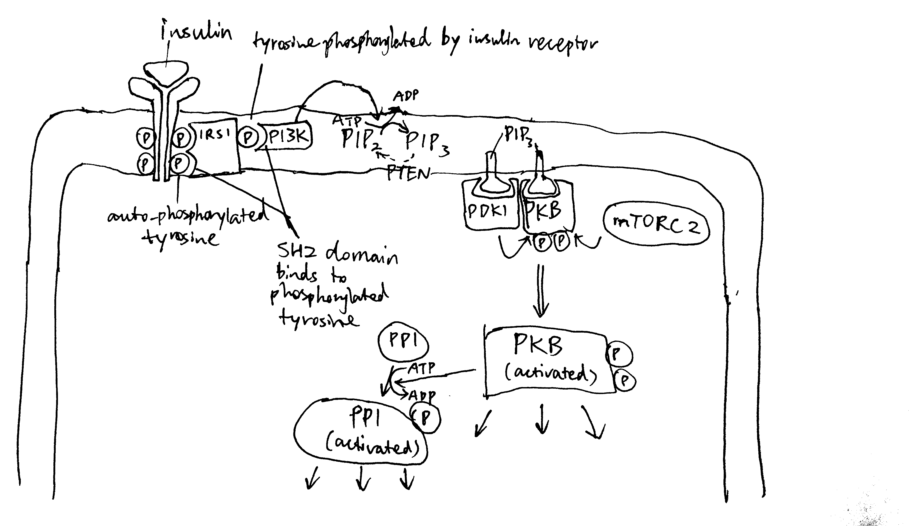
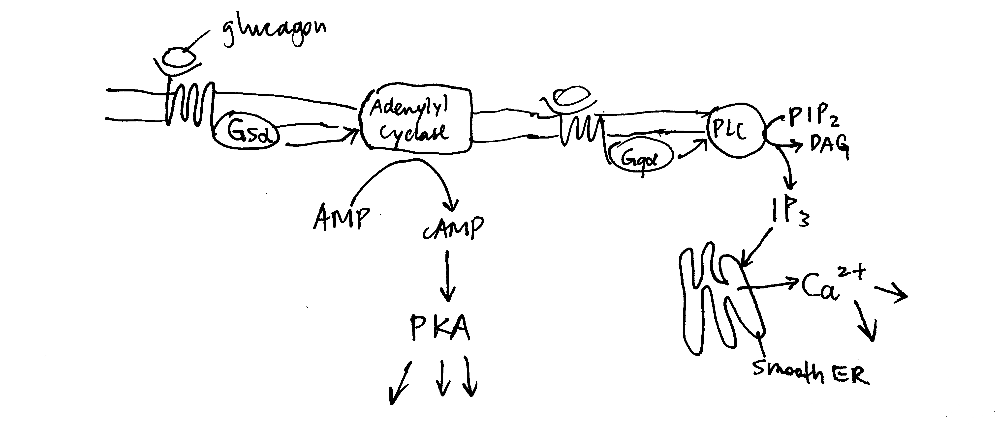
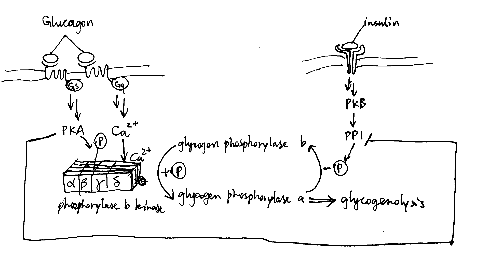
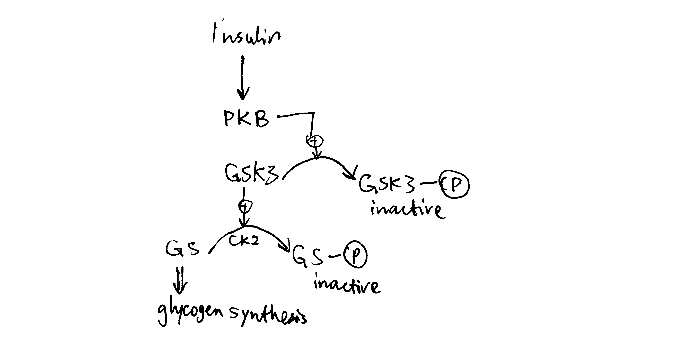
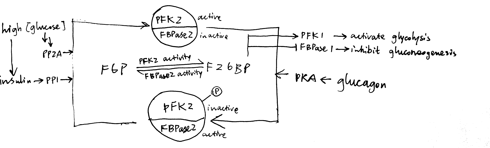
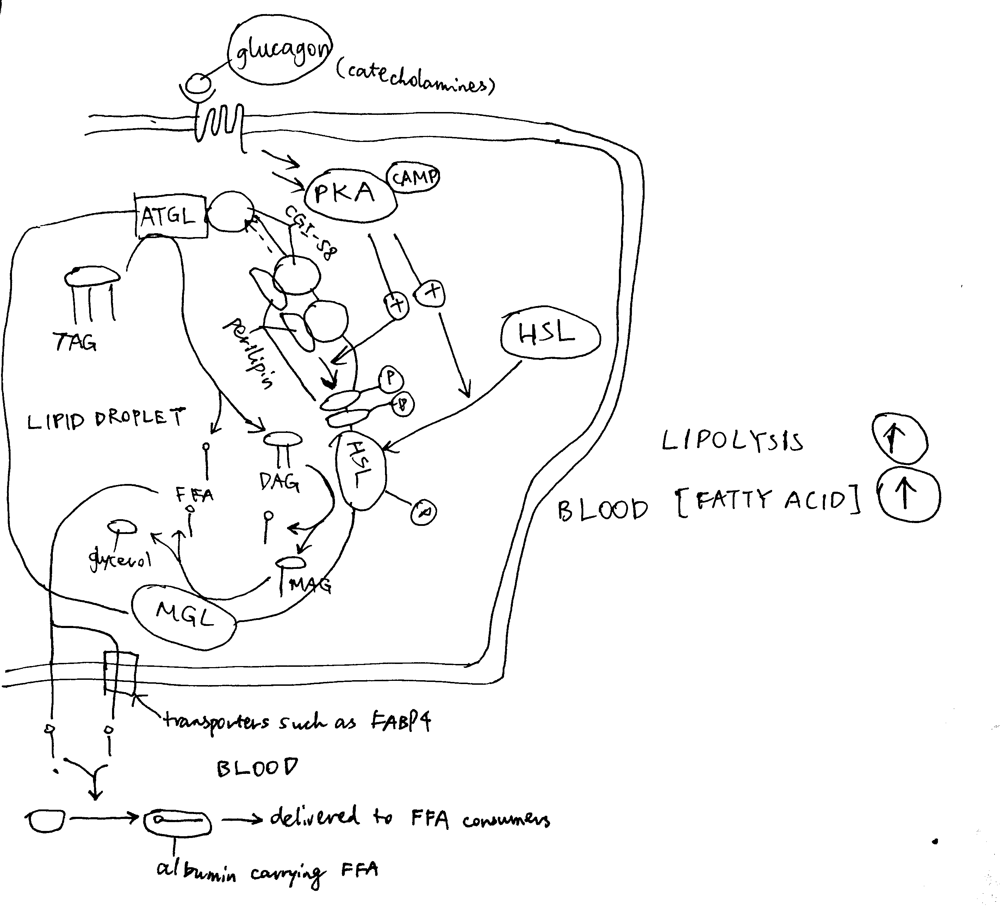
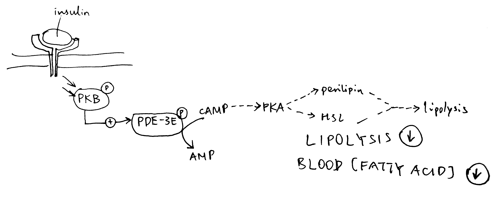
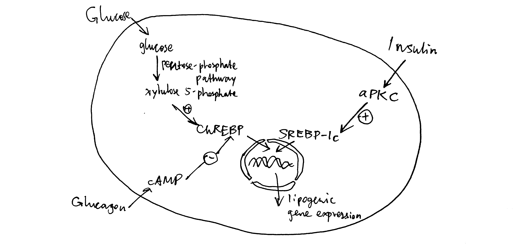

**"Glucagon and insulin affect the body in opposite ways." To what extent is this statement true?**

# Introduction

Glucagon and insulin are peptide hormones secreted by the endocrine cells ($\alpha$ and $\beta$ cells, respectively) of the islets of Langerhans in pancreas. Although these two hormones differ in their target tissues and mechanisms of action, the metabolic changes they bring about, at the whole-body level, have opposite effects, which helps to maintain energy homeostasis. Specifically, insulin results in adaptation to high blood glucose concentration and high energy status, which occurs after a meal, while glucagon results in adaptation to low blood glucose concentration.

# Initial Steps of Glucagon and Insulin Signalling

Glucagon and insulin each has diverse effects in different tissues, but the initial steps are common. To avoid repetition, these step are described in this section.

## Insulin Signalling

The insulin receptor belongs to the receptor tyrosine kinase (RTK) family. Upon insulin binding, the receptor dimer trans-autophosphorylates each other on tyrosine residues (pY). IRS1 (insulin receptor substrate 1) binds to pY via its SH2 (src homology 2) domain. Insulin receptor phosphorylates IRS1 on tyrosine, and then PI3K (phosphoinositide 3 kinase) binds to pY of IRS1 via SH2. PI3K converts PIP2 (PtdIns(4,5)P2) to PIP3 (PtdIns(3,4,5)P3), then PIP3 serves as the docking site for PDK1 (phosphoinositide dependent kinase 1) and PKB (Akt). PDK1 and mTOR2C activates PKB by phosphorylation, and PKB then phosphorylates other protein targets to bring about most insulin-induced metabolic changes. Among these effects, a significant porportion is mediated by PP1 (protein phosphatase 1), which is activated by PKB (Figure \@ref(fig:insulin-overview)).

```{r insulin-overview, echo=FALSE, fig.cap="Overview of insulin signalling.", out.width="100%"}

```

## Glucagon Signalling

Glucagon receptors are G-protein coupled receptors (GPCR). Upon glucagon binding, the receptor acts as a guanine nucleotide exchange factor and replace GDP bound to the G protein with GTP. The activated heterotrimeric G protein dissociates into $\beta\gamma$ and $\alpha$ subunits. Some glucagon receptors are associated with G~s~, and their $\alpha$ subunit activates adenylyl cyclase, which produces cAMP, which in turn activates protein kinase A (PKA).  Other glucagon receptors are associated with G~q~, and their $\alpha$ subunit activates phospholipase C, which converts PIP2 (phosphatidylinositol bisphosphate) to IP3 (inositol trisphosphate) and DAG (diacylglycerol). IP3 stimulates Ca^2+^ release from the smooth endoplasmic reticulum. PKA and Ca^2+^ then activates downstream proteins (Figure \@ref(fig:glucagon-liver-gs-gq) ).

```{r glucagon-liver-gs-gq, echo=FALSE, fig.cap="Overview of glucagon signalling.", out.width="100%"}

```


# Glucose Metabolism

Maintaining a glucose concentration of around 5 mmol/L is crucial to human survival. This glucose homeostatis is maintained by glucagon and insulin, where the former results in net increase in glucose concentration and the latter results in net decrease in glucose concentration.

## Glycogen Metabolism in Liver

In liver, net synthesis of glycogen (in order to lower down blood glucose concentration) is stimulated by insulin and net consumption is promoted by glucagon.

### Glucagon Activates Glycogenolysis in Liver

As described previously, glucagon signalling results in activation of PKA and release of Ca^2+^. PKA phosphorylates and thus activates phosphorylase b kinase. Ca^2+^ binds to phosphorylase b kinase, also activating it. Insulin inhibits glycogenolysis via PP1, which dephosphorylates phosphorylase kinase. Glucagon counteracts the effect of insulin in another way: PKA phosphorylates the R (regulatory) subunit of PP1, causing the dissociation of the C (catalytic) subunit, thus inactivating PP1 (Figure \@ref(fig:glucagon-insulin-glycogenolysis-simple) ).

```{r glucagon-insulin-glycogenolysis-simple, echo=FALSE, fig.cap="Effect of glucagon and insulin on hepatic glycogenolysis", out.width="100%"}

```

### Insulin Activates Glycogen Synthesis in Liver

Insulin activates glycogen synthesis in hepatocytes. Glycogen is synthesised by glycogen synthase (and branching enzymes), whose active (a) form is unphosphorylated. It is normally phosphorylated (inactivated) by caesin kinase 2 (CK2) and glycogen synthase kinase 3 (GSK3). Insulin-activated PKB phosphorylates (inavtivates) GSK3 and hence releases GS from inhibition (Figure \@ref(fig:insulin-gsk3)).

```{r insulin-gsk3, echo=FALSE, fig.cap="Insulin stimulates glycogen synthesis in the liver.", out.width="100%"}

```

## Glycolysis and Gluconeogeneis in Liver

Insulin activates glycolysis and inhibits gluconeogenesis in liver. Glucagon has opposite effects.

### Short-Term Control via PFK2/PBPase2 Bifunctional Enzyme

In liver, fructose 2,6-bisphosphate (F26BP) the key regulator of glycolysis and gluconeogenesis. It is an allosteric regulator of PFK-1 and FBPase-1 and have opposite effects on them. It significantly reduces the inhibitory effect of ATP on PFK-1—without F26BP, PFK-1 essentially has no activity in normal hepatocytes because hepatic ATP concentration is very high. In contrast, F26BP is an allosteric inhibitor of FBPase-1.

The PFK2/PBPase2 bifunctional enzyme (BFE) converts between fructose 6-phosphate (F6P) and F26BP. PFK2 is active in its unphosphorylated form while FBPase2 is active in its phosphorylated form. Insulin activates PP1, which dephosphorylates BFE (PP2A has the same effect), resulting in net production of F26BP, thus activating glycolysis and inhibiting gluconeogenesis. Glucagon activates PKA, which in turn phosphorylates BFE, reducing amount of F26BP and hence deactivating glycolysis and de-inhibiting (activating) gluconeogenesis (Figure \@ref(fig:hepatic-f26bp) ).

```{r hepatic-f26bp, echo=FALSE, fig.cap="Regulation of glycolysis and gluconeogenesis via F26BP in liver.", out.width="100%"}

```

The isoform of pyruvate kinase (PK) present in liver is also phosphorylated and inactivated by PKA, and this also contributes to glucagon-induced inhibition of glycolysis.

### Long-Term Transcriptional Control

Glucagon-triggered rise in cAMP concentration activates CREB (cAMP response element binding protein), which turns on synthesis of glucose 6-phosphatase and PEP carboxykinase, two key enzymes involved in gluconeogenesis.

Insulin activates PKB, which phosphorylates and inactivates other transcription factors, such as FOXO1, and thus reduces transcription of gluconeogenic enzymes.

## Glucose Uptake into Muscle Cells

Insulin sigalling in muscle cells results in activation of PKB, which in turn causes translocation of GLUT4-containing vesicles to the cell surface. This significantly increases the rate of influx of glucose into muscle cells, thus reducing blood glucose concentration.

# Lipid Metabolism

Glucagon is released when glucose is not abundant, thus its overall effect is to promote mobilisation and utilisation of the alternative fuel, triacylglycerides (TAG). Insulin has the opposite effect: it is released after a meal, when the nutrient concentration in blood is high, and it supresses TAG usage and promotes TAG storage.

## Lipolysis in Adipocytes

Lipolysis is the process by which triacylglycerol molecules (TAG) stored in the lipid droplet of adipocytes in white adipose tissues are hydrolysed to 3 free (non-esterified) fatty acid molecules and 1 glycerol molecule and released into the bloodstream, resulting in net increase in free fatty acid concentration in blood plasma.

As shown in Figure \@ref(fig:adipocyte-positive), PKA is central to the activation of the lipolytic pathway. Catecholamines (adrenaline and noradrenaline), being the major activators of lipolysis, activates PKA via $\beta$ adrenergic receptor, G~s~, AC and cAMP. Glucagon has also been shown to activate lipolysis *in vitro* (via PKA), but there is no clear evidence that it acts *in vivo*.


```{r adipocyte-positive, echo=FALSE, fig.cap="Activation of lipolysis by catecholamines (adrenaline and noradrenaline) and, with less evidence, by glucagon. PKA is activated via the GPCR-G~s~-AC-cAMP pathway described previously. Activated PKA has two roles. First, it phosphorylates HSL and increases enzymatic activity thereof. Second, it phosphorylates perilipin, which is the protein residing on the membrane of the lipid droplet (LD) providing protection against ATGL and HSL. The phosphate groups induce binding of HSL to perilipin, effectively translocating HSL from the cytosol to the LD. Phosphorylation also release CGI-58 from perilipin, and the free CGI-58 activates ATGL. TAG is hydrolysed to 3 fatty acids and a glycerol molecule stepwisely by ATGL, HSL and MGL.", out.width="100%"}

```

Insulin inhibits lipolysis via PKB and PDE-3B, resulting in net decrease in blood fatty acid concentration (Figure \@ref(fig:lipolysis-insulin-simple)).

```{r lipolysis-insulin-simple, echo=FALSE, fig.cap="Inhibition of lipolysis by insulin. Insulin activates PKB, which phosphorylates and thus activates the phosphodiesterase PDE-3B. PDE-3B de-cyclise cAMP, to AMP, thus reducing PKA activity and the lipolytic pathway downstream of PKA.", out.width="100%"}

```

## TAG Synthesis in Liver

TAG synthesis in liver is promoted after a meal. This is mainly mediated by de-phosphorylation (activation) of ACC (acetyl-CoA carboxylase) by PP2A as a result of elevated glucose concentration and pentose phosphate pathway activity. (Some books, such as Lehninger's, say that insulin-activated PP1 also de-phosphorylates ACC). The product of ACC, malonyl CoA, inhibits CPT1 (carnitine palmitoyl transferase) and hence oxidation of fatty acids.

Long term regulation of lipogenesis is achieved via the transcription factors ChREBP and SREBP-1c. These two TFs both up-regulates enzymes involved in lipogenesis, but their regulation differ. ChREBP is activated by xylulose 5-phosphate, which happens when there is a large flux through the pentose phosphate pathway due to high glucose concentration. This effect is reduced by cAMP, whose production is induced by glucagon. In contrast, SREBP-1c is activated by atypical PKC (aPKC), which is another protein kinase activated by insulin (Figure \@ref(fig:chrebp-srebp1c) ).

```{r chrebp-srebp1c, echo=FALSE, fig.cap="Long-term regulation of lipogenesis via ChREBP and SREBP-1c.", out.width="100%"}

```

## TAG (Re-)Synthesis in Adipocytes

During fed state, adipocytes, with help from endothelial cells, break down chylomicrons (from the intestine) and VLDLs (from the liver), hydrolyse the containing triacylglycerol molecules, take up the resulting fatty acids, and re-synthesise the TAG. Adipocytes do not express glycerol kinase, thus they have to obtain glycogen 3-phosphate, one of the substrate in the first step of TAG synthesis, from dihydroxyacetone phosphte (by glycerol 3-phosphate), which is a glycolytic intermediate. Insulin promotes glucose uptake and hence glycolysis in adipocytes, thus promoting TAG resynthesis.

# Conclusion

Although glucagon and insulin usually exert their effects on different enzymes, and sometimes in different tissues, the net results of their activity are opposite, which ultimately leads to energy homeostasis, where energy consumption and concentration of glucose in blood remain relatively constant while the pattern of food intake is changing.