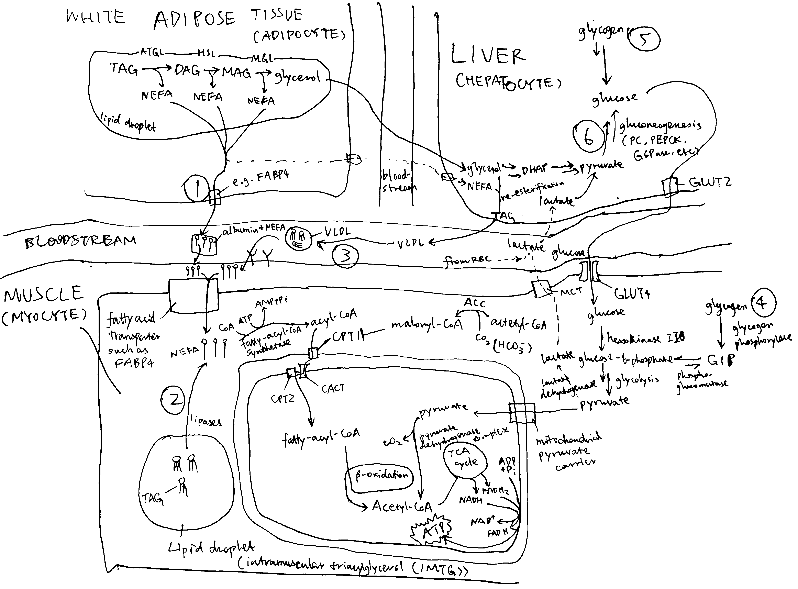
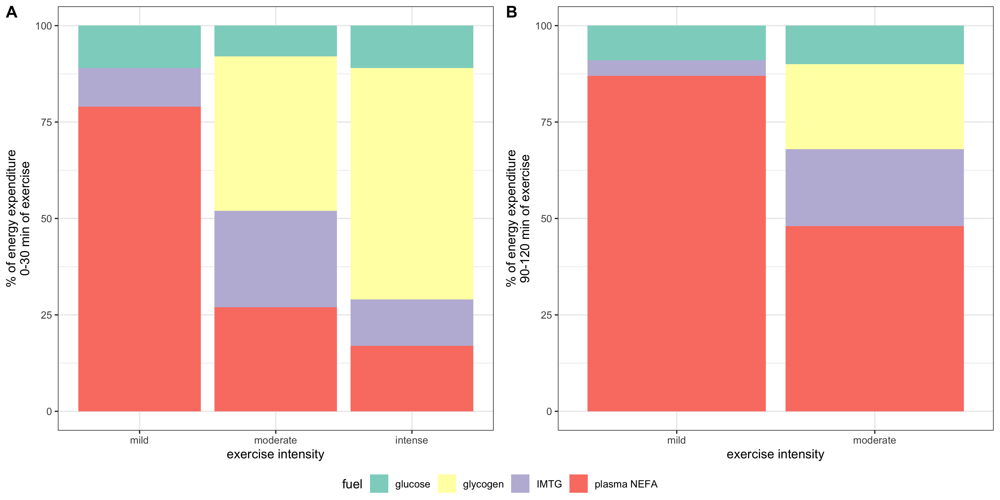

**What effects do the intensity and duration of exercise have on fuel selection by mammalian muscle?**

# Introduction

During exercise, glucose and fatty acids are the fuels used by the muscle. Their origin and relative contribution depend on the intensity and duration of exercise, as well as on characteristics of individuals such as the level of physical training.

# Overview

As shown in Figure 1, muscle contraction during exercise is powered by oxidation of glucose and fatty acids derived from a number of sources.

```{r powering-the-muscle, echo=FALSE, fig.cap="Sources of fuel during exercise. (1) white adipose tissue lipolysis; (2) intramuscular triglycerides (IMTG); (3) plasma TG (mainly contained in VLDL synthesised by the liver); (4) mucle glycogenolysis; blood glucose derived from liver glycogenolysis (5) and gluconeogenesis (6).", out.width="100%"}

```

Immediately after the onset of exercise (0-30 s) energy is derived predominantly from anaerobic respiration. After this period, both excercise intensity and duration determine the choice of fuel used for oxidation. As shown in Figure 2, during the first 30 minutes of a low-intensity exercise bout, the vast majority of fuel used by muscle is plasma NEFA (non-esterified fatty acids) originated from adipose lipolysis with tiny contributions from IMTG (intramuscular triglyceride) and plasma glucose. For moderately intense exercise, the contribution from fat is lower: plasma NEFA and IMTG each represent about 25% of total energy expenditure, and glycogen and plasma glucose account for the remaining 40% and 10%. For high-intensity exercise, the contribution from muscle glycogen is even higher (60%), and fat and glucose represents 30% and 10% of the total, respectively. Overall, as exercise intensity increases, carbohydrates (especially muscle glycogen) progressively becomes the preferred fuel over triglyceride-derived fuel. As for TG-derived fuel, the ratio of IMTG to plasma NEFA is greatest during moderately intense exercise and lowest during low-intensity excercise. These are explained in detail later.

Figure 2 also shows that, during prolonged (low- or moderate-intensity) exercise, the contribution from plasma NEFA increases and the contribution from other fuels decreases, regardless of exercise intensity. This is due to the large amount of TG reserve in adipose tissue and the gradual depletion of other fuels.

```{r exercise-choice-of-fuel, echo=FALSE, fig.cap="Effects of exercise intensity and duration on choice of substrates. 'Percentage of VO~2max~', where VO~2max~ is the highest rate of ATP generation via oxidative phosphorylation attainable, is a normalised parameter used to measure relative exercise intensity. Exercise requiring less than 30% VO~2max~ is considered low-intensity; 50%-70%, moderate intensity; 70-85%, high-intensity.", out.width="100%"}

```

```{r eval=FALSE, include=FALSE}
library(tidyverse)
library(ggpubr)

theme_set(theme_bw())

a <- tibble(type = rep(factor(c('mild', 'moderate', 'intense'), levels = c('mild', 'moderate', 'intense')), 4),
       fuel = rep(c('glucose', 'glycogen', 'IMTG', 'plasma NEFA'), each=3),
       p = c(11, 8, 11, 0, 40, 60, 10, 25, 12, 79, 27, 17)) %>% 
  ggplot(aes(type, p, fill=fuel))+
  geom_col()+
  scale_fill_brewer(palette = 'Set3')+
  labs(x='exercise intensity', y = '% of energy expenditure\n0-30 min of exercise')

b <- tibble(type = rep(factor(c('mild', 'moderate'), levels = c('mild', 'moderate')), each=4),
       fuel = rep(c('glucose', 'glycogen', 'IMTG', 'plasma NEFA'), 2),
       p = c(9, 0, 4, 87, 10, 22, 20, 48)) %>% 
  ggplot(aes(type, p, fill=fuel))+
  geom_col()+
  scale_fill_brewer(palette = 'Set3')+
  labs(x='exercise intensity', y = '% of energy expenditure\n90-120 min of exercise')


ggarrange(a, b, ncol=2, nrow=1, common.legend = TRUE, legend="bottom", labels = c("A", "B"))


ggsave('/Users/tianyishi/Downloads/exercise-choice-of-fuel.png', width = 12, height = 6)
```

## Glycogen and Glucose

### Blood Glucose

During exercise, catecholamines stimulates pancreatic $\alpha$ cells to secrete glucagon, which in turn promtotes hepatic glycogenolysis and gluconeogenesis. Both processes release glucose into the bloodstream.

Blood glucose is the predominant source of carbohydrate for oxidation in muscle. Its absolute amount of usage increases as excercise intensity increases (though proportionally remains largely unchanged), which is mediated by an increaed sensitivity to insulin (in part due to utilisation of IMTG) and thus increased translocation of GLUT4 to the cell surface membrane.

### Regulation of Glycogenolysis

Glycogen phosphorylase (GP) and phosphorylase kinase (PhK) are central to the regulation of glycogenolysis. Activated PhK phosphorylates GP, thus converting it from the inactive *b* form to the active *a* form. GP in its *a* form then phosphorolyses glycogen, releasing glucose 1-phosphase available for oxidation.

PhK is activated (1) by phosphorylation on $\alpha$ and $\beta$ subunits by PKA and (2) by binding of Ca^2+^ to $\delta$ subunit. PKA is activated upon catecholamine (mostly adrenaline) binding to cell surface receptors (via G~s~, adenylyl cyclase, and cAMP), and Ca^2+^ is released upon muscle contraction (stimulated by acetylcholine).

Ca^2+^ released upon muscle contraction results in a burst of glycogenolysis. The large amount of glycogen breakdown exceeds muscle's energy requirement and capacity of TCA cycle, resulting in accumulation of lactate. This probably explains the short period of anaerobic respiration at the onset of exercise. After a few minutes, the activation of phosphorylase reverses by a mechanism that is not fully understood.

Myocytes also respond, via $\beta$ adrenergic receptors, to catecholamines that are produced proportionally to exercise intensity. This results in activation of PKA (via G~s~, AC and cAMP), which in turn activates glycogenolysis.

The rate of glycogenolysis also depends on availability of P~i~, the substrate of glycogen phosphorylase. At rest and during mild exercise, fatty acid oxidation is capable of generating sufficient ATP, resulting in low P~i~ concentration. Availability of P~i~ increases as exercise intensity increases because the rate of ATP hydrolysis exceeds the rate of convertion from ADP and P~i~ back to ATP by oxidation of fatty acids (and plasma glucose).

## Fatty Acids

During exercise, the usage of fatty acids has an important role of delaying the onset of glycogen depletion and hypoglycemia. Its contribution to total energy expenditure increases as excercise proceeds. However, its usage is limited during strenuous exercise.

### Adipose Tissue Lipolysis and Plasma NEFA

Compared to resting conditions, adipose tissue lipolysis occurs at a higher rate during mild- or moderate-intensity exercise. This is mainly mediated by increased $\beta$-adrenergic receptor activation by catecholamines released by the adrenal gland upon sympathetic nerve stimulation. Exercise also increases blood flow in adipose tissue (which prevents toxic regional accumulation of fatty acids) and in muscle, thus promoting transport of NEFA to myocytes. Passive uptake of NEFA by myocytes, which is proportional to plasma NEFA concentration, is thus increased. AMPK, which is activated upon transition from rest to exercise and during prolonged exercise, phosphorylates ACC2 and malonyl-CoA decarboxylase, inhibiting the former and activating the latter, thus resulting in a decrease of malonyl-CoA concentration and hence releasing CPT-1 from inhibition. This promotes transport of fatty acids into mitochondria for $\beta$-oxidation in muscle cells.

As the exercise intensity continue to increase, however, oxidation of NEFA derived from adipose tissue lipolysis in muscle decreases. This is in part caused by decreased rate of lipolysis due to lactate (through activation of an orphan GPCR, GPR81). Lactate can also increase re-esterification of fatty acids to TG in the liver. Raising plasma fatty acid concentrations by intravenously infusing a lipid emulsion and heparin during the exercise bout increases plasma NEFA oxidation by about 30% but does not completely restore it to the rate observed during moderate-intensity exercise. Thus, high-intensity exercise also decreases the capacity of skeletal muscle to oxidise fatty acids, which is in part caused by increased glycogen catabolism. As more acetyl-CoA concentration are produced via glycogen catabolism, they are converted to malonyl-CoA by ACC2 located on the outer mitochondrial membrane, and the malonyl-CoA then inhibits CPT-1 and hence fatty acid oxidation.

### Intramuscular Triacylglycerol (IMTG)

Within myocytes, there are lipid droplets that stores TG. Their usage during exercise can be calculated by subtracting plasma fatty acid oxidation (determined by isotope tracers) from whole-body fat oxidation (determined by indirect calorimetry).

IMTG use is stimulated by catecholamines via $\beta$ adrenergic receptors. This is supported by the finding that pharmarcological blockage of $\beta_1 + \beta_2$ prevents the usage of IMTG.

### Plasma TG (VLDL-TG)

The liver takes up plasma NEFA and glycerol and use some of them to resynthesise TG. These TG are packaged in VLDL and released into the bloodstream. Muscle can break down some VLDL by lipoprotein lipase and oxidise the resulting fatty acids. However, this only contributes to a small fraction of energy usage during exercise and might be more important for replenishing IMTG stores after exercise.
