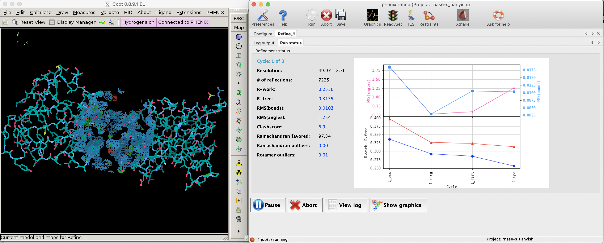
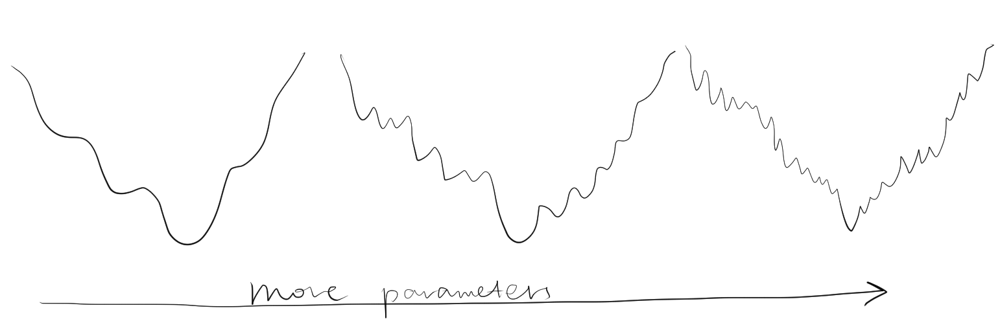
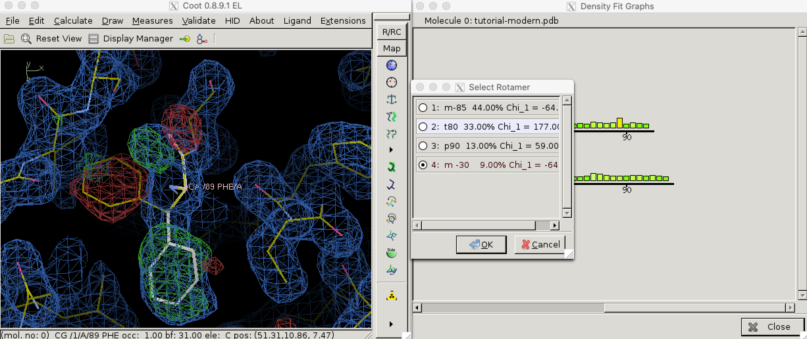
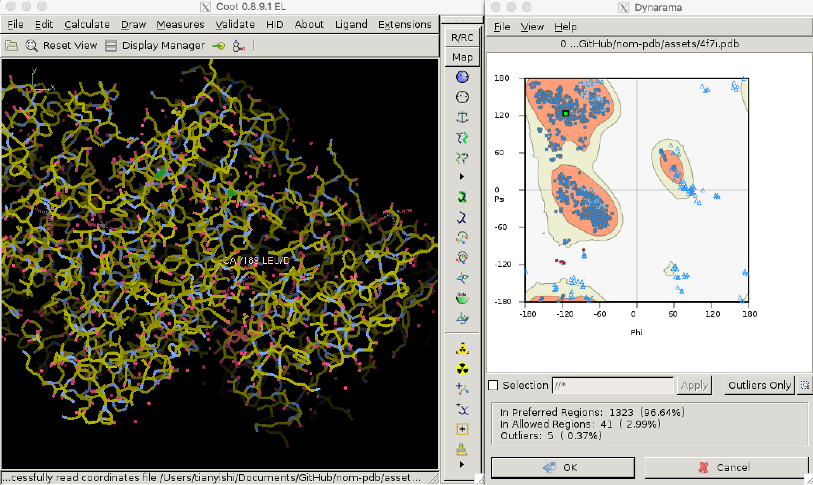

A high-quality protein structure model explains the experimental observations well, and conforms to physical and biochemical principles. There are some parameters indicating the quality of a structure model. Some of them are used during model building and refinement, while others apply only on a refined structure.

# The Essence of X-Ray Crystallography

The intensity at $(h, k, l)$ in the reciprocal space, i.e. the structure factor amplitudes collected in X-ray experiments is directly related to the Fourier transform of the electron density in the real space ($I = \mathbf{F}_{hkl}^2$), the latter being calculated as:


\begin{equation}
\mathbf{F}_{hkl} = \int_{x}\int_{y}\int_{z}\rho(x, y, z)e^{2\pi i(hx +ky + lz) }\mathrm{d}x \mathrm{d}y \mathrm{d}z
\end{equation}


In practice, since the number of atoms and reflections (hence $(x, y, z)$ or $(h, k, l)$ coordinates is limited, its discrete form, which can be efficiently computed, is used:[^fftw]


\begin{equation}
\mathbf{F}_{hkl} = \sum_{j}^{n}f_j e^{2\pi i(hx_j +ky_j + lz_j) }
\end{equation}


where $(x_j, y_j, z_j)$ is the coordinates of the *j*-th atom in real space.

This is also known as the *structure factor equation*.

[^fftw]: Most crystallography softwares seem to use Fast Fourier Trasnform (FFT) algorithms provided by FFTW (http://www.fftw.org/) to compute discrete fourier transforms (and its inverse)

Solving the electron density from structure factors involves solving the inverse Fourier transform of the above equation, also known as the *electron density equation*, in its discrete form:


\begin{equation}
\rho(x, y, z) = \dfrac{1}{V}\sum_{h}\sum_{k}\sum_{l}w_{hkl}|\mathbf{F}_\text{obs}|e^{-2\pi i(hx + ky + lz - \alpha^\prime_{hkl})}
\end{equation}

where $\alpha^\prime_{hkl}$ is the phase at each set of coordinates in the reciprocal space. The phases are not directly available but are necessary (actually more important than intensities) for computing $\rho(x,y,z)$ (electron density).

The phases can be solved either by phasing experiments, in which case the resolution is relatively low but the data is unbiased, or by molecular replacement (MR), in which case the resolution is relatively high but the data suffer from bias (the phases resemble the search model more than the actual structure). Thus, bias minimisation measures such as maxinum likelihood map coefficients are applied before electron density map contrstruction.

# Assessing the Quality of A Structure During Model Building and Refinement

Solving the electron density and ultimately the atomic structure from experimental data is an iterative process, starting from a model with low resolution and imperfect phases and progressively refining the model by applying prior knowledge on the information the current model can provide so far.

In general, the first step in refinement is to construct a crude electron density map (Equation (3)) using phase angles ($\alpha^\prime$) obtained either from MR or experimental phasing. This initial map, **F**~0~, is improved using techniques such as *density modification, solvent leveling, solvent flattening*. At some critical point in the iterative improvement of phases, the map becomes clear enough that a protein chain can be traced through it. From this point on, real-space refinement is also conducted at each round of iteration. Electron density map is obtained (details in Section \@ref(fit)), and filled with atoms, and transformed back to the reciprocal space. This process repeats until converging to a high-quality strucure. $R$ and $R_\text{free}$, explained below, are used to assess progress in the refinement, and is also a major factor in evaluating the quality of a model.

## *R* and *R*~free~

*R* is a measure of the deviation of calculated intensities from models (details in Section \@ref(reci)) from the observed intensities in the diffraction pattern, defined by the following equation:

$$
R = \dfrac{\sum ||\mathbf{F}_\text{obs}| - |\mathbf{F}_\text{calc}||}{\mathbf{F}_\text{obs}}
$$

Since bias can easily be introduced into the *R* value (especially by overparameterisation, see Section \@ref(reci)) and a reduction of *R* value sometimes does not improve the actual quality of structure (@Kleywegt-1996), a small fraction (typically around 5%[^rfree-pdb]) of randomly selected reflections are removed from the data used for refinement. These reflections can then be used to calculate an R factor, denoted as $R_\text{free}$, whose reduction can be considered as an *unbiased estimate* of the improvement of the model.

[^rfree-pdb]: In PDB files, this fraction is recorded in the field `FREE R VALUE TEST SET SIZE`

```{r coot-phenix, echo=FALSE, fig.cap=" R and R-free values decreases as refinement proceeds (left: Coot; right: phenix.refine).", out.width="100%"}

```

Figure \@ref(fig:coot-phenix) shows the decrease of *R* and *R*~free~ during a refinement task conducted in Phenix.

## Reciprocal-Space Refinement: Refinement by least squares {#reci}

Reciprocal-space refinement involves computerised attempts to improve agreement between $\mathbf{F}_\text{obs}$ and $\mathbf{F}_\text{calc}$ by *without* consideration of the maps and models. *Refinement by least squares* is the earliest successful technique and is discussed here.[^bayesian]

[^bayesian]: modern refinement softwares use techniques such as simulated annealing and beyesian methods to improve the accuracy of refinement

The goal of refinement by least squares is, find $(x_j, y_j, z_j)$ for all atom $j$ whose *expected* ( i.e. computed) structure factor amplitudes, $|\mathbf{F}_\text{calc}|$ are as close as possible to *observed* structure factor amplitudes, $|\mathbf{F}_\text{obs}|$. Specifically, this means minimising the function $\Phi$:

\begin{equation}
\Phi = \sum_{hkl}(w_{hkl}\mid\mathbf{F}_\text{obs}\mid - \mid\mathbf{F}_\text{calc}\mid)_{hkl}^{2}
\end{equation}

where $w_{hkl}$ is the weight term that depends on the reliability of the corresponding measured intensity and $|\mathbf{F}_\text{calc}|$ is a variant form of Equation (2) that can include additional parameters such as *B*-factor ($B_j$) and occupancy $n_j$. An equation with $B_j$ and $n_j$ included can be written as:

\begin{equation}
\mathbf{F}_\text{calc} = \sum_{j}n_j f_j e^{2\pi i(hx_j +ky_j + lz_j) - B_j[(\sin\theta)/\lambda]^2}
\end{equation}

Note that the equatin shows that the effect of *B*-factors depends on the angle of reflection $(\sin\theta)/\lambda$.

Solving the minimum of $\Phi$ analytically is impractical, and instead numerical methods are used, which would lead to a minimum closest to the starting value.To prevent the refinement converging to a local minimum, it is important that the starting parameters be near the *global minimum*. Is also important *not* to include too many parameters (such as *B*-factor) at the initial stages of resolution when the resolution is low, as this would decrease the radius of convergence (Figure \@ref(fig:radius-convergece)).

```{r radius-convergece, echo=FALSE, fig.cap="Adding number of parameters improves precision of refinement, but makes it more unlikely to reach the global minimum from a given point. Thus, refinement starts with a small number of parameters, and more parameters are only added after the success of previous lower-resolution refinement steps.", out.width="100%"}

```

To minimise the number of parameters used during early stages of refinement (and thus to increase radius of convergence), individual $(x,y,z)$ coordinates are actually not used. Instead, only torional angles $\psi$ and $\phi$ are allowed to change, and all bond lengths and angles are fixed to their theoretical average, side chains are assumed to be in their preferred conformation, and peptide linkages are fixed to be planar. This strategy is known as *restrained* reciprocal space refinement. As refinement proceeds, more parameters, from individual $(x,y,z)$ coordinates to isotropic B-factors and finally anisotropic factors, can be added into calculation.


## Real-Space Refinement: Map Fitting {#fit}

*Map fitting* or *model building* entails building a molecular model that fits realistically into the current electron density contour map.

To reduce the bias (towards **F**~calc~ (**F**~c~)) when constructing the electron density map, Fourier syntheses of **F**~obs~ and **F**~calc~ are used.
A Fourier synthesis _m_**F**~o~ - _n_**F**~c~ is calculated as:

$$
\rho(x, y, z) = \dfrac{1}{V}\sum_{h}\sum_{k}\sum_{l}(m|\mathbf{F}_\text{o}|-|\mathbf{F}_\text{c}|)e^{-2\pi i(hx + ky + lz - \alpha^\prime_{hkl})}
$$

and its corresponding electron density map is called an _m_**F**~o~ - _n_**F**~c~ map.

Simply put, the 2**F**~o~ - **F**~c~ map resembles a molecular surface, and a **F**~o~ - **F**~c~ map emphasises the error (positive density implies that the unit cell contains more electron density in this region than implied by the model (**F**~c~). Near the end of refinement, the **F**~o~ - **F**~c~ map becomes rather empty except in problem areas, which may need to be corrected manually.

Fitting a molecular model into the electron density map depends on prior knowledge, such as average bond lengths and angles, the amino acid sequence of the protein, properties of peptide chains, etc. For example, we know that carboxyl oxygens in adjacent amino acid residues in a $\beta$-sheet  point in opposite directions. Thus, once a $\beta$-sheet along with one or two carboxyl oxygen are discernible, we can make a sensible guess of the positions of all other carbonyl oxygens.


# Assessing Quality After Automatic Model Building and Refinement

## Density fit analysis and local geometry validation

Automatic model building and refinement use the decrease of *R* value as an indicator of progress and terminates when *R* is considered to be sufficiently low. This may lead to situations where the global *R* is favourable but local geometry can still be improved.

Local geometry validation programs, such as "Density fit analysis" in Coot (Figure \@ref(fig:coot-density-fit-2)), evaluate the model geomtry on a per-residue basis and flag outliers. These outliers can then be fixed manually. With the aid of electron density contour maps (where model atoms lie outside 2**F**~o~ - **F**~c~ contours, the **F**~o~ - **F**~c~ will often show the atoms with negativel contours, with nearby positive contours pointing to correct locations for these atoms).


```{r coot-density-fit-2, echo=FALSE, fig.cap="Use the 'Density fit analysis' function to evaluate model geometry on a per-residue basis and plot a histogram that shows outliers, then use the 'Rotamers' tool to fix a side chain that's pointing the wrong way.", out.width="100%"}

```

### Structural parameters: bond length, bond angle, chirality, planarity, and dihedral angles

During late stages of refinement, restraints on structura paramaters such as bond lengths and angles are release such that thay are allowed to change freely as long as *R* values could be made to decrease. This may lead to unrealistic models with improbable structural parameters. Thus, they need to be validated. By convention, this is done by calculating the root-mean-square deviations (RMSD) of these parameters in the model from the corresponding set of values based opon the geometry of small organic molecules. These values are recorded in PDB files in `REMARK 3` fields:

```{}
REMARK   3  DEVIATIONS FROM IDEAL VALUES.                                       
REMARK   3                 RMSD          COUNT                                  
REMARK   3   BOND      :  0.003           1366                                  
REMARK   3   ANGLE     :  0.675           1846                                  
REMARK   3   CHIRALITY :  0.050            186                                  
REMARK   3   PLANARITY :  0.005            246                                  
REMARK   3   DIHEDRAL  : 15.473            459                                  
```

Because bond angles, lengths, chirality and planarity are restrained in early stages of refinement, they are less likely to deviate much from ideal values. Dihedral angles, which is allowed to change throughout the refinement, produce much larger RMSD and are worth closer examination.

### Torsional Angles and Ramachandran Plot

Torsional (dihedral) angles $\psi$ and $\phi$ are show much more variation than bond lengths and angles, but only a subset of all possible ($\phi$, $\psi$) pairs are allowed so that adjacent amino acid side chains do not clash. Validation of torsional angle is achieved via a lookup table, where the keys are ($\phi$, $\psi$) pairs and values are scores. A ($\phi$, $\psi$) is considered preferred or allowed if its score is within certain thresholds. Otherwise, it is considered an outlier. Due to glycine's small size and proline's cyclic structure, the preferred/allowed regions of their torsinal angle pairs are defined differently, for example in Phenix/cctbx[^cctbx-rama8000]. Torsional angle validation is often visualised with a Ramachandran plot, as shown in Figure \@ref(fig:coot-ramachandran).[^protein]

[^cctbx-rama8000]: In Phenix/cctbx, a lookup table (actually implemented as an array for better performance) is defined for each of the following cases: glycine, cis-proline, trans-proline, pre-proline, isoleucine/valine, and all other amino acid residues: [`mmtbx/validation/ramachandran/rama8000_tables.h`](https://github.com/cctbx/cctbx_project/blob/master/mmtbx/validation/ramachandran/rama8000_tables.h)
[^protein]: Recently I've been developing a PDB file parser. It is now able to parse coordinate information reliably, which allows Ramanchandran plot analysis: https://github.com/TianyiShi2001/protein


```{r coot-ramachandran, echo=FALSE, fig.cap="Validating dihedral angles with Ramachandran plot in Coot", out.width="100%"}

```

### Undefined regions

Often, some regions (often the terminal regions) of the protein are highly disordered and produce no detectable diffraction at high resolution and are thus invisible in the electron-density maps. It is not uncommon to omit these residues in the model. In some cases, however, exact coordinates are given for these atoms, along with very high *B*-factors (above 50 or 60 angstroms), and one must be careful not to over-interprete these regions.

### Unexplained Density

Empty electron density may remain after all known contents of the unit cell have been located. This can either due to an artifect of missing Fourier terms, reagents used in purification or crystallisation, or it could be due to previously unknown ligands (cofactors, inhibitors or allosteric effectors).

### Distortions due to crystal packing

Although flexibility of atoms is usually reflected by the *B*-factor, in certain situations dynamic regions of a protein molecule can be rigidly fixed in a specific conformation as a result of crystal packing interactions. It should be declared in the PDB header that the protein is affected by crystallisation. One can also check whether these interactions are likely to occur by displaying all neighbouring, symmetry-related molecules in the crystal structure and examine if any intermolecular interactions are present that are a result of crystal packing.

# References {-}