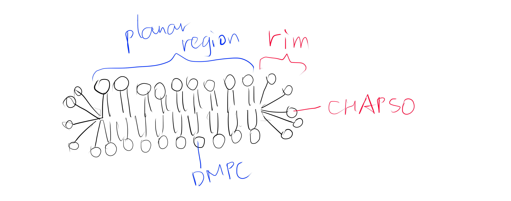
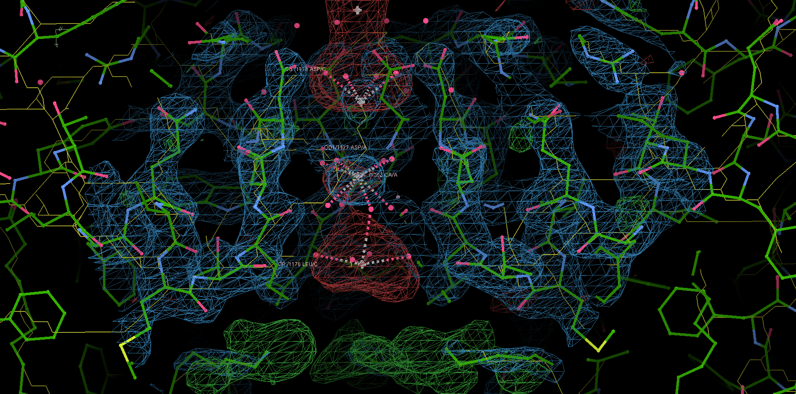

# Introduction


The Ca^2+^ selectivity of voltage-gated calcium (Ca~v~) channels remained unclear. They were thought to use a 'knock-off' methanism which requires multiple ion-binding cores, but mutational analyses supported a single high-affinity Ca^2+^ binding site. This paradox is explained by the mechanism proposed in this article, based on the crystal structures of Ca~v~Ab channels.

# Methods

In this study, the authors created several mutants of bacterial Na~v~ channel Na~v~Ab by site directed mutagenesis using QuickChange at the selectivity filter region[^s]. Some of these mutations changes the activity of the channel from allowing efflux of Na^+^ to allowing influx of Ca^2+^ to different extents (quantified by the relative permeability of Ca^2+^ against Na^+^). Baculovirus were used as the vector to infect *Trichopulsia ni* cells. Proteins were collected from insect cells, purified, concentrated to ~20mg ml^-1^, and reconstituted into DMPC:CHAPSO bicelles (Figure \@ref(fig:dmpc-chapso)). Crystals were grown in a hanging-drop vapour-diffusion format.

[^s]: specifically, from ^175^TLESWSM^181^ to TL**DD**WS**D**, TL**DD**WS**N**, TL**DD**WS**M**, TLE**D**WSM, TLE**D**WS**D** and TL**D**SWSM

```{r dmpc-chapso, echo=FALSE, fig.cap="The DMPC:CHAPSO bicelle. Bicelles are disks with a planar region formed by long chain lipid phospholipids and a rim composed of short chain phospholipids or detergent molecules. It provides an environment that resembles a lipid bilayer where membrane proteins' natively resides. Membrane proteins can be incorporated into bicelles for functional studies as well as crystallisation.", out.width="100%"}

```

Before X-ray diffraction data collection, crystals were soaked with cryo-protectant solutions containing Ca^2+^, Mn^2+^ or Cd^2+^ of indicated concentrations. These ions travel through solvent channels within the crystals and chelate with amino acid residues in the selectivity filter region.

X-ray diffraction data were integrated and scaled with the HKL2000 packaged and further processed with the CCP4 package. THe structure of Ca~v~Ab and its derivatives were solved by molecular replacement by using an individual subunit of the Na~v~Ab structure (PDB code 3RVY) as the search template. This choice is natural since the proteins used in this study are derived from Na~v~Ab and differ from it by no more than 3 amino acid residues.

The divalent cations were identified by anomalous difference Fourier maps calculated using data collected at wavelengths of 1.75 Å for Ca^2+^, Cd^2+^ and Mn^2+^. Anomalous scattering describes cases where a pair of structure factors $\mathbf{F}_{hkl}$ and $\mathbf{F}_{\overline{hkl}}$ does not obey Friedel's law[^fl], which occurs when the incident X-ray photons have an energy close to a transition energy of the diffracting atom, resulting in absorption of radiation energy and change in phase (normal scattering does not change the phase). At the wavelengths convinient for diffraction, only atoms heavier than phosphorus or sulfur behave as anomalous scatterers. While anomalous scattering data are frequently used to solve the phase problem (in techniques known as single/multiple wavelength anomalous dispersion (SAD/MAD)), it can also be used (as in this study) to calculate an anomalous difference map after phases are available to show the locations of the heavy atoms.[^prm]

Crystallography and NMR System software was used for refinement of coordinates and *B*-factors. Final models were obtained after several cycle refinement with REFMAC and PHENIX and manual re-building using COOT. The geometries of the final structural models of Ca~v~Ab and its derivatives were verified using PROCHECK.

[^prm]: This map is automatically calculated in phenix.refine.

[^fl]: Friedel's law states that $\mathbf{F}_{hkl}$ and $\mathbf{F}_{\overline{hkl}}$ have the same amplitude but opposite phase angle.


13 crystal structures of 5 proteins (Na~v~Ab and 4 Ca~v~Ab variants) with the following divalent cation concentrations were determined and deposited into PDB:[^pdb]

- TLESWSM (Na~v~Ab) + Ca^2+^ 15mM
- (TLE**D**WSM, TLE**D**ES**D**, TL**DD**WSM) + Ca^2+^ 15mM
- TL**DD**WS**D** + (Ca^2+^ 15mM; Mn^2+^ 100mM; Cd^2+^ 100mM)
- TL**DD**WS**N** + Ca^2+^ (0.5, 2.5, 5, 10, 15mM)

Of the 13 crystal structure models, 4MVR (^175^TLDDWSD^181^) corresponds to the protein with the greatest permeability ratio _P_~Ca~:_P_~Na~ , while [4MS2](https://www.rcsb.org/structure/4MS2) (^175^TLDDWSN^181^) diffracted to the highest resolution (2.75 Å).

[^pdb]: namely 4MS2, 4MTO, 4MTF, 4MTG, 4MVU, 4MW8, 4MVZ, 4MVM, 4MVO, 4MVQ, 4MW3, 4MVS, 4MVR

# Analyses of Results

## Ca^2+^ Binding Sites

Using the anomalous diffraction data, the **F**^+^~Ca~ - **F**^-^~Ca~ anomalous difference map was calculated. Two strong peaks followed by a weaker peak were found along the ion-conduction pathway, which correspond to the three Ca^2+^ binding sites. They are designated site 1, 2 and 3 from the extracellular side to the intracellular side.

Site 2 is the site with the highest affinity for Ca^2+^. It is surrounded by a total of 8 oxygen atoms, 4 of which coming from the carboxylate of D177 above and the other 4 from the carbonyl of L176 below. Site 1 is coordinated by the plane of 4 carboxyl groups from D178, and site 3 by the plane of 4 carbonyls from T175 (Figure \@ref(fig:cavab-schematic)). Throughout the selectivity filter, the O-Ca^2+^ coordination distances are in the range of 4.0-5.0 Å, which is much longer than the ionic diameter of Ca^2+^ (2.28 Å), suggesting that the bound Ca^2+^ ion maintains its hydration shell while passing through the pore. Site 3 has the lowest affinity, consistent with its role in exit of Ca^2+^ from the selectivity filter into the central cavity. Figure \@ref(fig:coot-4ms2) shows the molecular model and electron density near the selectivity fileter region of Ca~v~Ab (TL**DD**WS**N** + 15mM Ca^2+^) in COOT[^v] (contoured at r.m.s.d = $3.02 \sigma$).

(ref:r) A schemetic showing the Ca^2+^ ion coordination sites of Ca~v~Ab (TL**DD**WS**D**)

```{r cavab-schematic, echo=FALSE, fig.cap="(ref:r)", out.width="100%"}
knitr::include_graphics('../img/cavab-schematic.png')
```

```{r coot-4ms2, echo=FALSE, fig.cap="The selectivity filter region of 4MS2.", out.width="100%"}

```

The relative affinities of the three sites were further confirmed by experiments on Ca~v~Ab (TL**DD**WS**N**) with varying Ca^2+^ concentrations (0.5, 2.5, 5, 10, 15mM): at low Ca^2+^ concentration, two strong peaks of approximately equal intensity are found at Site 1 and Site 2; at high concentration the electron density is significantly enhanced in Site 2 and decreased in Site 1. The electron density at Site 3 remains low in all concentrations.

## Ion-Permeation Mechanism

Based on the properties of the three coordination sites, an ion-permeation mechanism can be deduced. The three coordination sites are separated by a distance of about 4.5 Å, which makes it energetically unfavourable for Ca^2+^ to occupy adjacent sites simutaneously. Thus the authors suggested that the selectivity filter oscillates between two states, in which either a single hydrated Ca^2+^ occupies Site 2, or two of them each occupies Site 1 and Site 3. The entry of Ca^2+^ into Site 1 is promoted by it high extracellular concentration, and the exit of Ca^2+^ is facilitated by the low affinity of Site 3.

Notably, this mechanism suggests that Ca^2+^ ions are kept hydrated during its passage through the selectivity filter. This is very different from the mechanism by which potassium channels achive selectivity, which requires K^+^ ions' hydration shell to be removed.

## Roles of Key Selectivity Filter Residues

The five variants of Ca~v~Ab the author produced have different Ca^2+^ selectivity ratios, which can be partially explained by directly comparing the difference in the arrangement of selectivity filter residues. This comparison is sometimes facilitated by superposition of one structure onto another. For example, the carboxyl group of D177 in TL**DD**WS**D** interacts with the Ca^2+^ ion, while the carboxyl group of E177 in TLE**D**WS**D** swings away from the selectivity filter and forms  a hydrogen bond with D181 and the main-chain nitrogen atoms of S180.

[^v]: COOT version 0.9.1 (packaged with CCP4), on Linux version 5.8.16-2-MANJARO


