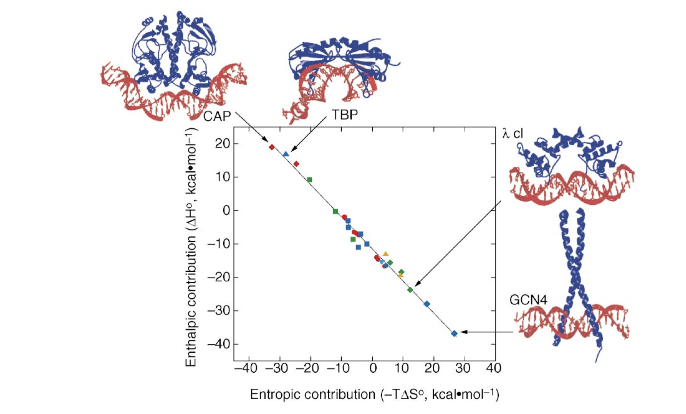
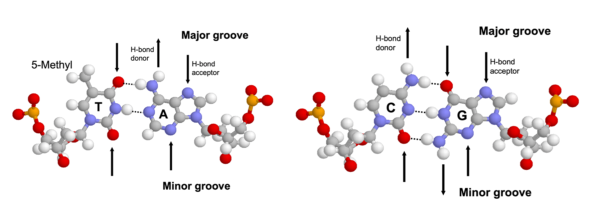
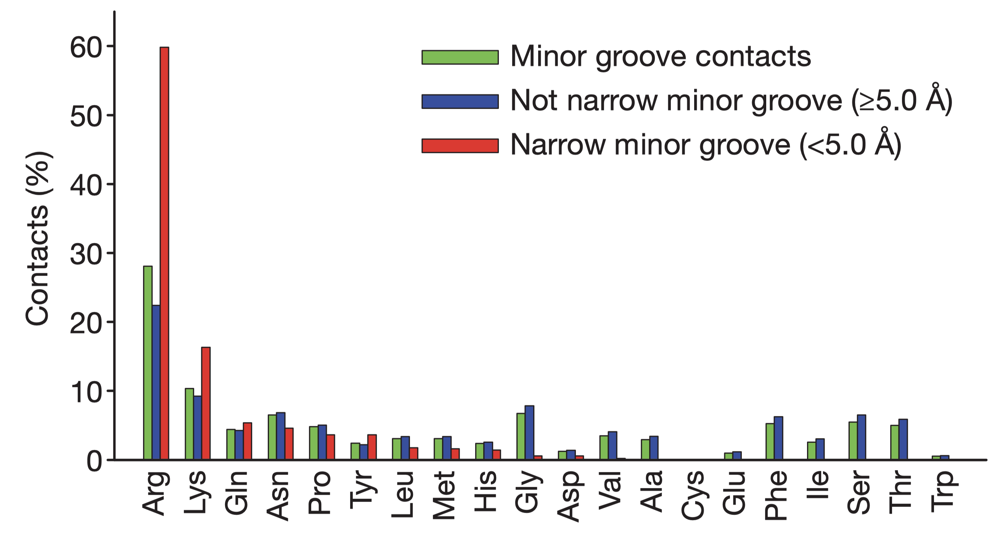

# Introduction

Protein-DNA interactions have profound impact on the expression and regulation of genes. Many DNA-binding proteins, especially transcription factors, are able to recognise and bind to a specific short sequence of DNA, while others, typically those involved in routine tasks such as DNA damage repair (e.g. glycosylase) and DNA packaging (e.g. histone) show less specificity.

# An Overview of Mechanisms of Protein-DNA Interactions

Binding of proteins to DNA results from the favourable interactions between short DNA sequences and the amino acid side chains of specific DNA-binding motifs in proteins. In many DNA-binding proteins, the affinity and specificity of binding is also enhanced by flexible segments outside the globular core that mediate specific and nonspecific interactions but are sometimes not included in the definition of DNA binding domains. The majority of DNA-binding domains are made of either $\alpha$-helices, $\beta$-sheets, or both. While they can be classified into different types of motifs, any one type of motif can be used in multiple ways to interact with DNA, depending on the protein and the binding site.

There are multiple mechanisms by which specificity is achieved. First, specific DNA base pairs and amino acid side chains can establish shape complementarity, resulting in hydrogen bonds or favourble polar, electrostatic, or hydrophobic interactions. This is commonly referred to as *direct readout* or *base readout*. These interactions usually more frequently in the the more accessible major groove of DNA than in the minor groove. However, there is no simple one-to-one relationship between DNA and protein sequences, which means this mechanism itself is not sufficient to accout for the specificity. The second mechanism, *shape readout*, involves recognition of a sequence-dependent DNA shape, for example an overall bend, a segment of narrow minor groove, or a kinked base pair step.

Base readout and shape readout can be further devided into different modes. These mechanisms rarely exists in isolation, and protein-DNA recognition uses a continuum of mechanisms that depend on the structural features and flexibility of both DNA and protein.


# Thermodynamics of Protein-DNA Binding

All protein-DNA complexes can gain favourable $\Delta H$ from direct protein-DNA recognition interactions and favourable $\Delta S$ from water release. However, in systems with strongly distorted DNA, the loss of favourable interaction due to the molecular strain of base pair destacking is so large so that the net $\Delta H$ becomes unfavourable. This is compensated by a more positive $\Delta S$ as the strained interface experiences less immobilisation (Figure \@ref(fig:pnipni-thermodynamics)).

(ref:pni-thermodynamics) The relative enthalphic and entropic contributions to binding free energy ($\Delta G_\text{free}$) of a few site-specific DNA-binding proteins with similar $\Delta G_\text{free}$ (about -11.7 kcal/mol). Taken from @Jen-Jacobson-2000

```{r pnipni-thermodynamics, echo=FALSE, fig.cap="(ref:pni-thermodynamics)", out.width="100%"}

```

# Base Readout in the Major Groove

The major groove is an ideal site for forming specific interactions between DNA bases and amino acid side chains because the four possible base pairs have a unique pattern of hydrogen bond donors and acceptors (and the 5-methyl of thymine) in the major groove. Proteins can also form hydrogen bonds with bases in the minor groove, but this contributes much less to the specificity (because the hydrogen bonding pattern cannot distinguish between AT from TA or CG from GC) (\@ref(fig:pni-major-minor-base)). Many DNA-binding motifs, including HTH, zinc finger and Leucine zipper, forms hydrogen bonds in the major groove.

```{r pni-major-minor-base, echo=FALSE, fig.cap="Hydrogen bonding patterns in the major and minor groove of AT and CG base pairs.", out.width="100%"}

```

Specificity not only depends on the number of contacts formed but also on the uniqueness of the hydrogen bonding geometry. Bidentate hydrogen bonds (2 H-bonds with different donors and receptors, which can be formed, for example, between the two NH/NH~2~ groups and the O and N of guanine) have the highest degree of specificity followed by bifurcated hydrogen bonds (two H-bonds share one donor) and single hydrogen bonds.

Water molecules can be found at some protein-DNA binding sites. While water molecules can allow flexibility and mediate non-specific binding, they are also present in many specific protein-DNA compelxes, such as Trp repressor-DNA, where their positions are highly ordered and serve to bridge the hydrogen bonds.


# Shape Readout {#sr}

In physiological conditions, most DNA exists in its B form with well-defined geometries. However, due to the subtle differences between the chemical properties of the four bases, the DNA shape varies in a sequence-dependent manner, and this structural variation is important for protein-DNA recognition.

The B-DNA conformation is largely stabilised by the stacking energy between adjacent base pairs. Thus regions with weak stacking energy, which were found to be AT-AT and AT-TA stacks, have a stronger deformability (i.e. propensity to deviate from the B-DNA conformation). Specifically, DNA sequences of at least four consecutive A-T base pairs without an intervening TpA step are called "A-tracts", which not only improves deformability but also has implications on electrostatic potentials, which are described in Section \@ref(ele)

The following table summarises the relationship between several sequence elements and their impact on the structural property of DNA:

| Sequence Element          | Structural Property                                                |
| ------------------------- | ------------------------------------------------------------------ |
| A-tract                   | narrow minor groove, bending, rigid for $\ge$ bp                   |
| TATA box                  | high deformability                                                 |
| YpR step (especially TpA) | compresses major groove, high deformability, 'hinge' step, kinking |
| RpY step                  | compresses minor groove, low deformability                         |

## Minor Groove Narrowing {#ele}

@Rohs-2009 reported that the binding of arginine residues to narrow ($< 5$ angstroms) minor grooves is a common mode of protein-DNA recognition (Figure \@ref(fig:pni-narrow-minor)). These narrow groove are usually associates with A-tracts, which estabilish a connection between DNA sequence and shape. Arginines often insert into the minor groove as part of short sequence motifs that vary among different proteins, e.g. Arg-Gln-Arg in the Hox protein SCR, Arg-Lys-Lys-Arg in POU homeodomains, thus providing specificity.

The narrowing results in a more negative electrostatic potential in the minor groove, which promotes the binding of positively charged arginine. The preference of arginine over lysine can be explained by the greater energetic cost of removing a charged lysine from water due to lysine's smaller radius of the charged group (or greater charge density) compared to arginine.

(ref:pni-narrow) Amino acid frequencies in minor grooves. Taken from @Rohs-2009

```{r pni-narrow-minor, echo=FALSE, fig.cap="(ref:pni-narrow)", out.width="100%"}

```

## Kinks

YpR steps (especially TpA steps) have a strong tendency to form kinks that disrupt the linearity of the double helix. They can contribute to binding specificity by optimising protein-DNA contacts. The binding site of the catabolite activator protein (CAP), for example, shows dramatic kinks at two CpA steps, which along with two additional smaller kinks cause an overall bending of the DNA of about 90 degrees around the protein.

# The Nucleosome as an Example of Non-Specific Binding

Histones are the ubiquitous nuclear protein that mainly serve to compact DNA. A nucleosome is formed by 147 base pairs of DNA wrapping around a histone octamer, and adjacent nucleosomes are joined by a linker sequence (about 50 bp long in humans). Since nucleosome are so prevalent, the histone-DNA interaction is often considered as non-specific, and its association with DNA is thought to be due to the electrostatic attraction between the abundant lysine and arginine residues on the surface of histoens and the negatively charged phosphate backbone of DNA. However, histones have preferred DNA regions to bind to.

Nucleosomes are often formed in regions enriched with A-tracts for two reasons. First, A-tracts offer high deformability, which is required to bend DNA and wrap it around histone octamers. Second, histones are enriched with arginine residues, which recognise and penetrateinto the narrow minor grooves formed by A-tracts, thus providing important stabilising interaction (Section \@ref(ele)).

# (Question 2)

## (a) bHLH Motif

The basic helix-loop-helix (bHLH) motif consists of two $\alpha$-helices separated by a loop. One of the helices (usually the longer one) contain basic residues (arginine and lysine) that bind to the major groove of DNA. The flexible loop and the other helix are involved in dimerisation. Many bHTH proteins occur as heterodimers (e.g. Myc/MAX), and their activity is hightly regulated by the dimerisation of subunits.

## (b) Leucine Zipper

The leucine zipper motif consists of a dimer of $\alpha$-helices. The dimerisation is driven by interactions between the hydrophobic side chains that cover their inner surfaces. Specifically, each helix has a periodic repetition of leucine residues at every seventh position. Since every turn in an $\alpha$-helix contains 3.6 amino acids—two turns contain 7.2, which is slightly more than 7, the helices coil around one another in a left-handed sense. The N-terminal DNA-binding domains of each helix protrudes into the major groove of DNA, which together recognise a 8-bp long sequence.

## (c) Zinc Finger

The zinc finger contains a short $\alpha$-helix, a two-stranded antiparallel $\beta$-sheet, and a Zn^2+^ ion coordinated by cysteine and histine residues. The zinc ion serves to stabilise the overall structure, while the helix make contact with DNA's major groove. A typical zinc finger protein, e.g. Zif268, contains a chain of 3 zinc-finger modules that coil in a right-handed sense, so as to follow the curve within the major groove. Each finger recognises 3 base pairs, and thus a protein with 3 zinc finger domains recognise a continuous sequence of 9 base pairs.

## (d) TATA box binding protein

TATA box binding proteins (TBP) use a ten-stranded $\beta$-sheet to recognise DNA by binding in the minor groove. Insertion of the concave $\beta$-sheet into the groove requires substantial DNA distortion. The flexibility intrinsic to TpA steps (Section \@ref(sr)) in the TATA sequence faciliates formation of kinks when TBP binds. In addition, yeast TBP-TATA structure shows that the kinks in the first and last base pair step (**TA**TATA**AA**) are stabilised through intercalations with phenylalanine residues.


# References


