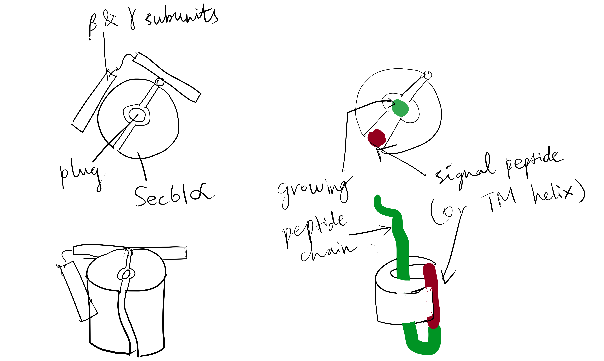
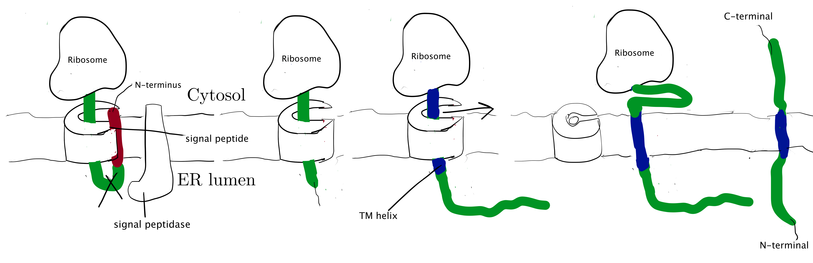
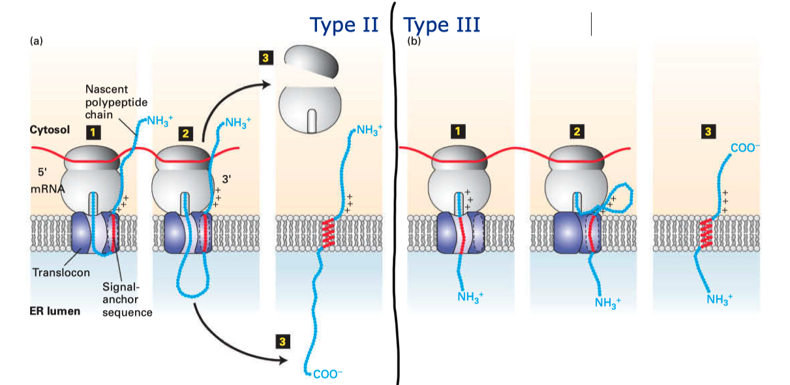
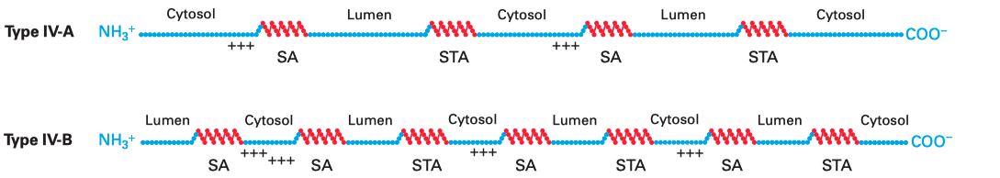
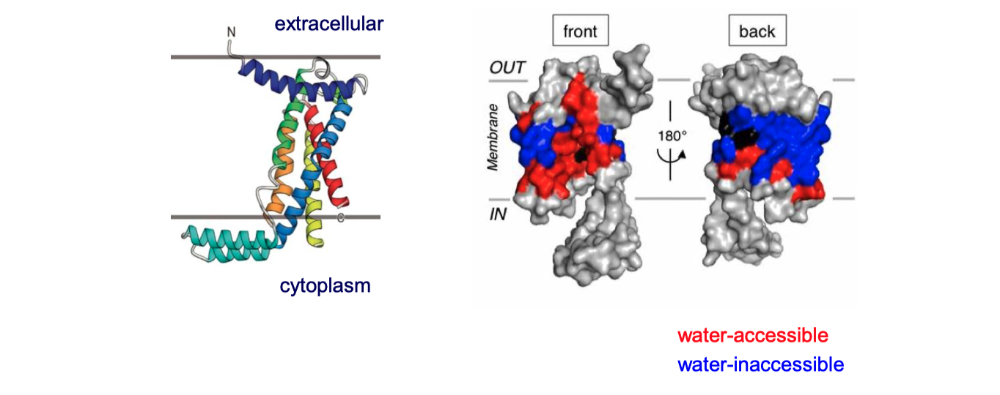
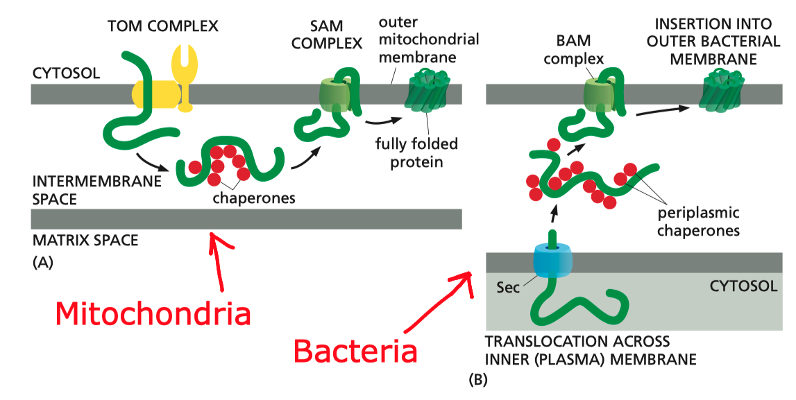
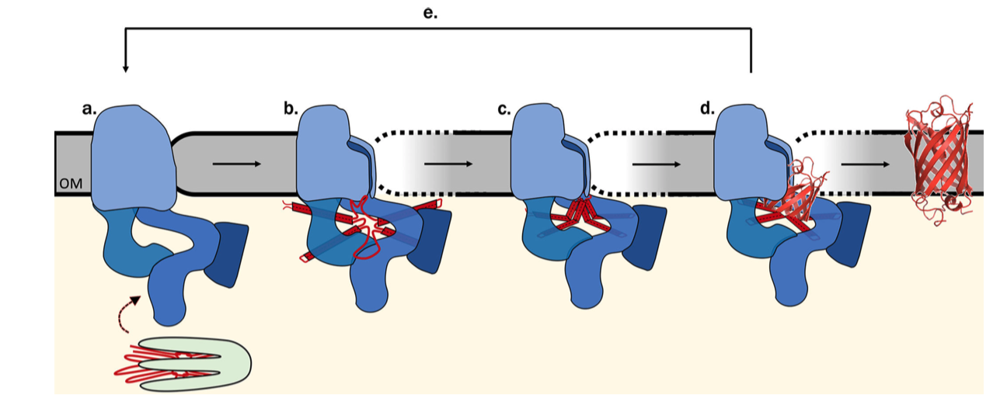

The majority of integral membrane proteins in an eukaryotic cell are made of one or more $\alpha$-helices and are first inserted co-translationally via the Sec61 translocon into the endoplasmic reticulum (ER) membrane, assembled there, and then dispatched, via the golgi apparatus and vesicles, to their final destinations. Bacteria use the SecYEG translocon, which is a homolog of Sec61, to insert membrane proteins into their plasma membrane. There are also translocons specific to chroloplasts (TIC-TOC), mitochondria (TIM-TOM) and peroxisomes (PEX), but this essay will focus on the Sec61 translocon.

# Targeting the Protein to the ER Membrane: SRP and the Sec61 Translocon

The common co-translationally inserted membrane proteins are targeted to the Sec61 translocon on the ER membrane via the cytosolic signal recognition particle (SRP) and the SRP receptor near the translocon.

SRP is a ribonucleoprotein particle made up of 6 proteins bound to a 300-nucleotide RNA acting as a scaffold. The M and Alu domains of SRP are critical for its functions. The M domain contains a cleft whose inner surface is lined by methionine and other hydrophobic side chains. This cleft binds to a hydrophobic segment of the nascent peptide as soon as it emerges from the exit tunnel. Meanwhile, the Alu domain blocks the elongation factor 2 (eEF2) binding site on the ribosome, pausing translation.

Usually it is the first hydrophobic segment that is recognised by SRP. This segment can either be a pure ER-targeting signal sequence or be the first TM helix itself (see next section). Recognition by SRP not only serves to target the ribosome-nascent protein to the ER but also prevents exposure of the hydrophobic segment to the aqueous environment.

SRP and SRP receptor each has a GTP binding site. When their GTP-bound forms associate with each other, they form two GTPase active sites. The GTPase activity is inhibited by signal peptide binding. Once the nascent chain has left SRP and enters the translocon, the two GTP molecules are hydrolysed, causing dissociation of SRP and its receptor. GTP replaces GDP on both proteins, and they are ready to initiate another round of ER targeting.

The Sec61 translocon is made up of 3 subunits: Sec61$\alpha$, an integral membrane protein composed of two 5-helix bundles that constitutes the central channel and two smaller proteins, Sec61$\beta$ and Sec61$\gamma$. The central channel through Sec61$\alpha$ is sealed by a plug made of a helical peptide that only opens during traslocation. The channel can also open laterally by hinging apart the two 5-helix bundles to expose a hydrophobic binding pocket for signal sequences and/or TM helices of the nascent peptide. The verticle opening allows elongation of the nascent peptide chain through the central pore, and the lateral opening allows attachment of signal sequences and exit of TM helices into the membrane (Figure \@ref(fig:sec61)).

```{r sec61, echo=FALSE, fig.cap="The structure and mode of action of the Sec61 translocon. Left: the closed conformation. Right: the open conformation.", out.width="100%"}

```

# Single-Pass Proteins

A single-pass membrane protein use a single 20-25 residue long $\alpha$-helix made mainly of hydrophobic amino acids to traverse the membrane. The $\alpha$-helical structure satisfies hydrogen bonding between main chain carbonyl and amino groups and exposes hydrophobic side chains, which form favourable hydrophobic interactions with the aliphatic core of the membrane bilayer. Co-translational insertion of this helix is a natural strategy to minimise unfavourable interation between the hydrophobic helix and the aqueous cytosolic environment and between the hydrophilic regions of the peptide surrounding the helix and the hydrophobic core of the bilayer.

Single-pass proteins are classified into three types according to the mechanism by which they are inserted. All of them are described in the following sections.

## Type I Proteins

Type I membrane proteins, like soluble proteins to be translocated into the ER lumen, contain an N-terminal ER-targeting signal sequence to be cleaved. The signal sequence is recognised by SRP, causing the ribosome-nascent peptide complex to be targeted to the Sec61 translocon. Sec61$\alpha$ opens the lateral gate, and the signal peptide fits into the exposed hydrophobic bindng pocket. The sequence following the signal peptide displaces the plug and inserts into the central channel, resulting in the conformation shown in Figure \@ref(fig:mem-insert-type-i). Signal peptidase cleaves off the signal peptide once it recognises a specific sequence on the C-terminal end of the signal peptide. After cleavage, translation continues and the newly synthesised sequence is threaded through the channel and enters the ER lumen, until another hydrophobic segment is encountered. This segment is the TM helix of the nascent protein, and it acts as a *stop-transfer signal* (or "stop-transfer anchor sequence") by triggering the lateral opening of Sec61$\alpha$ and thus allowing this helix to move into the membrane. The C-terminus continues to be synthesised and loops out on the cytosolic side of the membrane. Eventually, the hydrophic N- and C- termini are on the luminal and the cytosolic face, respectively.

```{r mem-insert-type-i, echo=FALSE, fig.cap="Insertion of type I membrane proteins.", out.width="100%"}

```


## Type II and III Proteins

Type II and III proteins do not contain a cleavable signal sequence, and they have opposite orientations: the N-terminus is on the cytosolic and the luminal face in type II and type III proteins, respectively.

Type II and III proteins use the sequence of their TM helix as an ER-targeting signal ("start-transfer singal", or "signal anchor sequence"), and the targeting is also mediated by SRP and SRP receptor. The distribution of positively charged residues around the helix dictates its orientation: the positively charged residues tend to remain on the cytosolic side of the membrane, thus in type II proteins where the N-terminal side has more positively charged residues, the helix adopts the orientation with the N-terminus facing the cytosolic side; and in type III proteins where the C-terminal side has more positively charged residues the opposite orientation is adopted (\
Figure \@ref(fig:mem-insert-type-iii-iii) ).

(ref:ii-iii) Insertion of type II and III membrane proteins. In type II proteins, the orientation of the signal anchor sequence in the hydrophibic binding pocket of the laterally opened Sec61$\alpha$ results in the opening of the pore in the vertical direction (in the same way as type I proteins, but the signal peptide is not cleaved off), allowing the remaining C-terminal portion of the polypeptide to thread through the pore and enter the ER lumen. In type III proteins, the orientation of the signal anchor sequence causes the channel to close, and the C-terminal portion is synthesised in the cytosol.

```{r mem-insert-type-iii-iii, echo=FALSE, fig.cap="(ref:ii-iii)", out.width="100%"}

```

# Multi-Pass Proteins

Multi-pass membrane proteins (a.k.a. type IV proteins) contain more than one TM $\alpha$ helices and traverse the membrane multiple times. Since the adjacent helices are in opposite orientations, insertion of multipass membrane proteins can be viewed as an alternation of insertion of a type I helix and insertion of a type II helix, which is dictated by the TM helix sequences that alternatingly act as start-transfer signals (signal anchor sequences) and stop-transfer signals (stop-transfer anchor sequences).

In multipass proteins with N-terminus in the cytosol (type IV-A), the TM helix sequence that first emerges from the ribosome (the one closest to the N-terminus) functions in the same way as the start transfer sequence (signal-anchor sequence) of the type II protein, which interacts with SRP to target the protein to the translocon, opens the translocon channel, and allow growing polypeptide chain to pass through the channel. Unlike type II proteins, as the chain grows, the translocon will encounter another hydrophobic TM helix sequence, which then functions as the stop-transfer signal (stop-transfer anchor sequence) in the same way as in type I proteins: the channel is closed, and this helix is moved via the lateral gate to the bilayer, and the nascent chain continues to grow into the cytosol. If a third TM helix sequence is encountered, it will function as another type II-like start-transfer signal, but this time the insertion does not depend on SRP and SRP receptor. This cycle continues until translation completes.

The insertion of multipass proteins with N-terminus in the ER lumen (type IV-B) occurs in a similar manner. The only difference is the first TM helix sequence, which now functions in the same way as the start-transfer sequence of the type III protein, resulting in a closed translocon and the growing peptide to be synthesised in the cytosol. Then, the second, third, fourth TM helix sequences functions in the same way as the first, second, and third TM helix sequences in a type IV-A protein and so on.

```{r type-iv-a-b, echo=FALSE, fig.cap="Multipass membrane proteins have multiple TM helices which alternatingly function as start-transfer signals (signal-anchor sequences, SA) and stop-transfer signals (stop-transfer anchor sequences, STA). The distribution of charge usually follows the same rule as in type II and III proteins, so that in the final conformation, the cytosolic side has more positively charged residues overall.", out.width="100%"}

```

# Insertases

Some membrane proteins are inserted into the lipid bilayer via Sec-independent mechanisms, which are mediated by factors generally termed 'insertases'. The bacterial (YidC), mitochondrial (Oxa1),  and chrloroplast (Alb3) insertases are evolutionarily related, whereas the ER membrane contains 3 seemingly unrelated insertases: Get1/2 complex, the ER membrane-protein complex (EMC), and TMCO1.

## Insertion of Tail-anchored Proteins by the Get system

Tail-anchored proteins also use an $\alpha$-helix to traverse the membrane, but this helix is located near the C-terminus. Because there are only few, if any, residues succeeding the C-terminal helix, translation terminates while the helix have not yet emerged from the exit tunnel, so recognition by SRP is not possible, and its insertion into ER membrane depends on a post-translational pathway involving Get1, Get2, and Get3 proteins.

In this pathway, the protein is completely synthesised and released into the cytosol. ATP-bound Get3 binds to the hydrophobic C-terminal tail of the protein (facilitated by some other proteins), and then docks onto the dimeric Get1/Get2 receptor on the ER membrane. Accompanying the hydrolysis of ATP by Get3, the Get1/Get2 complex facilitates the insertion of the tail into the ER membrane. Finally, ATP displaces ADP and Get3 is released back to the cytosol.

## The Roles of YidC

YidC contains 5 TM helices arranged to form a partially hydrophilic groove that is open towards both the lipid bilayer and the cytosol (Figure \@ref(fig:yidc)). Cross-linking experiments suggest that this groove operates as a binding site for TM helices (of the protein to be inserted). YidC alone can mediate insertion of a small subset of small (single- or double-pass) proteins in either co-translationally or post-translationally, and it is also suggested that YidC may act as a chaperone in conjunction with the Sec translocon. Specifically, it may shield the hydrophilic surface of TM helice that line polar cavities/channels in the final structure.

(ref:yidc) The structure of *Bacillus halodurans* Yidc.

```{r yidc, echo=FALSE, fig.cap="(ref:yidc)", out.width="100%"}

```


# $\beta$-barrel Proteins

In Gram-negative bacteria, intergral OM (outer membrane) $\beta$-barrel proteins (OMPs) are translocated in an unfolded form across the IM (inner membrane), ferried to the OM via periplasmic chaperones, and integrated into the OM by the $\beta$-barrel assembly machine (Bam) multiprotein complex.

In mitochondria, the precursors of nucleus-encoded $\beta$-barrel proteins are transferred from the TOM complex, with the help of chaperones, to the SAM (sorting and assembly machinery) complex. The SAM complex, being homologous to the Bam complex, mediates the assembly and insertion of $\beta$-barrel proteins in a similar manner (Figure \@ref(fig:insert-beta-barrel)).

(ref:beta) Insertion of $\beta$-barrel proteins into bacterial or mitochondrial outer membrane.

```{r insert-beta-barrel, echo=FALSE, fig.cap="(ref:beta)", out.width="100%"}

```

The exact mechanism of assembly and insertion is not fully understood, but a recent proposed mechanism is shown in Figure \@ref(fig:insert-beta-barrel-mech) [@Ricci-2019].

(ref:mech) **Proposed Bam-assisted assembly and insertion of $\beta$-barrel proteins.** **(a)** Unfolded precursor protein (red) stablised by chaperons (green) are transferred to the Bam complex (blue). **(b)** The five periplasmic POTRA domains of BamA is thought to nucleate the early formation of OMP secondary structure and, together with Bam lipoproteins, form a ring that act as a scaffold for the client protein. The hydrogen bonds between the $\beta$-1 and $\beta$-16 strands of BamA are metastable, allowing transient lateral opening of the barrel through this seam. **(c)** The Bam complex prevents aggregation, protects the client protein from proteolysis, and lowers the kinetic barrier to OM integration to accelerate OMP folding along the native pathway, **(d)** Bam destabilises the membrane locally, which facilitates the insertion of the client protein into the membrane. **(e)** The folded client protein is released into the membrane, and the Bam complex restores to its idle state.

```{r insert-beta-barrel-mech, echo=FALSE, fig.cap="(ref:mech)", out.width="100%"}

```

# References