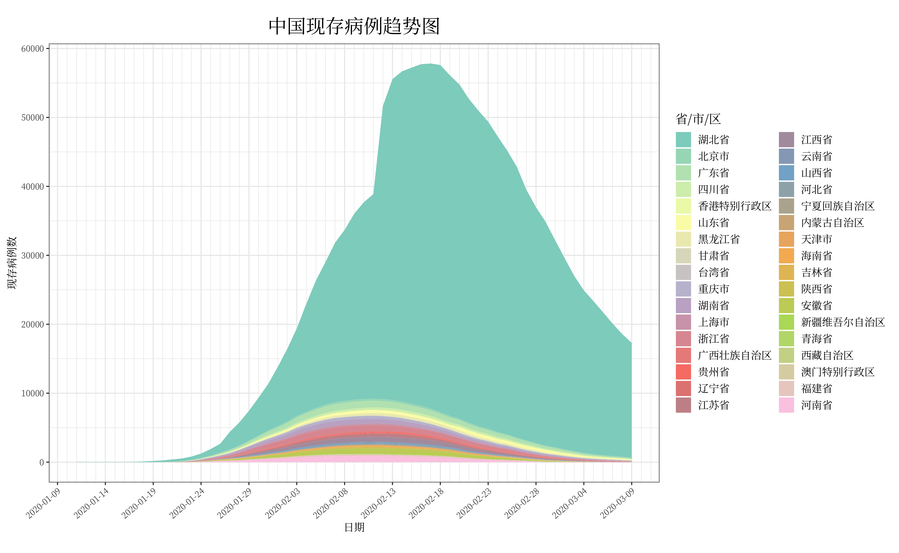
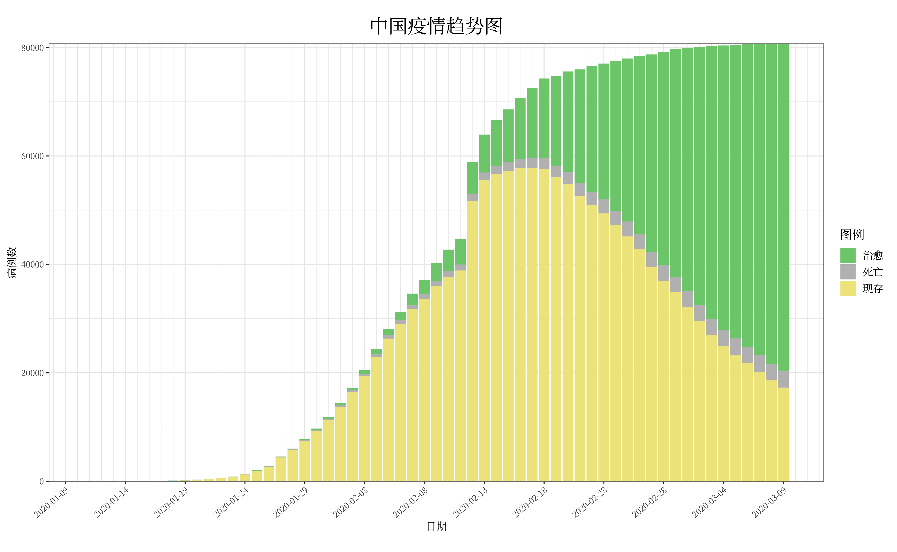
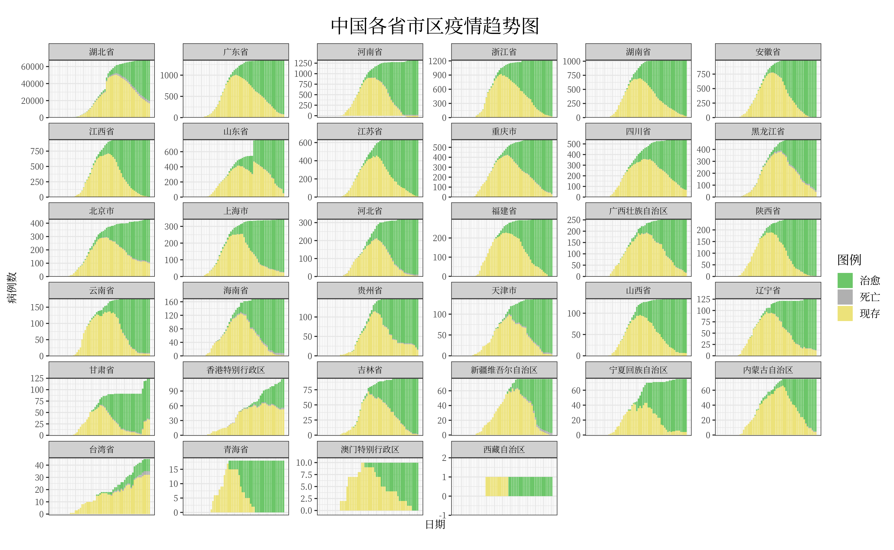
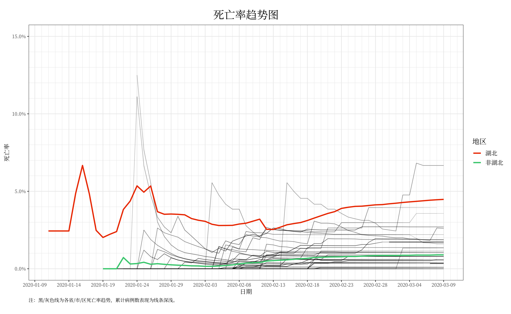
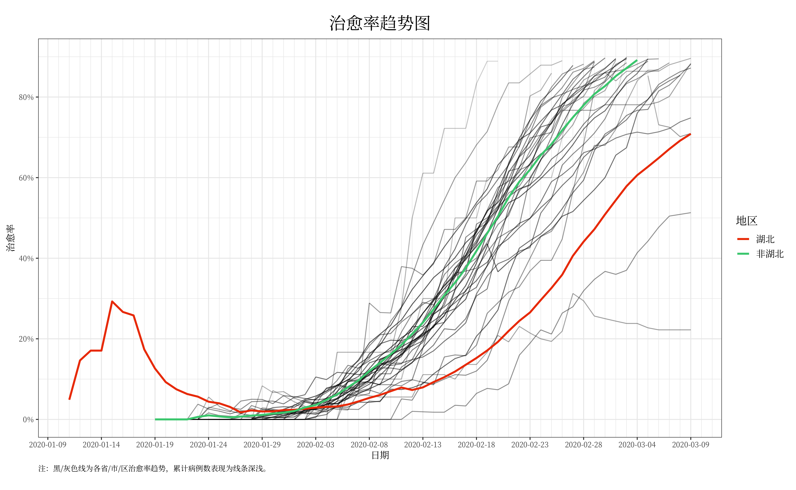

```{r include=FALSE}
knitr::opts_chunk$set(out.width = '100%')
```

# About the virus

See [Wikipedia](https://en.wikipedia.org/wiki/2019–20_outbreak_of_novel_coronavirus)

# Statistics

<details><summary>Source Code</summary>
<p>

```{r eval=FALSE}
library(tidyverse)
library(lubridate)
library(scales)
library(RColorBrewer)
library(maps)
library(mapdata)
library(maptools)

if('content' %in% dir()){setwd('content/special/data')}

source('ncov_commons.R')

# read data ---------------------------------------------------------------

read_ncov <- function(sheet, caseType, fn = 'wuhan.xlsx'){
  readxl::read_excel(fn, sheet = sheet) %>%
  replace(is.na(.), 0) %>% 
  mutate(date = as_date(date)) %>% 
  mutate_at(-1, cumsum) %>% 
  gather(location, !!caseType, -1) %>% 
  mutate(location=as_factor(location))
}

calc_ncov_params <- function(df){
  mutate(df,
         current = all-death-cure,
         deathRate = death/all,
         cureRate = cure/all)
}

ncov <- read_ncov('incidence-wiki', 'all') %>% 
  left_join(read_ncov('death-wiki', 'death')) %>% 
  left_join(read_ncov('cure-wiki', 'cure')) %>% 
  calc_ncov_params()

ncovByHubei <- 
  bind_rows(
    ncov %>% # hubei
      filter(location=='湖北省') %>% 
      select(-location) %>% 
      add_column(type='湖北'), 
    ncov %>% # non-hubei
      filter(location!='湖北省') %>% 
      group_by(date) %>% 
      summarise(all = sum(all, na.rm = TRUE),
                death = sum(death, na.rm = TRUE),
                cure = sum(cure, na.rm = TRUE)) %>% 
      calc_ncov_params() %>% 
      add_column(type='非湖北')
    )


typeColorPairs = c(cure='palegreen3', death='grey', current='khaki')

hubeiContrastColor = c(湖北="orangered2", 非湖北='seagreen3')

{ # death and cure rates
ncov %>% 
  ggplot(aes(date, deathRate))+
  geom_line(aes(group=location, alpha=log(current)))+
  geom_line(data = ncovByHubei, aes(color=type), size=1.1)+
  scale_alpha_continuous(guide=FALSE)+
  scale_y_continuous(limits = c(0,0.15), minor_breaks = seq(0, 0.15, 0.01), labels = scales::percent)+
  theme_default+
  dateScale+
  labs(title='死亡率趋势图', x='日期',y='死亡率',
       color = '地区',
       caption = '注：黑/灰色线为各省/市/区死亡率趋势，累计病例数表现为线条深浅。')+
  scale_color_manual(values=hubeiContrastColor)

ggsave('img/china_death_rate.png', width = 13, height = 8)

ncov %>% 
  ggplot(aes(date, cureRate))+
  geom_line(aes(group=location, alpha=log(current)))+
  geom_line(data = ncovByHubei, aes(color=type), size=1.1)+
  scale_alpha_continuous(guide=FALSE)+
  scale_y_continuous(limits = c(0,0.9), breaks = seq(0,0.8,0.2), labels = scales::percent)+
  theme_default+
  dateScale+
  labs(title='治愈率趋势图', x='日期',y='治愈率',
       color = '地区',
       caption = '注：黑/灰色线为各省/市/区治愈率趋势，累计病例数表现为线条深浅。')+
  scale_color_manual(values=hubeiContrastColor)

ggsave('img/china_cure_rate.png', width = 13, height = 8)
}

{ # 治愈死亡现存趋势
(p <- ncov %>%
  mutate(location = fct_reorder(location, -all, min)) %>% 
  select(-all) %>% 
  gather(type, cases, 3:5) %>% 
  mutate(type=factor(type, levels=names(typeColorPairs)))%>% 
  ggplot(aes(date, cases, fill=type))+
  geom_col()+
  scale_fill_manual(labels=c('治愈','死亡','现存'), values = typeColorPairs)+
  labs(title = '中国疫情趋势图', fill = '图例', x='日期', y='病例数')+
  theme_date+
  dateScale+
  scale_y_continuous(expand = c(0, 1))
)

ggsave('img/china_cure_death_current_all.png', width = 13, height = 8)

p + facet_wrap(~location, scales = 'free_y')+
  theme(axis.ticks.x = element_blank(),
        axis.text.x = element_blank())+
  labs(title = '中国各省市区疫情趋势图', fill = '图例')

ggsave('img/china_cure_death_current_facet.png', width = 13, height = 8)
}

{ # 现存
ncov %>% 
    ggplot(aes(date, current, fill=fct_reorder(location, -current, last)))+ 
    geom_area(position = position_stack())+
    dateScale+
    theme_date+
    fill_province+
    scale_y_continuous(breaks = seq(0, 70000, 10000))+
    labs(fill='省/市/区', x = '日期', y='现存病例数', 
         title = '中国现存病例趋势图')
ggsave('img/china_current.png', width = 13, height = 8)
}

setwd('../../..')
```

</p>
</details>

## Number of cases reported by the government

```{r echo=FALSE}

```

## Incidence, Death and Cure Over Time


```{r echo=FALSE}

```

```{r echo=FALSE}

```

## Death and Cure Rates 

```{r echo=FALSE}

```

```{r echo=FALSE}

```