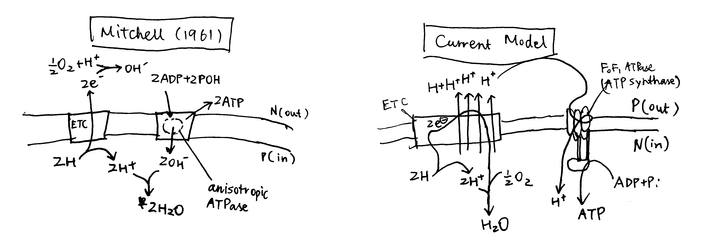
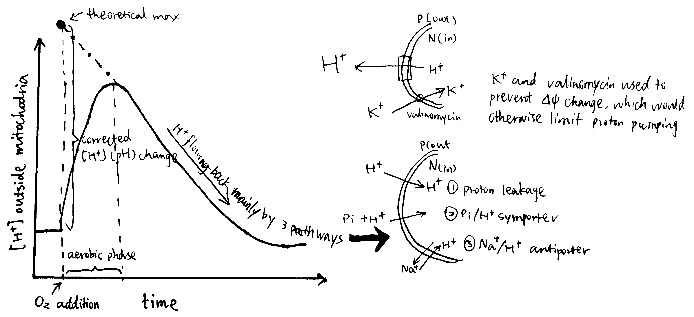
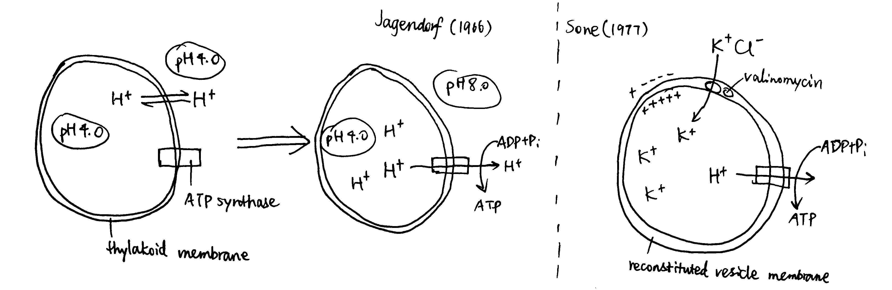

```{r include=FALSE}
knitr::opts_chunk$set(out.width = '100%')
```


# SAQ

<p class="topic">**Explain the difference between electrochemical gradient, pH gradient and membrane potentials. How can they be measured and how are these related to chemiosmotic mechanism.**</p>

The electrochemical gradient describes the difference in chemical stability of ions (typically protons),  between two aqueous compartments separated by a non-conducting and non-permeable membrane (typically a energy-transducing membrane such as mitochondrial inner membrane). It is quantified by the difference in Gibbs' free energy, $\Delta G$, or its molar equivalent, _chemical potential_, $\Delta\mu$, of the ion species (proton) between the two compartments.

Usually, electrochemical gradient is used in studying processes coupled with $\text{H}^+$ movement across a membrane, where one side is positively charged and has a high $\left[\text{H}^+\right]$ and the other side with -ve charge and low $\left[\text{H}^+\right]$. These are denoted by P and N sides, respectively, and the 'gradients' are often defined as the value of the corresponding parameter on the N side minus its value on the P side.

The electrochemical gradient is the sum of pH gradient (concentration gradient) and membrane potential (electrical gradient). 

pH gradient is the (log-transformed) difference in the concentration of protons, $\left[\text{H}^+\right]$, across the membrane. Protons tend to move down its concentration gradient to maximise the entropy of the whole system, and this tendency, i.e. potetial energy is the "chemical" part of the electrochemical potential. Intracellular/intra-orgenellar pH can be measured with pH-sensitive microelectrodes, nuclear magnetic resonance, or pH-sensitive fluorescent proteins [@Loiselle:2010]. Low-RMM weak acids and bases can equilibrate across the membrane independent of the membrane potential. When there is an pH gradient, however, weak acids accumulate in the basic compartment and bases in the acidic compartment, and this property is used to measure pH gradient. 

The membrane potential is the electrical potential difference across the membrane. According to Coulomb's law, postively charge protons is repelled by the positively charged P side while attracted towards the N side, and this also results in a potential energy, which adds to the electrochemical gradient as the "electro-" part. Membrane potential is measured with microelectrodes.

Considering only the effect of concentration and electrical potential, the electrochemical potential for the proton on either side is defined as follows:

$$\bar{\mu}_{\text{H}^+} = \bar{\mu}_{\text{H}^+}^\circ + RT\ln\left[{\text{H}^+}\right] + z_{\text{H}^+}F\Psi$$

where $\bar{\mu}_{\text{H}^+}^\circ$ is the chemical potential under standard states, $RT\ln\left[{\text{H}^+}\right]$ and $z_{\text{H}^+}F\Psi$ are the additional chemical potential due to concentration and electrical potential, respectively.

The electrochemical gradient is the difference of the electrochemical potential between two compartments:

$$\Delta\bar{\mu} = \bar{\mu}_{\text{N}} - \bar{\mu}_{\text{P}} = \left(RT\ln\left[{\text{H}^+}\right]_{\text{N}} + z_{\text{H}^+}F\Psi_{\text{N}}\right) - \left(RT\ln\left[{\text{H}^+}\right]_{\text{P}} + z_{\text{H}^+}F\Psi_{\text{P}}\right)$$

$$ = -\ln{10}RT\left(\text{pH}_\text{N}-\text{pH}_\text{P}\right) + F(\Psi_{\text{N}}-\Psi_{\text{P}})=F\Delta\Psi- 2.3RT\Delta\text{pH} \text{  (J mol}^{-1}\text{)}$$

or it can be expressed as 'protomotive force' in (milli)volts:

$$\Delta\text{p}=\Delta\Psi-\dfrac{2.3RT}{F}\Delta\text{pH}$$


# Essay

<p class="topic">**What is the evidence that the chemiosmotic mechanism applies to oxidative phosphorylation and photophosphorylation?** <br><sub>*The essay MUST be equipped with at least 3 annotated diagrams and the length should be 1500-1750 words. Remember to include at least one KEY experimental evidence in the essay.*</sub></p>

## Clues leading to the original chemiosmosis hypothesis

The mechanism of oxidative phosphorylation were initially thought to be analogous to substrate-level phosphotylation, that the redox reactions create 'high-energy' intermediates, which in turn adds P~i~ to ADP. In 1961, Peter Mitchell listed 6 facts to question this chemical mechanism hypothesis:

1. The 'high-energy' intermediate is not found.
2. The close association between phosphorylation and membranous structrures is not explained.
3. P/O ratio varies--it does not follow a fixed stoichiometry.
4. ATP hydrolysis outside mitochondria promotes NAD reduction inside, accentuated by succinate oxidation. (this observation is probably irrelevant or wrong?)
5. Uncoupling can be caused by reagents with distinct chemical properties--so they are unlikely to act on a single 'intermediate'.
6. Unexplained swelling and shrinkage accompany phosphorylation.

Trying to explain these phenomena, he proposed his initial chemiosmosis mechanism, with following 3 features:

1. A membrane located, reversible and anisotropic 'ATPase'
2. An electron and hydrogen translocation system
3. A charge impermeable membrane 

According to this model, oxidation of substrates does not occur in a single compartment, but it instead allow protons and electrons to go in different directions, which in turn creates a concentration gradient of H^+^ and OH^-^, as well as a membrane potential. ATP synthesis is driven by the one-way movement of OH^-^ down its electrochemical gradient.

Mitchell's origin model was rather different from the current model, as depicted in figure \@ref(fig:mitchell1961), but it provided decent explanations for the phenomena listed above. (In his later review [@Mitchell:1966], there were some amendments made on his original model, but I have no time to read it)

```{r mitchell1961, echo=FALSE, fig.cap="Left, Mitchell's original chemiosmosis model; right, the current model"}

```

The principal idea was that, energy released from 'asymmetric' redox reactions can be used to establish a rather 'physical' form of energy (not the common chemical bond energy), the electrochemical gradient, and this is the first coupling. The second coupling is between the synthesis of ATP and the vectorised diffusion of some species promoted by the electrochemical gradient established by the first coupling.

It should be noted that the conception of first coupling was not new. Before the 1960s, it was known that redox reactions can create a electrical potential between two compartments, and it had been noted that some inhibitors of ion transport also has an effect (either stimulatory or inhibitory) on respiratory rate [@Robertson:1960] (Fig. \@ref(fig:fig1)).

```{r fig1, echo=FALSE, fig.cap="Correlation between the effect on oxygen uptake and on ion accumulation of some inhibitors"}
knitr::include_graphics('img/chemiosmosis-inhibitor.png')
```

## Proving proton pumping by the redox chain and determining H^+^/O ratio

The 'first coupling' of the current chemiosmosis model means the pumping of protons into the P compartment powered by stepwise redox reactions along the ETC, with the overall oxidation of NADH or FADH~2~ as substrate by molecular oxygen.

In actively respiring mitochondria, the proton concentrations (i.e. pH) on either side of the membrane is constant because the rate at which protons are pumped into the P compartment and that flowing back to the N compartment are equal. This makes it difficult to detect the presence of proton flux.

@Mitchell:1967a devised the following procedure to solve the problem (Fig. \@ref(fig:mitchell1967a)):

1. mitochondria are incubated in anaerobic conditions, allowing H^+^ to equilibrate (i.e. making $\Delta p$ fall back to zero)
2. a pH-sensitive glass electrode is used to monitor pH of the suspension (i.e. the environment outside the mitochondria)
3. a known quantity of O~2~ is introduced into the suspension by 'injecting pulses of air-saturated 150mM KCI solution.'
4. by measuring the pH change, the amount of protons pumped out of the mitochondria can be calculated, and with the known amount of O~2~, the H^+^/O ratio can be calculated. 

```{r mitchell1967a, echo=FALSE, fig.cap="Determining H/O ratio (Mitchell 1967a)"}

```

Additional procedures are needed to minimise error, and they're described in *Bioenergetics* pp59-60

## Proving the ATP synthesis is driven by the electrochemical gradient

The electrochemical gradients is the sum of concentration gradient and electrical potential gradient, and each of them are shown to drive ATP synthesis.

@Jagendorf:1966 showed ATP synthesis can be induced in dark, by artificially creating a pH difference across the thylakoid membrane in chloroplasts (Fig \@ref(fig:Sone)). In this experiment, broken chloroplasts (extracted from spinach) are first incubated in an acidic solution, allowing the thylakoid space to achieve the enviornmental pH of 4.0 (different acids are used to verify its non-specificity). Next, chloroplasts are exposed to pH 8.0 to develop the proton gradient across the thylakoid membrane. While moving out from the thylakoid space, protons drive ATP synthase. The amount of ATP produced is then determined by firefly luciferase assay. By repeating with different pHs, the authors concluded that the rate of ATP synthesis is positively correlated with the pH difference between two phases.

@Sone:1977 used reconsitituted vesicles, made from purified $\text{F}_o\text{F}_1$ complex and the membrane of a thermophilic bacterium, to achieve ATP synthesis by induced membrane potential (Fig \@ref(fig:Sone)). They first incubated mitochondria with valinomycin at a fixed pH, then exposed the suspension to KCl. Valinomycin-mediated entry of K^+^ shifts the membrane potential so the vesicle interior becomes more positively charged. Consequently, H^+^ moves out and drives ATP synthase.

```{r Sone, echo=FALSE, fig.cap="Left, Jagendorf (2016); right, Sone (1977)"}

```

## Monitoring the protomotive force and proton flux in different conditions

If the chemiosmotic model is corrent, it will have some properties resembling those of an electric circuit--the current ($I$) and electromotive force ($V$) are mirrored by the proton flux ($J_{\text{H}^+}$) and the protomotive force ($\Delta\text{p}$), respectively. These two terms can be monitored in different states of the proton circuit, and the results are in accordance with the chemiosmotic model.

```{r circuit-analogy, echo=FALSE, fig.cap="Circuit Analogy. Top left, proton gradient; top right, oxygen concentration, whose gradient reflects proton flux; below, illustrations of each numbered state."}
knitr::include_graphics('img/circuit_analogy.jpg')
```

The different states shown in Fig \@ref(fig:circuit-analogy) are explained below:

1. When ETC substrate is absent, there is absolutely no oxygen consumption. No active forces act protons so they are allowed to equilibrate, and therefore the $\Delta\text{p}$ is zero. This resembles an electrical circuit without a power source.
2. When substrate (e.g. succinate) is provided, it is oxidised by ETC and oxygen is consumed. ETC starts to pump H^+^ into the P face, building up the electrochemical gradient If the membrane was perfectly impermeable to H^+^, ETC would quickly stop as its provided energy for proton efflux balances the electrochemical gradient which favours protons' influx, and there would be no oxygen consumption. However, the membrane is 'leaky' (and there are other processes causing influx of H^+^), causing constant influx of H^+^, which in turn allows H^+^ to be steadily, but slowly, pumped to the P face, which is accompanied by oxygen usage. This resembles more of a closed circuit where energy is dissipated slowly through a high-resistance resistor than of an 'open circuit' as described in some books.
3. When ADP is added, ATP synthase can use the proton gradient to synthesise ATP. The proton flux through ATP synthase is huge, so the oxygen concentration (whose gradient parallels proton flux) decreases steeply. (I can't give an rigorous mathematical explanation on the decrease of $\Delta\text{p}$)
4. ATP is used up, and the condition is identical to state 2.
5. FCCP short-circuits the proton circuit by allowing H^+^ quickly flowing back to the N face without doing 'useful work' (driving ATP synthase). The proton influx is so large that it outstrips the maximal efflux powered by ETC, so $\Delta\text{p}$ quickly falls back to zero. 

## Lateral proton current?

The widely accepted view that ETC pumps protons transversally from the N to the P face may need updating for the following reasons stated by @Morelli:2019:

1. H^+^ almost never exist as isolated protons. Instead, they bind to water to form H~3~O^+^. Free protons in a mitochondrial periplasmic space are too few (fewer than 10) to drive ATP synthase.
1. Free protons are destructive for biological membranes
1. The pH inside mitochondria was shown to be higher by 0.5 units from what was previously believed [@Zurawik:2016]
1. Phospholipid membranes are intrinsically (significantly) permeable to protons

According to the classic view of proton pumping, complex I should have a continuous channel traversing the membrane. However, based on comprehensive X-ray studies, the 'proton entrance half channel' is not identified with certainty, while the 'proton exit half channel' is clearly identifiable, and an obvious proton tunnelling is found at the centre of complex I. This leads to an lateral mechanism of proton circuiting, as shown below:

```{r Morelli2019, echo=FALSE, fig.cap="A possible lateral proton circuit suggested by Morelli (2019)."}
knitr::include_graphics('img/Morelli2019.png')
```


# Bibliography