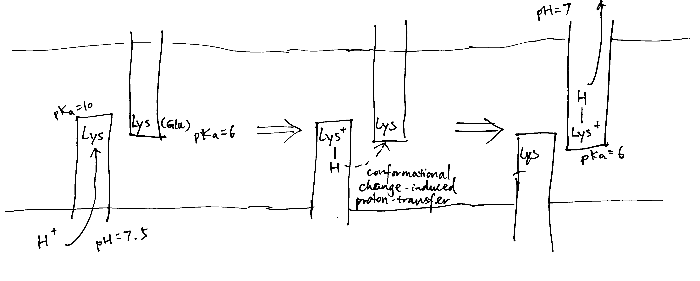

```{r include=FALSE}
knitr::opts_chunk$set(fig.align = 'c', out.width = '100%')
```

# SAQ

**Using the physical chemistry principles, discuss factors which are contributed in the favourability of an electron transfer reactions between cofactors.**

The reduction potential, $E$, is used to quantify favourability of gaining electrons (getting reduced). $E^{\circ\prime}$ is the reduction potential measured under biological standard conditions (i.e. pH = 7, oxidised and reduced species are 1M, 298K and 1 atm). When concentrations of the oxidised and reduced species differ:

$$E=E^{\circ\prime} + \dfrac{RT}{zF}\ln\left(\dfrac{\text{[reduced]}}{\text{[oxidised]}}\right)$$

For two half equations, A^+^ + $e^-\rightarrow$ A and $\text{B} + e^- \rightarrow$ B^-^ with $E$ of $x$ and $y$ respectively, a full reaction equation can be constructed, which can be A^+^ + B^-^ $\rightarrow$ A + B (with $E_\text{r}$ = x - y) or the reverse (with $E_\text{r}$ = y - x); the one with positive $E_\text{r}$ (reaction potential) will actually occur.

Electron transfers occur because electrons are moving down to a lower energy level. In simple cases, atoms with greater electronegativity have greater affinity for electrons and thus a more positive reduction potential, and _vice versa_. This is the case for strong oxidants F~2~ and Cl~2~ (electronegative; highly positive $E$) and strong reductants Li and Na (electropositive, highly negative $E$). In most cases, however, other factors, such as change in state, conformation, or interactions with water, will significantly affect the reduction potential. For example, Cu and Ag is less electronegative than hydrogen, but their monovalent ions are more easily reduced than H^+^. That is mainly because the formation of metallic solid upon reduction is highly exergonic. Similarly, although the atoms involved in the redox reactions in the repiratory chain are not variable (Cu and Fe), they have different $E$ due to the enviornment (e.g. proximity to the P/N face, identity of ligands).

The series of cofactors along the electron transport chain have a generally steadily increasing $E^{\circ\prime}$, so electrons are moved toward increasingly lower energy levels. There are some exceptions to this trend, but $E_\text{r}$ would be made positive in these cases by making a concentration difference (usually by means of 'pulling' from the next redox centre with favourable $E$).

While the thermodynamic feasibility of the redox reactions is solely determined by the difference in the reduction potentials (which is proportional to Gibbs free energy), the kinetics (rates) are affected by more factors. 

Electrons are passed from one centre to another by _tunnelling_. Specifically, the wave function for an electron in the donor shows there is a probability that the electron will be found at an acceptor some distance away. _Tunnelling_ is independent of temperature and orientation of chemical groups, but is instead influenced by 1) the distance between the electron donor and acceptor, 2) the redox potential difference, $E$, and 3) the 'reorganisation energy', $\lambda$.

Within each respiratory complex, the redox centres are close to each other—no more than 14Å apart (the maxium 14Å is found between N5 and N6a Fe-S clusters in complex I). Ubiquinone has binding sites in complex I (II) and III in close proximity to the redox centres from which it receives and to which it delivers electrons, and the same is true for cyt _c_ (which binds to complex III and IV). This arrangement makes the numerous electron transfer steps not the limiting factor in the respiratory chain.

# Essay

**What mechanisms are employed by mitochondrial electron transfer proteins to generate a proton-motive force (pmf)? Using the concept of membrane capacitance, explain why the dominant component of the pmf in mitochondria is an electrical potential rather than a pH gradient.**

## Two Proton Translocation Models: Loop and Pump

Mechanisms of coupling redox reactions to proton translocation can be classified into two models: the chemical loop, and the conformational pump.

In the loop model shown in Figure \@ref(fig:loop), the hydrogens (protons plus electrons) from the substrate (AH~2~) first reduce an mediator molecule (B) on the N side, and this mediator is reoxidised, forcing protons to be released to the P side via one pathway and electrons to flow back to the N side via another pathway. The electrons then reduce another species (C) using protons from the N side. This mechanism is employed in the respiratory chain, where ubiquinone serves as the 'mediator' molecule and ETC components from Rieske Fe-S protein in complex III to Cu~B~ centre in complex IV as the electron pathway. The number of protons translocated in this way has to follow a fixed stoichiometry (i.e. 1 proton per electron). (Not shown in this diagram, the reduction of Q near the N face driven by QH~2~ oxidation near the P face in the Q cycle is also an example of this mechanism.)

```{r loop, echo=FALSE, fig.cap='The loop model. Left, generic form; right, simplified example found in the respiratory chain.'}
knitr::include_graphics('../img/etc-mech-1.png')
```

The key idea of the pump mechanism is the conformational change driven by redox reactions. Conformational change can lead to alternating proton accessibility from the two faces and differential pKa values of proton binding sites, resulting in proton translocation (explained in Figure \@ref(fig:pump)). The number of protons pumped in this way does not have to follow a fixed stoichiometry within the thermodynamic constraints (i.e. _E_~r~/n must be greater than ∆p). This mechanism is thought to be employed in complex I and IV of the respiratory chain. However, recent studies have shown that complex IV may adopt a unique mechanism, as explained later in this essay.

```{r pump, echo=FALSE, fig.cap='The conformational pump mechanism. When the "pump" protein is reduced, the proton binding site is exposed to the N face and with high pKa, promoting proton binding; upon oxidation, the proton binding site is open to the P face, and pKa drops, promoting proton dissociation.'}
knitr::include_graphics('../img/etc-mech-2.jpg')
```

## Complex I

As shown in Figure \@ref(fig:3m9s), bacterial complex I (from *Thermus thermophilus*) comprises two domains. The hydrophobic, transmembrane domain (a.k.a. membrane arm) has a proton-translocating P-module and subunit NuoH. The hydrophilic domain (a.k.a. peripheral domain) has an NADH-oxidising dehydrogenase module (N-module) which feeds electrons to the electron-transferring chain of Fe-S clusters, and the connecting Q-module, which reduces ubiquinone. Mammalian mitochondrial complex I is similar in gross organisation and function, although it possesses more subunits.

```{r 3m9s, echo=FALSE, fig.cap='Annotated structure of bacterial complex I. PDB accession code: 3M9S'}
knitr::include_graphics('../img/3M9S.png')
```

### Hydrophilic domain (peripheral arm)

All FMN and the seven (bacteria have additional two redundant ones) Fe-S centres reside in the hydrophilic domain. FMN, which is located at the extremity of the hydrophilic arm, accepts two electrons from NADH~2~ and transfers them one by one to the nearest Fe-S centre (N3). Electrons then flow from N3 through a series of isopotential Fe-S centres and finally to N2, whose $E^\circ$ is significantly less negative (-100 mV) [@Sazanov-2006]. The ubiquinone is then reduced by two one-electron gaining from N2; the existence of at least two forms of semiquinone is identified by electron paramagnetic resonance. 

### Hydrophobic domain (membrane arm)

The hydrophobic domain comprises subunits NuoAHJKLMN, of which NuoLMN are homologous to bacterial Mrp Na^+^/H^+^ antiporters (characterised by the conserved 14 transmembrane helices).

At the centre of each antiporter-like subunit (NuoLMN), two transmembrane helices are 'broken' and each have a kink known as a 'π-bulge', and there is a lysine residue in this region (Glu407 for NuoM) critical to proton pumping, confirmed by mutagenesis studies. There are two symmetry-related plausible proton channels lined by hydrophilic/charged residues, one connecting the central lysine on one broken TM to the P face and the other connecting lysine of the other TM to the N face.

```{r lys, echo=FALSE, fig.cap='Plausible proton paths'}
knitr::include_graphics('../img/membrane-arm.png')
```


As shown in Figure \@ref(fig:proton-path), NuoL/M/N may work by using conformational changes (induced from the hydrophilic domain) to transfer a proton from the lysines on the helix with N half channel to the other lysine (or Glu in NuoM) on the helix with P half channel, and if the pK~a~s of the two lysines differ, this leads to unidirectional proton transport. This mechanism is in accordance with the general scheme shown in Figure \@ref(fig:pump).

```{r proton-path, echo=FALSE, fig.cap='Schematic diagram of proton translocation in complex I'}

```

The three antiporter-related subunits are thought to be responsible for the translocation of 3 protons per 2 $e^-$. An additional channel is found at the interface of subunits NuoN,K,J,A (according to @Efremov-2011 and @Sazanov-2015 or NuoH,J,K according to @Hirst-2013 and @Nicholls-2013) and they are thought to act together to pump another proton with a similar mechanism involving protonation/deprotonation of lysine.

### Coupling 

It is debated how the redox reactions in the hydrophilic domain triggers conformational change, and how this conformational change is transmitted along the hydrophobic domain.

Some features of the Fe-S centre N2 (the last Fe-S centre in complex I) led to hypotheses in which N2 plays a major role in pumping protons[^N2]^,^[^N22], but currently, the mainstream idea is that the initial conformational change in the hydrophilic domain is contributed mostly by the reduction of ubiquinone. 


[^N2]: In some papers [@Hirst-2013; @Verkhovskaya-2013] it was suggested that coupling of electron transport to movement of protons depends on the significantly exergonic reduction of the N2 centre by the roughly isopotential wire of Fe-S centres that delivers electrons from NADH, and the large E~m,7~ span from N3 to N2 must provide the majority of the driving force for the proton pumping events associated with reduction and reoxidation of N2. This may be incorrect, as newest measurements [@Sazanov-2015] of redox potentials of the full Fe-S series (N3-N1b-N4-N5-N6a-N6b-N2) shows that N3, N4 and N6 are about equipotential at about -250 mV, while N1b, N5 and N6b actually have lower potentials; and such an arrangement is claimed by @Roessler-2010 to be energy efficient.

[^N22]: The mid-point reduction potential of N2 is shown to be pH-dependent, so that E~acid~ > E~alkaline~, and indeed a proton binding site is present there: His226 in _Y. lipolytica_, and protons are more likely to bind when N2 is reduced. However, shifting the midpoint potential to a more negative and pH insensitive value by exchanging His226 with a methionine affected the functioning of complex I including proton pumping only marginally. [@Zwicker-2006]

As claimed by @Wirth-2016, reduction of ubiquinone is a two-step process, where the Q binding site cycles between a conformation that permits electron transfer (E-state), and a conformation that permits proton transfer (P-state) onto intermediates of ubiquinone. The conformational change associated with this controlled process is assumed to initiate proton translocation.

It was originally suggested that the horizontal HL helix (see Figure \@ref(fig:3m9s)) in NuoL could move horizontally like a piston to transmit conformational change along the hydrophobic domain[^HL], but now, after realising the similarity between NuoH and NuoL/M/N, it is thought that conformational changes associated with π-bulges in the mid-membrane parts are transmitted laterally to NuoN/M/L [@Nicholls-2013], and, as suggested by @Wirth-2016, this is achieved by electrostatic coupling in the central hydrophilic axis.

[^HL]: The alternative role of HL would be to stabilise ends of the helices while permitting movement of the middle hydrophilic axis.

As I mentioned last week [@Shi-2019], as there is no complete evidence demonstrating how complex I proton pump works, other hypotheses exists, including a radical one recently proposed by @Morelli:2019, which emphasises the elusiveness of the ‘proton entrance half channel’ (from the middle Lys to the N face) contrasted by the clarity of the ‘proton exit half channel’ (to the P face). Together with another piece of evidence that an obvious proton tunnelling is found at the centre of complex I, Morelli drafted an lateral mechanism of proton circuiting, as shown in Figure \@ref(fig:Morelli2019)

```{r Morelli2019, echo=FALSE, fig.cap="A possible lateral proton circuit suggested by Morelli (2019). Protons are only pumped from the middle to the P side, then trasferred through the hydrophilic heads of phospholipids to ATP synthase. After a complete turn in ATP synthase, protons move back through channelling in the middle of the membrane to complex I, but not to the N side"}
knitr::include_graphics('img/Morelli2019.png')
```

## Complex III (cyt _bc~1~_ complex)

Complex III is a homodimer, with each monomer consisting of three subunits: cytochrome b, the Rieske iron-sulfur protein, and cytochrome c1. Each monomer has two binding sites for ubiquinone, called Q^N^ and Q^P^, indicating their proximities to two opposite faces. 

Uniquinone oxidation and proton translocation is coupled in the Q cycle, as illustrated in Figure \@ref(fig:ciii).

```{r ciii, echo=FALSE, fig.cap="The Q cycle. Left, stage 1; right, stage 2."}
knitr::include_graphics('../img/complexIII.png')
```

In stage 1, QH~2~ binds to Q~N~ of one dimer and a Q binds to the Q~P~ of another dimer. The QH~2~ at Q~N~ is oxidised by two electron acceptors in two steps: the first electron is accepted by the Rieske iron-sulfur protein and passed though cytochrome c~1~ and finally to cytochrome c, and second other electron is accepted by cytochrome b, passed through its two hemes (b~H~ and b~L~) and finally to the Q at Q~P~ on the other monomer, forming semiquinone. The two protons of QH~2~ are released into the P face (the molecular details is unclear). 

In stage 2, the same process is repeated—one QH~2~ is oxidised to Q, its protons released and electrons passed 1) onto one cytochrome c and 2) to the other side—but this time the electron acceptor on the other side is semiquinone. Acceptance of an electron by semiquinone, and the addition of two protons from the matrix, produces QH2.


## Complex IV

Complex IV (cytochrome oxidase) accepts electrons from cytochrome c to reduce oxygen to water and pumps 2 electrons to the P face.

Previous X-ray studies suggested that complex IV exists as dimers with each monomer comprising 13 subunits [@Tsukihara-1996]. However, it was recently shown by @Zong-2018 that complex IV is actually a 14-subunit monomer, and dimerisation was an artifect due to the dissociation of NDUFA4 subunit during the detergent-based purification steps before crystallisation (NDUFA4 hampers dimerisation).

### Reduction of oxygen 

The key catalytic activities are found in subunit I and II, as shown in Fig. \@ref(fig:complexIV)

```{r complexIV, echo=FALSE, fig.cap='Schematic diagram of complex IV with emphasis on the electron-transport and catalytic activities of subunit I and II.'}
knitr::include_graphics('../img/complexIV.png')
```

Each cytochrome c first donates one electron to Cu~A~ located in the globular domain of subunit II. Cu~A~ is a binulear centre, but it undergoes one-electron redox reactions. The electron is then passed onto haem *a*, and then to haem *a*~3~-Cu~B~ binuclear centre, where an oxygen molecule is bound. 4 electrons from cyt c and 4 protons from the N phase are required to reduce one oxygen molecule to two water molecules. Cu~B~ has three His ligands, and the forth empty coordination site mediates oxygen reduction by holding the intermediates (its malfunction leads to generation of ROS). 

### Pump mechanism

For each pair of electrons, 2 H^+^ from N phase is consumed to make water and another 2 H^+^ is pumped intot he P phase.

According to a recent review by @Wikstrom-2018, the favoured charge-conpensation mechanism is as follows: (see Figure \@ref(fig:civ-p))

1. when an electron is transferred from haem *a* to the haem *a*~3~-Cu~B~ binulear centre (BNC), one proton from Glu242 is loaded onto the 'proton loading site' (PLS[^pls]). This is a purely electrostatic event (not acid-base, as pK~a~ of PLS is not high enough). 
2. reprotonated Glu242 transfers another proton to BNC, annihilating the -ve charge in BNC, so H^+^ on PLS can leave. There must be a barrier preventing H^+^ flowing back to the N side, which can be achieved by raising the energy of the transition state of proton transfer between the Glu242 and PLS.

[^pls]: Although the identity of PLS is uncertain, many studies indicates that it may be the A-propionate substituent of haem _a_~3~.

```{r civ-p, echo=FALSE, fig.cap='Charge-compensation mechanism of proton pumping in complex IV.', out.width='70%'}
knitr::include_graphics('../img/civ-p.png')
```

## Components of pmf in chloroplasts and mitochondria

In mitochondria, the major component of protomotive force ($\Delta p$) is the membrane potential ($\Delta \Psi$), while in chloroplasts it is $\Delta$pH. This is caused by the physiology of these organelles and the electrical properties of membranes.

In chloroplasts, when protons are being pumped into the thylakoid space, the developed membrane potential is balanced out by efflux of K^+^ and influx of Cl^–^ through voltage-gated channels, such as KEA3 K^+^/H^+^ antiporter and voltage-gated VCCN1 Cl^–^ channel, so it results in a pure pH difference. TPK3 was originally thought to be one of such channels but was recently shown to be not critical [@Hohner-2019]. There are not many enzymes in the thylakoid lumen, so a low pH is not unsafe. In addition, the high H^+^ concentration has regulatroy functions. [@Hohner-2019]

If mitochondria were allowed to develop such a pH difference (very basic matrix), this would denature the numerous enzymes, such as those involved in $\beta$-oxidation and TCA cycle, that operate inside the matrix. In mitochondria, there are not such ion channels to counteract change in $\Delta \Psi$, so proton translocation results in charge imbalance, leading to $\Delta \Psi$ change[^precise], and a significant membrane potential can be established with only minuscule amount of charge movement.This can be explained by the low capacitance of the membrane. Capacitance is the amount of charge separation needed to develop unit voltage difference, i.e.

$$C=\dfrac{Q}{V}$$

Given a constant $V$ ($\Delta \Psi$), lower capacitance means smaller charge difference is required to build up that voltage difference. 

Figure \@ref(fig:capacitance) shows a simple parallel-plate capacitor, which is analogous to mitochondrial inner membrane. 

```{r capacitance, echo=FALSE, out.width='70%', fig.cap="Illustration of a simple parallel-plate capacitor"}
knitr::include_graphics('img/capacitance.png')
```

The electrical capacitance of such a plate can be calculated as:

$$C = \dfrac{\epsilon A}{d}$$

where $\epsilon$ is the permittivity of the plate, $A$ is the surface area and $d$ is the distance separating charges. For mitochondrial inner membrane, although $\dfrac{A}{d}$ is large, $\epsilon$ is very small, so the overall capacitance is small.

#### A failed quantitative analysis

According to @Liang:2017, the cell membrane capacitance is aroud 10 mF/m^2^, and in the *Bioenergetics* book [@Nicholls-2013], the capacitance of the mitochondrial inner membrane takes the same valu. According to a model built by @Mannella-2013, one mitochondria with matrix volume of $9.6\times10^4$ nm^3 would have a inner membrane (cristae) surface area of $5.76\times10^6$ nm^2^.

With these values, to build up a $\Delta \Psi$ of -140 mV, the charge required is:

$$Q=CV=0.01\text{F m}^{-2} \times 5.76 \times 10^{-12}\text{m}^{-2}\times 0.14\text{V}=8.1 \times 10^{-15} \text{ C}$$

which corresponds to $8.1 \times 10^{-15}/96450=8.4 \times 10^{-20}$ moles of H^+^, or $8.4 \times 10^{-20}/(9.6\times 10^{-20})=0.875$ M (concentration), which is not realistic...

[^precise]: To be precise, when ∆p = 0, there is still (negative) membrane potential ($\Delta \Psi$), and H^+^ equilibrate under this $\Delta \Psi$, which results in a lower pH inside (more concentrated H^+^). The $\Delta \Psi$ that contributes to ∆p is actually the $change$ in $\Delta \Psi$ caused by proton translocation. 

# References {-}

