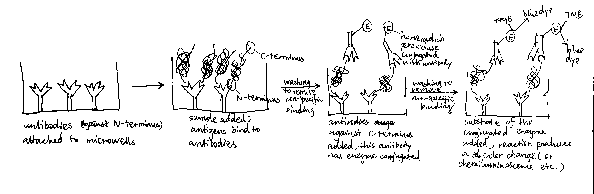
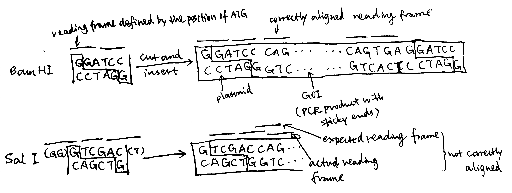
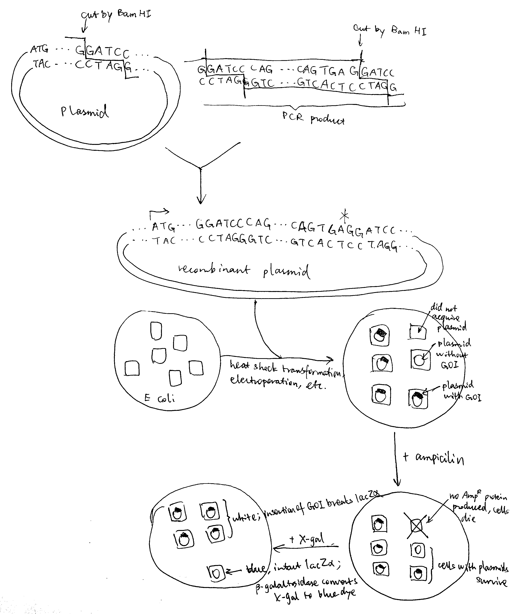
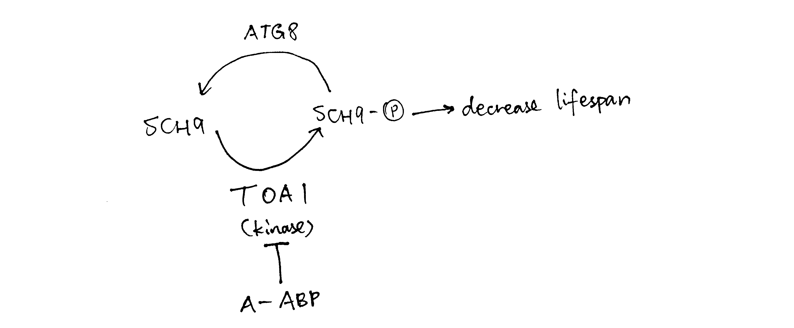

```{r include=FALSE}
knitr::opts_chunk$set(out.width = '100%')
library(tidyverse)
theme_set(theme_bw()+theme(plot.title = element_text(hjust=0.5)))
```

# Alzheimer's Disease

## Effect of AMPK on secreted A$\beta$ levels in neuronal cultures

(a) In ELISA (enzyme-linked immunosorbant assay), antibodies are used to bind an antigen of interest (usually protein) with high specificity, and the presence and concentration of the antigen is reported by the extent of reaction of the enzyme conjugated with the antibody. Using two types of antibodies binding to different regions of the antigen allows sandwich ELISA (see below), which has greater specificity. Horseradish peroxidase converts its substrate to a coloured product, and the intensity of the colour, which is related to the concentration of A$\beta$ peptide (the antigen), can be measured by a spectrophotometer as absorbance of EM wave at a certain visible wavelength (the relationship is not always linear so a calibration is needed).

```{r echo=FALSE}

```


(b) By plotting 'measured value' against the number of dilution (the power to which $\frac{1}{2}$ is raised), it can be shown that the realtionship between them is roughly linear when measured value is around 100.

```{r}
standard <- c(206, 215, 201, 199, 205, 197, 199, 202, 190, 120, 67, 41, 27, 13, 8, 8)
untreated <- c(211, 197, 200, 202, 198, 195, 197, 164, 88, 47, 27, 15, 6, 9, 7, 7)
AICAR <- c(207, 202, 205, 199, 189, 200, 183, 101, 58, 30, 18, 12, 7, 7, 8, 6)
pow <- 0:15

df <- tibble(pow, standard, untreated, AICAR)
df %>% gather(standard, untreated, AICAR, key = 'treatment', value = 'measured value') %>% 
  ggplot(aes(pow, `measured value`, color = treatment, shape = treatment, linetype=treatment))+
  geom_point()+xlab('number of dilution (i.e. number of times the concentration is halved)')+
  geom_smooth(se=FALSE, method='loess', span=0.4, size=0.5)+
  geom_hline(yintercept = 100)+
  scale_x_continuous(breaks = 0:15)
```

Reading off from the plot:
  
- for the standard solution, a $\dfrac{1}{2^{9.5}}$ dilution corresponds to 100 units. Thus, 100 units correspond to $10\times \dfrac{1}{2^{9.5}}=0.01381\text{ ng/ml}$
- for the untreated sample, a $\dfrac{1}{2^{7.9}}$ dilution corresponds to 100 units, or $0.0138\text{ ng/ml}$, so the undiluted sample has a A$\beta$ concentration of $0.01381\times2^{7.9}=3.299\text{ ng/ml}$. The volume of 10^6^ cells is 100$\mu$l, so the level of secretion is $3.299\times0.100\times 1000=329\text{ pg/10}^6\text{ cells/day}$
- for the sample with AICAR, the undiluted sample has a A$\beta$ concentration of $0.01381\times2^{7.2}=2.031\text{ ng/ml}$. The level of secretion is $2.031\times0.100\times 1000=203\text{ pg/10}^6\text{ cells/day}$

(c) Upon activation by AICAR, AMPK reduces secretion of A$\beta$

## Effect of added A$\beta$ on AMPK activity

(d) Triton X-100 is a detegent, disrupting the cell membrane and lysing the cell; PMSF inhibits serine proteases, preventing degradation of target protein; protein A, which is immobilised on sepharose, binds specifically to the F~c~ region of anti-AMPK antibody

(e) This ensures that all measured enzymatic activity is due to AMPK but not other kinases that would be present in the whole cell extract. 

(f) Substituting $t_{\frac{1}{2}}=14\text{ days}$ and $t = 14$ into $A=A_0e^{-kt}=A_0e^{-\dfrac{\ln{2}t}{t_{\frac{1}{2}}}}=A_0\times(2)^{-\dfrac{t}{t_{\frac{1}{2}}}}$, $A=A_0\times(2)^{-\frac{9}{14}}=0.6404A_0$, i.e.  $A_0=1.5614A$, where $A_0$ is the original activity and $A$ is the activity after 9 days. $$\begin{aligned}A_0 \text{ cpm}\div80\%\div(2.2\times10^{12})\text{ cpm/Ci}\div(0.5\times10^{-3})\text{ Ci/nmol}\div(50\times10^{-3}\text{ mg cell protein})\div20\text{ min}\div\frac{50}{50+5+5}\\=x \text{ nmol substrate phosphorylated/min/mg cell protein}\end{aligned}$$ where x is the final answer. This simplifies to $$x=1.3636\times10^{-9}A_0=2.129\times10^{-9}A$$
    - Activity (+A$\beta$): $2.129\times10^{-9}\times(11800-278)=2.45\times10^{-5} \text{ nmol substrate phosphorylated/min/mg cell protein}$
    - Activity (no A$\beta$): $2.129\times10^{-9}\times(2940-278)=5.67\times10^{-6} \text{ nmol substrate phosphorylated/min/mg cell protein}$

(g) AMPK activity increases as A$\beta$ is added, and AMPK may help to degrade A$\beta$ according to (c).

## Association of $\tau$ protein with microtubules

(h) tau alone is soluble and exists solely in the supernatant. Unphosphorylated tau binds to microtubules strongly and exists entirely in the pallet (insoluble). Phosphorylated tau has less affinity to microtubules and most of them are found in the supernatant. 

## Phosphorylation sites on tau

(i) 
    - Induce mutations on different positions and observe their effect on phosphorylation. The mutated position(s) can be determined by DNA sequencing and the effect of phosphorylation can be determined by isoelectric focusing (phosphorylated protein has a more negative charge). 
    - Fragment the protein and test each piece for phosphorylation.

(j) These phosphorylation sites are all located on the MT binding domain (235-368) and thus phosphorylation can directly (at least sterically) hinder binding to MT. In addition, MT binding domain contains many postively charged lysine (K) residues and few negatively charged (D and E) residues. This suggest that the binding between tau and MT is electrostatic (+ve on tau, -ve on MT). Phosphorylation adds -ve charge on tau and thus hinders electrostatic binding. 

# Notch Receptor

(a) The primer sequences are:
    ```{}
forward primer
5' GGATCC CAGGACGTGGATGAGTGCTCGCTGGG 3' # 33 nt
reverse primer
5' GGATCC TCA CTGGCACAGATGCCCAGTGAAGCCC 3' # 34 nt
    ```
    To produce a standalone peptide, a start codon (ATG) and a stop codon (TGG) is needed. The stop codon is included in the reverse primer (`5'TCA3'` which correspond to `5'TGA3'` in the forward direction). The start codon is defined in the plasmid and sets the reading frame. The restriction site chosen must ensure correct reading frame alignment of the gene of interest, and Bam HI does this job (while some others, such as Sal I, does not), so I chose it, and its sequence, `GGATCC`, is included at the 5' end of both primers
    ```{r echo=FALSE}

    ```
    Regarding restriction sites, Pst I and Sph I must not be chosen because they are contained within the gene of interest and applying these restriction enzymes will break the gene. The remaining part of the primer corresponds to the gene of interest, and the 3' ends are chosen to include 3-4 consecutive G/C to ensure high annealing stability, facilitating DNA polymerase binding.

(b) Bam HI is applied both to the plasmid and the PCR product, creating sticky ends and allowing them to join. The resulting set of plasmids (some are recombinant and some are not) are transformed into bacteria by heat shock (by disrupting the cell membrane using CaCl~2~ and exposing cells to thermal imbalance) or electroporation (by using short pulses of high-voltage electric currents). Ampicilin is added to kill cells without gaining the plasmid, and after that, usually (when a lacZ$\alpha$ gene is incorporated into the cloning site in the reverse direction) X-gal is used to test whether the cells with plasmids contains the gene of interest (blue-white screening). 
    ```{r echo=FALSE}
    
    ```

(c) As illustrated in the plasmid map, the expression of inserted gene is controlled by the *Lac* operator. When uninduced, lac repressor protein due to *LacI* expression binds to *Lac* operator, preventing expression of inserted gene. IPTG can be used to induce expression. IPTG is an analogue of lactose, which activates *Lac* inducible operon by deactivating the lac repressor. IPTG is not metabolised by *E. coli* so it can be maintained at a constant concentration. 

(d) The protein product contains N-terminal hexahistidine tag which binds to Nickle ions with high affinity. Affinity chromatography using nickle-bound resin can be used to purify the protein. After that, size-exclusion chromatography may also be done to remove any possible aggregates of this peptide or complexes of this peptide with other species.

(e) Run a SDS-PAGE, stain with Commassie blue and there should be only one band.

(f) This extracellular protein is likely to contain disulfide bridges, which would not form in the normal reducing intracellular environment of bacteria. Some strains of *E. coli*, such as *Origami*, have mutant thioredoxin reductase and/or glutathione reductase an thus have a oxidising cytoplasm, and they can be used to express proteins with disulfide bridges.

(g) 
    - From the blot developed with biotin binding protein, A alone produce a band while B or C alone does not. This indicates that A must be a potential ligand (because it, being alone and biotin-tagged, is pulled down by biotin-binding Streptavidin). 
    - From the blot developed with His tag binding antibody, only A+B produces a band. As A is the potential ligand, B must be Notch that is pulled down along with A. C must not be Notch because A+C does not produce a band, so C is another potential ligand.
    - C alone does not produce a band in the biotin-specific blot possibly because the biotin tag possibly because C's tertiary structure prevents biotin binding 
  
(h) The potential ligand A binds to Notch (B), so A+B produces a band on the His-specific blot. It is uncertain whether A interacts with C. A and C are both potential ligands and will not produce a band on the His-specific blot. A+C produces a band on the biotin-specific blot and this may be solely due to A (which itself alone produces the band). A might bind to C without making C's biotin available for binding, or A might not bind to C, or A might bind to C, making its own biotin unavailable and C's biotin available, so that a band with equal thickness is produced. 

(i) 
    - Fluoresence resonance energy transfer (FRET), in which the potential ligand and Notch are each tagged with a fluorophore, where one type of fluorophore, when excited, can transfer energy to the other type of fluorophore through nonradiative dipole-dipole coupling and hence induce fluorescence of the acceptor fluorophore. The energy transfer is only possible when two fluorophores are very close to each other (when their associated proteins are bound to each other). If excitation of the donor fluorophore results in emission from the acceptor fluorophore, it indicates complex formation. 
    - As shown in Figure \@ref(fig:spr), surface plasmon resonance can also be used to monitor complex formation. 
    - MST (Microscale Thermophoresis) allows detection of complex formation in complex bioliquids such as blood serum or cell lysate.
    
```{r spr, echo=FALSE, fig.cap='Principles of SPR'}
knitr::include_graphics('../img/spr.jpg')
```

\newpage

# Compound A

(a) Toa1 decreases generation time and decreases lifespan.

(b) No effect on both.

(c) As a control group.

(d) DMSO reduces lifespan.

(e) Regarding lifespan in DMSO, when either Toa1 or Abp1 (or both) is absent, lifespan is unresponsive to compound A. Among these three conditions, when Toa1 is present and Abp1 is absent, lifespan is constantly short; when Toa is absent, lifespan is constantly long. This suggest that Toa1 reduces lifespan, and Abp1 itself has no effect on the lifespan when Toa1 is absent. 
    When both proteins are present, lifespan increases with concentration of A and then decreases. This suggest that, at low concentrations of A, Abp1 binds to A, and the binding of Toa1 to Abp1-A complex reduces Toa1's ability to shorten lifespan. At high concentrations of A, Abp1 becomes less effective in deactivating Toa1, possibly because Abp1 forms aggregates.

(f) Mutation of ATG8 always leads to short lifespan and generation time, and mutation of SCH9 always leads to increased lifespan and generation time, regardless of the conditions of ABP1 and TOA1, and they all made the lifespan insensitive to the concentration of compound A. When mutations of ATG8 and SCH9 occur simutaneously, the effect of ATG8 loss dominates and results in short lifespan & generation time. 
    Therefore, SCH9 may reduce lifespan and generation time and ATG8 opposes SCH9's activity. This explains $sch9\Delta$, $atg8\Delta$ and $sch9\Delta atg8\Delta$. In addition, Toa1's ability to reduce lifespan is dependent on SCH9. In $sch9\Delta abp1\Delta$ and $sch9\Delta toa1\Delta$, the life-span reduction cannot be done without SCH9. In $abp1\Delta atg8\Delta$, lifespan reduction is caused by Toa1+SCH9 and in $toa1\Delta atg8\Delta$ caused by SCH9, and no ATG8 was present to oppose this effect. 
    
(g) In the western blot data, for Sch9 5SA, the purpose of changing serine to alanine is usually to test for phosphorylation, and in this case the band is shorter than WT, indicating there is phosphorylation on Sch9. Also Sch9 5SA band is similar in length to $toa1\Delta$, which implies that toa1 loss has an similar effect to making Sch9 unavailable for phosphorylation. Thus Toa1 may phosphorylate Sch9, and this is in accordance with an observation in (f): 'toa1's ability to reduce lifespan is dependent on sch9'. Sch9 5SA with phosphatase further reduces the signal, and this indicates that Sch9 has other phosphorylation sites (apart from the site where 5 S was changed to A i.e. target of toa1) being phosphorylated.

(h) WT + compound A produced a low signal comparable to the WT + phosphate band. Thus compound A may hamper phosphorylation of Sch9 (by directly hindering phosphorylation, or acting as a phosphatase). As toa1 is 'target of A' and toa1 is the kinase that phosphorylates Sch9, compound A is very likely to inhibit toa1.  

(i) see Figure (g)

(j) Purify the proteins and study their interactions *in vitro*.
    - to confirm phosphorylation of Sch9 by Toa1: mix Sch9, Toa1 and ATP (control group: Sch9 and ATP only) and run isoelectric focusing (phosphorylated Sch9 has a more negative charge)
    - to confirm the role of compound A: mix compound A, Sch9, Toa1 and ATP (control group: buffer+Sch9+Toa1+ATP) and run isoelectric focusing.
    
(k) In strains with Sch92D3E but not WT Sch9, the lifespan is constantly reduced and this effect is unaffected by compound A. 
    
(l) See Figure \@ref(fig:fuckyoucompoundA).

```{r fuckyoucompoundA, echo=FALSE, fig.cap='When compound A concentration increases, TOA is is inhibited and less Sch9 is phosphorylated, so there is less lifespan-reduction effect due to phosphorylated Sch9, and hence the lifespan increases. When the concentration of A gets too high, however, ATG8 phosphatase is expressed to dephosphorylate Sch9 and thus decrease lifespan.'}

```


