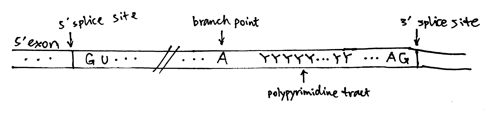
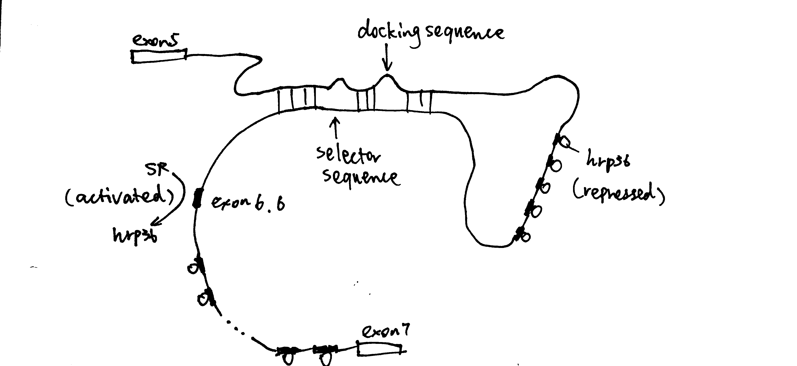

```{r include=FALSE}
knitr::opts_chunk$set(out.width = '100%')
```


# Overview

RNA splicing by spliceosomes removes introns from nascent pre-mRNA and joins protein-coding exon sequences, which matures the mRNA and makes it ready for translation. By chosing variable splice sites, different mature mRNAs (and hence proteins) can be produced from the same pre-mRNA.

# Structure of the Intron

Splice sites (i.e. exon-intron junctions) have conserved features. As shown in Figure \@ref(fig:intron), most introns have an invariant GU at the 5' end (5' splice site) and AG at the 3' end (3' splice site), their flanking sequences are variable but the bases are found at frequencies higher than expected based on a random distribution. The branch point A is also invariant, and most introns also have a polypyrimidine tract between the branch point and the 3' splice site. These 'standard' pre-mRNAs are spliced by snRNPs U1, U2, U4, U5, and U6. A small fraction of pre-mRNA does not follow the 'GU-AG' rule and have 5'-AU and AC-3' instead, which are spliced by four low-abundance snRNPs together with U5. 

```{r intron, echo=FALSE, fig.cap='The structure of a typical intron'}

```

# Spliceosome Assembly and the Splicing Process

The spliceosome is a large and dynamic RNP machine whose size is comparable to a ribosome. The 5 snRNPs that constitute the spliceosome are U1, U2, U4, U5, and U6, each of which is a association of an snRNA with proteins. The key catalytic activity is attributed to RNA, so the spliceosome is an ribozyme. A spliceosome is assembled whenever an intron is to be removed and its components are recycled after splicing. The series of events are shown in Figure 2.

```{r spliceosome-assembly, echo=FALSE, fig.cap='Spliceosome assembly and the splicing process'}
knitr::include_graphics('../img/spliceosome-assembly.jpg')
```

1. U1 base-pairs with the 5' splice site; SF1 (splicing factor 1) binds to the branch-point A; U2AF (U2 auxilliary factor) associates with the polypyrimidine tract and 3' splice site. Then, U2 replaces SF1 and U2AF.
2. The U4/U6.U5 tri-snRNP complex joins, forming the spliceosome
3. Rearrangement of base-paring interactions leads to the catalytically active conformation. U6 dissociates from U4 and replaces U1. U4 is also released.
4. The catalytic core of U6/U2 catalyses the first transesterification reaction (ligating 5' guanosine to the 2' OH of the branch point adenosine)
5. Further rearrangements take place, and the second transesterification reaction occurs (joining the two exons)

The two sequential transesterification reactions *per se* do not require energy input, as there is no net bond breaking (two phosphodiester bonds are hydrolysed and another two are formed), but ATP/GTP hydrolysis is used to drive structural transitions and as a 'proofreading' mechanism.

As shown in Figure \@ref(fig:splice-detailed-mech), In the catalitically active state, U6 partially base-pairs with U2 and U6 forms an internal stem loop structure with three nucleotides coordinated to two Mg^2+^ ions. Mg^2+^ ions stabilise the transitions states of the two transesterification reactions and thus achieve catalysis. The key bases coordinated to Mg^2+^ are confirmed by substitution of oxygen for sulfur atoms at various locations.

```{r splice-detailed-mech, echo=FALSE, fig.cap='The transesterification reactions in detail'}
knitr::include_graphics('../img/splice-detailed-mech.jpg')
```

# Alternative Splicing

pre-mRNAs contain *cis*-acting regulatory sequences (either splicing enhancers or silencers) to which splicing factors can bind and thus regulate splicing (Figure \@ref(fig:alternative-splicing)). RNA-RNA base pairing, which can occur either in *cis* or *trans*, can also specify splice site use. 

RNA-binding proteins/RNPs that regulate splicing can be classified into 3 classes: the classical hnRNPs, serine-arginine repeat (SR) proteins, and tissue-specific RNA-binding proteins. Generally, hnRNPs inhibit splicing from nearby splice sites by interacting with splicing silencers while SR proteins promotes splicing by binding to enhancers. 

```{r alternative-splicing, echo=FALSE, fig.cap='Splicing control by cis-regulatory sequences. ISE/ESE, intronic/exonic splicing enhancers; ISS/ESS, intronic/exonic splicing silencers.'}
knitr::include_graphics('../img/alternative-splicing.jpg')
```

RNA-RNA recognition can also control splice site choice, as exemplified by the exon 6 cluster of the *Drosophila* DSCAM gene, as shown in Figure \@ref(fig:alternative-splicing-rna-rna).

```{r alternative-splicing-rna-rna, echo=FALSE, fig.cap='hrp36 binds to all axon6 variants and represses their inclusion in the mature mRNA. When the cis-acting RNA selector sequence upstream of a specific exon (in this case 6.6) pairs with the docking site, it results in activation of the exon immediately downstream.'}

```
