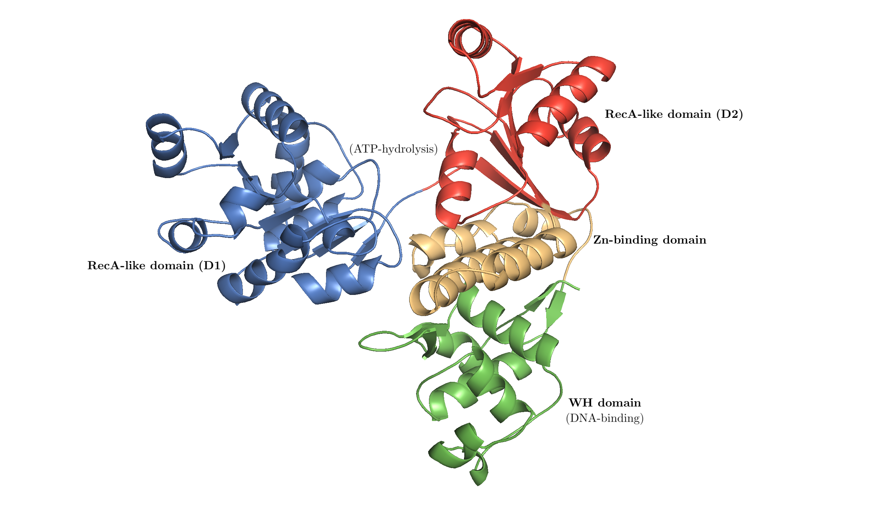
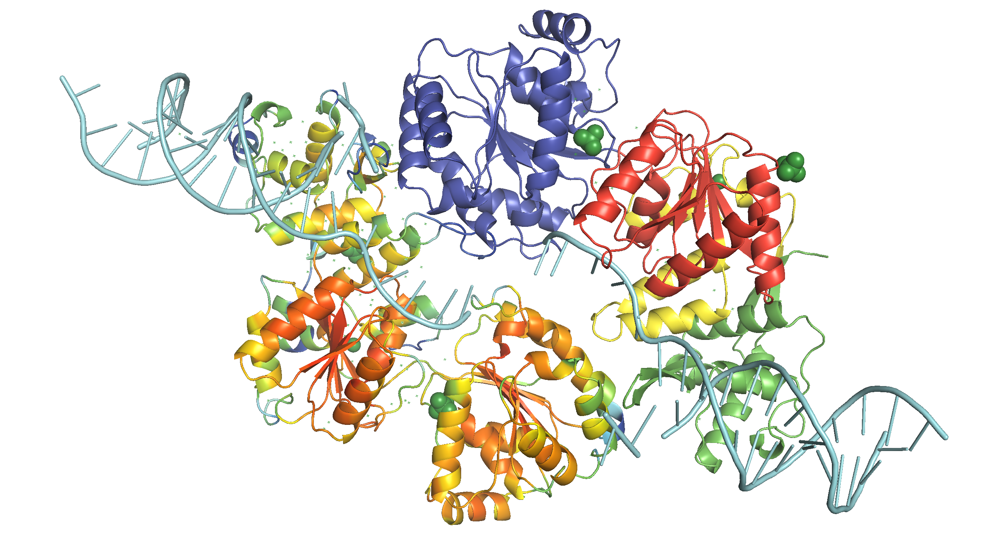

```{r setup, include=FALSE}
library(reticulate)
use_python('/usr/local/bin/python3.8')
require("seqinr")
require("ape")
```

For the second tutorial, I want you to try some proper molecular biology using online tools, just as we do every day in the lab. Try it out on your own first, though you may wish to discuss any issues you may be having with each other. Please bring files/printouts and if you have one, your laptop to the tutorial. You will find NCBI BLAST useful and various links within www.expasy.org (e.g. In proteomics section, Clustal, T-coffee, Translate, prot param etc). You may also like to download ApE or Snapgene viewer from the web but make sure you scan with e.g. Sophos before you open them. You can do full in silico cloning in ApE (but only in the expensive paid-for version of Snapgene) but Snapgene (even free viewer) offers much better visualization so you may want to use both but for different features. For structural productions, Swissprot is convenient, then for mutagenesis, move to Pymol or equivalent. 


```{}
Mystery gene (lower case = non-coding, upper case = coding)

GTATTTTGCGTCCATTTCGATCAAAAGACTATTTCTCATTTCCTCCCACGATTTTAGATAATAATATTATCTTATGTCATGCACAGATGATAAGTGATGATGACGATCTACCATCTACTCGCCCGGGATCTGTGAATGAGGAATTACCAGAAACCGAACCCGAAGATAATGATGAGTTGCCTGAAACAGAACCTGAAAGCGATTCCGATAAACCTACCGTAACCTCGAATAAAACAGAAAACCAAGTTGCTGATGAAGATTATGATTCATTCGACGATTTTGTGCCCAGTCAAACACACACAGCCTCCAAAATACCTGTAAAAAATAAACGAGCCAAAAAGTGCACTGTAGAATCTGATTCATCATCTTCGGATGATTCCGATCAAGGAGATGATTGTGAATTTATCCCAGCTTGTGATGAGACACAGGAAGTTCCGAAAATCAAAAGAGGATACACTCTGAGAACTCGAGCAAGTGTAAAGAACAAATGTGATGATTCATGGGATGATGGAATAGACGAAGAAGATGTCTCAAAAAGATCAGAAGACACGTTAAATGATTCATTTGTTGATCCTGAATTCATGGATTCTGTTCTAGATAATCAATTAACGATCAAAGGCAAAAAGCAATTTCTCGATGATGGAGAGTTTTTCACAGACCGGAATGTTCCTCAGATTGATGAAGCTACAAAAATGAAGTGGGCATCAATGACGTCACCTCCTCAAGAAGCTTTGAACGCATTGAACGAATTCTTCGGTCATAAAGGATTCCGAGAAAAGCAGTGGGATGTTGTCAGAAATGTTTTGGGAGGAAAAGACCAATTTGTTCTTATGTCCACTGGTTATGGTAAAAGTGTATGTTATCAGCTACCATCACTTCTTCTCAATTCGATGACTGTCGTGGTATCTCCATTAATTTCATTGATGAATGATCAAGTAACTACATTGGTTTCTAAAGGTATTGATGCAGTGAAACTAGATGGACATTCTACACAAATTGAATGGGATCAAGTTGCGAATAATATGCACCGAATTAGGTTCATCTACATGTCACCTGAAATGGTTACGAGCCAAAAGGGTTTGGAATTATTAACTTCTTGCCGAAAACATATCTCCCTCCTCGCTATTGATGAAGCTCATTGTGTTTCTCAATGGGGACACGACTTTCGAAACTCGTACAGGCATCTCGCAGAAATTAGAAACCGATCTGATCTATGCAATATTCCAATGATTGCTCTTACCGCTACTGCCACAGTTAGAGTTCGTGATGACGTCATTGCTAATTTAAGACTCCGCAAGCCATTAATCACAACTACGTCGTTTGATAGAAAGAATCTCTACATTTCTGTGCATTCTTCAAAGGACATGGCTGAAGATTTAGGATTATTCATGAAAACCGATGAAGTTAAAGGAAGACACTTTGGTGGACCTACTATTATTTATTGCCAAACGAAACAAATGGTCGATGATGTGAACTGTGTTTTGAGAAGAATCGGAGTTCGTTCTGCTCATTATCACGCAGGACTCACTAAAAATCAACGAGAAAAAGCACACACCGATTTTATGAGAGATAAGATTACAACAATCGTTGCGACAGTTGCATTTGGTATGGGAATTGACAAACCCGACGTTCGAAATGTGATTCATTACGGATGCCCGAACAATATCGAATCATATTATCAAGAAATCGGAAGAGCTGGTCGAGATGGATCTCCAAGTATTTGTCGTGTATTCTGGGCTCCGAAAGATTTGAATACTATAAAATTTAAACTTCGAAATTCGCAGCAAAAAGAAGAAGTAGTTGAAAATCTTACAATGATGCTAAGACAACTCGAGTTGGTTCTGACAACCGTTGGATGTAGAAGATACCAACTTCTGAAGCACTTTGACCCATCATACGCGAAACCTCCAACTATGCAAGCTGATTGTTGTGATAGATGTACTGAAATGCTCAATGGAAATCAAGATTCATCATCCAGTATTGTTGATGTTACAACAGAATCGAAGTGGTTGTTTCAAGTTATTAACGAAATGTACAACGGGAAAACTGGTATCGGAAAACCAATCGAATTTCTGAGGGGATCGAGTAAAGAAGACTGGCGAATCAAGACCACATCTCAACAAAAATTGTTTGGAATTGGAAAACATATTCCTGATAAATGGTGGAAAGCACTTGCAGCATCACTTCGAATTGCTGGTTATCTTGGAGAAGTTAGGCTGATGCAAATGAAATTTGGAAGTTGTATCACTTTGTCCGAACTCGGGGAACGATGGCTTTTGACTGGAAAAGAGATGAAAATCGATGCGACACCGATTTTATTGCAAGGGAAGAAAGAAAAAGCCGCACCTTCAACTGTCCCCGGAGCTTCAAGATCTCAGTCAACTAAATCAAGTACAGAGATTCCAACCAAGATTCTCGGAGCGAATAAGATTCGTGAATACGAGCCTGCAAATGAAAACGAGCAGCTGATGAACTTGAAAAAGCAAGAAGTCACTGGTCTTCCAGAGAAGATTGATCAACTGCGCTCTCGTCTTGACGACATTCGTGTAGGAATTGCAAACATGCATGAAGTAGCACCATTCCAAATTGTATCGAATACTGTTCTTGATTGTTTTGCCAACTTGAGACCTACCTCAGCCTCGAATCTCGAAATGATTGATGGAATGTCGGCTCAGCAGAAATCTAGATACGGAAAACGATTTGTCGATTGTGTTGTACAATTTTCAAAGGAAACTGGCATTGCAACAAACGTCAATGCCAACGATATGATACCCCCTGAACTTATTTCAAAAATGCAGAAAGTTCTCTCGGATGCGGTGAGAAGAGTATACACAGAGCATCTTATTTCGAGATCCACTGCGAAAGAAGTGGCAACTGCTCGAGGAATTAGTGAGGGTACTGTATATTCATATCTCGCGATGGCGGTAGAAAAAGGATTACCTCTTCACTTAGACAAGTTAAATGTCTCCAGAAAGAATATTGCAATGGCTCTAAATGCAGTTAGAGTACATTTAGGATCAAATGTTGCCGTACTGACACCATGGGTTGAAGCTATGGGAGTCGTACCTGATTTTAATCAGTTGAAATTGATCCGGGCAATTCTTATTTACGAATATGGATTGGATACGAGTGAGAACCAAGAGAAGCCAGACATCCAATCTATGCCGTCCACTTCAAATCCATCCACCATCAAAACAGTTCCATCAACACCTTCATCCTCTCTCAGAGCTCCTCCATTGAAGAAATTCAAACTTTAAATTTCTTATATTTTTTTTAATCTGAATATCATAACTATACGGTCTCTTATTTTCAATCTCATCCCTGTCTATATGAATGCTGGTTATTCGATTTTCACTTATGAATTTTTAAAAACACTT
```

```{}
pIVEX2.3d Vector Sequence

TCGCGCGTTTCGGTGATGACGGTGAAAACCTCTGACACATGCAGCTCCCGGAGACGGTCACAGCTTGTCTGTAAGCGGATGCCGGGAGCAGACAAGCCCGTCAGGGCGCGTCAGCGGGTGTTGGCGGGTGTCGGGGCTGGCTTAACTATGCGGCATCAGAGCAGATTGTACTGAGAGTGCACCATATATGCGGTGTGAAATACCGCACAGATGCGTAAGGAGAAAATACCGCATCAGGCGCCATTCGCCATTCAGGCTGCGCAACTGTTGGGAAGGGCGATCGGTGCGGGCCTCTTCGCTATTACGCCAGCTGGCGAAAGGGGGATGTGCTGCAAGGCGATTAAGTTGGGTAACGCCAGGGTTTTCCCAGTCACGACGTTGTAAAACGACGGCCAGTGCCAAGCTTGCATGCAAGGAGATGGCGCCCAACAGTCCCCCGGCCACGGGGCCTGCCACCATACCCACGCCGAAACAAGCGCTCATGAGCCCGAAGTGGCGAGCCCGATCTTCCCCATCGGTGATGTCGGCGATATAGGCGCCAGCAACCGCACCTGTGGCGCCGGTGATGCCGGCCACGATGCGTCCGGCGTAGAGGATCGAGATCTCGATCCCGCGAAATTAATACGACTCACTATAGGGAGACCACAACGGTTTCCCTCTAGAAATAATTTTGTTTAACTTTAAGAAGGAGATATACCATGGCACATATGAGCGGCCGCGTCGACTCGAGCGAGCTCCCGGGGGGGGTTCTCATCATCATCATCATCATTAATAAAAGGGCGAATTCCAGCACACTGGCGGCCGTTACTAGTGGATCCGGCTGCTAACAAAGCCCGAAAGGAAGCTGAGTTGGCTGCTGCCACCGCTGAGCAATAACTAGCATAACCCCTTGGGGCCTCTAAACGGGTCTTGAGGGGTTTTTTGCTGAAAGGAGGAACTATATCCGGATATCCACAGGACGGGTGTGGTCGCCATGATCGCGTAGTCGATAGTGGCTCCAAGTAGCGAAGCGAGCAGGACTGGGCGGCGGCCAAAGCGGTCGGACAGTGCTCCGAGAACGGGTGCGCATAGAAATTGCATCAACGCATATAGCGCTAGCAGCACGCCATAGTGACTGGCGATGCTGTCGGAATGGACGATATCCCGCAAGAGGCCCGGCAGTACCGGCATAACCAAGCCTATGCCTACAGCATCCAGGGTGACGGTGCCGAGGATGACGATGAGCGCATTGTTAGATTTCATACACGGTGCCTGACTGCGTTAGCAATTTAACTGTGATAAACTACCGCATTAAAGCTTATCGATGATAAGCTGTCAAACATGAGAATTCGTAATCATGTCATAGCTGTTTCCTGTGTGAAATTGTTATCCGCTCACAATTCCACACAACATACGAGCCGGAAGCATAAAGTGTAAAGCCTGGGGTGCCTAATGAGTGAGCTAACTCACATTAATTGCGTTGCGCTCACTGCCCGCTTTCCAGTCGGGAAACCTGTCGTGCCAGCTGCATTAATGAATCGGCCAACGCGCGGGGAGAGGCGGTTTGCGTATTGGGCGCTCTTCCGCTTCCTCGCTCACTGACTCGCTGCGCTCGGTCGTTCGGCTGCGGCGAGCGGTATCAGCTCACTCAAAGGCGGTAATACGGTTATCCACAGAATCAGGGGATAACGCAGGAAAGAACATGTGAGCAAAAGGCCAGCAAAAGGCCAGGAACCGTAAAAAGGCCGCGTTGCTGGCGTTTTTCCATAGGCTCCGCCCCCCTGACGAGCATCACAAAAATCGACGCTCAAGTCAGAGGTGGCGAAACCCGACAGGACTATAAAGATACCAGGCGTTTCCCCCTGGAAGCTCCCTCGTGCGCTCTCCTGTTCCGACCCTGCCGCTTACCGGATACCTGTCCGCCTTTCTCCCTTCGGGAAGCGTGGCGCTTTCTCATAGCTCACGCTGTAGGTATCTCAGTTCGGTGTAGGTCGTTCGCTCCAAGCTGGGCTGTGTGCACGAACCCCCCGTTCAGCCCGACCGCTGCGCCTTATCCGGTAACTATCGTCTTGAGTCCAACCCGGTAAGACACGACTTATCGCCACTGGCAGCAGCCACTGGTAACAGGATTAGCAGAGCGAGGTATGTAGGCGGTGCTACAGAGTTCTTGAAGTGGTGGCCTAACTACGGCTACACTAGAAGGACAGTATTTGGTATCTGCGCTCTGCTGAAGCCAGTTACCTTCGGAAAAAGAGTTGGTAGCTCTTGATCCGGCAAACAAACCACCGCTGGTAGCGGTGGTTTTTTTGTTTGCAAGCAGCAGATTACGCGCAGAAAAAAAGGATCTCAAGAAGATCCTTTGATCTTTTCTACGGGGTCTGACGCTCAGTGGAACGAAAACTCACGTTAAGGGATTTTGGTCATGAGATTATCAAAAAGGATCTTCACCTAGATCCTTTTAAATTAAAAATGAAGTTTTAAATCAATCTAAAGTATATATGAGTAAACTTGGTCTGACAGTTACCAATGCTTAATCAGTGAGGCACCTATCTCAGCGATCTGTCTATTTCGTTCATCCATAGTTGCCTGACTCCCCGTCGTGTAGATAACTACGATACGGGAGGGCTTACCATCTGGCCCCAGTGCTGCAATGATACCGCGAGACCCACGCTCACCGGCTCCAGATTTATCAGCAATAAACCAGCCAGCCGGAAGGGCCGAGCGCAGAAGTGGTCCTGCAACTTTATCCGCCTCCATCCAGTCTATTAATTGTTGCCGGGAAGCTAGAGTAAGTAGTTCGCCAGTTAATAGTTTGCGCAACGTTGTTGCCATTGCTACAGGCATCGTGGTGTCACGCTCGTCGTTTGGTATGGCTTCATTCAGCTCCGGTTCCCAACGATCAAGGCGAGTTACATGATCCCCCATGTTGTGCAAAAAAGCGGTTAGCTCCTTCGGTCCTCCGATCGTTGTCAGAAGTAAGTTGGCCGCAGTGTTATCACTCATGGTTATGGCAGCACTGCATAATTCTCTTACTGTCATGCCATCCGTAAGATGCTTTTCTGTGACTGGTGAGTACTCAACCAAGTCATTCTGAGAATAGTGTATGCGGCGACCGAGTTGCTCTTGCCCGGCGTCAATACGGGATAATACCGCGCCACATAGCAGAACTTTAAAAGTGCTCATCATTGGAAAACGTTCTTCGGGGCGAAAACTCTCAAGGATCTTACCGCTGTTGAGATCCAGTTCGATGTAACCCACTCGTGCACCCAACTGATCTTCAGCATCTTTTACTTTCACCAGCGTTTCTGGGTGAGCAAAAACAGGAAGGCAAAATGCCGCAAAAAAGGGAATAAGGGCGACACGGAAATGTTGAATACTCATACTCTTCCTTTTTCAATATTATTGAAGCATTTATCAGGGTTATTGTCTCATGAGCGGATACATATTTGAATGTATTTAGAAAAATAAACAAATAGGGGTTCCGCGCACATTTCCCCGAAAAGTGCCACCTGACGTCTAAGAAACCATTATTATCATGACATTAACCTATAAAAATAGGCGTATCACGAGGCCCTTTCGTC
```


1. Use the information in the attached DNA file (mystery gene) to identify the encoded protein and the species. 
    - Caenorhabditis elegans Probable Werner syndrome ATP-dependent helicase homolog 1 (wrn-1) (UniProt accession code: [Q19546](https://www.uniprot.org/uniprot/Q19546))
    
2. Draw a schematic diagram of the protein, noting the number of amino acids, predicted Mw and pI of the encoded protein, and annotate on functional domains (e.g. in ppt).
    - 1056 amino acids; MW = 118522.73 Da (average mass)/118447.63 Da (monoisotopic mass); pI = 6.08 (predicted using ExPASy ['Compute pI/Mw tool'](https://web.expasy.org/compute_pi/))
    - [Automated homology modelling in the SWISS-MODEL Repository](https://swissmodel.expasy.org/repository/uniprot/Q19546) uses 1oyy.1.A, 4cdg.1.A and 4cgz.1.A as templates to obtain models with global QMEANs of -3.35, -3.57 and -4.19, respectively 
    - Manual (interactive) modelling using 4q47.1.A (DrRecQ catalytic core (Dr = *Deinococcus radiodurans*)) achieved a better QMEAN of -3.09. The structure is shown in Fig. \@ref(fig:wrn-model) (highlighting functional domains) and in Fig. \@ref(fig:wrn-b-factor) (showing local quality (QMEAN) scores). The annotations on functional domains are based on @Chen-2014.
    - Update on 2 Feb: yet a higher QEMAN of -2.90 is achieved with 2wwy.1. 2wwy.1 is the structure of human RECQ-like helicase in complex with DNA substrate[@Pike-2015]. The homology model based on this is shown in Fig. \@ref(fig:recq-in-action), and the PyMOL Session (`.pse`) file can be downloaded [here](https://tianyishi2001.github.io/ox/tutorial/resources/wrn/model/tianyi-wrn.pse).
    - As shown in Fig. \@ref(fig:wrn-org-cox), WRN is unique in the family of RecQ helicases in possessing an 3'-to-5' exonuclease domain[@Cox-2013]. In *C. elegans*, the exonuclease and the helicase are encoded in separate genes. The two experimental structures used for modelling (4q47.1.A (DrRecQ) and 2wwy.1 (human RECQ1)) and the query *C. elegans* wrn homolog all represent only the helicase domain and the RQC (WH) domain. 

```{r wrn-model, echo=FALSE, fig.cap="A homology model of *C. elegans* wrn-1 based on DrRecQ catalytic core (PDB accession code: 4Q47). The N-terminal part contains the common core structure of the RecQ helicase family, which comprises two RecA-like domains, D1 and D2, each composed of a central β-sheet surrounded by α-helices. The conserved sequence motifs at the interface of D1 and D2 are responsible for ATP binding and hydrolysis. The following Zn-binding domain stabilizes the protein structure. The C-terminus consists of a WH domain (a.k.a RQC domain), which directly participates in DNA binding and base pair separation. [@Chen-2014]", out.width="100%"}

```

```{r wrn-b-factor, echo=FALSE, fig.cap="The same homology model, showing local QMEAN scores (b-factor). Compared to green and thin regions, red and thick regions have local geometrical properties deviating further from those of experimentally determined structures. The Zn-binding domain and WH domain are more consistent with experimental structures than the two RecA-like domains.", out.width="100%"}
knitr::include_graphics('../img/wrn-b-factor.png')
```

```{r recq-in-action, echo=FALSE, fig.cap="WRN catalytic core (RECQ) in action. This structure is based on the structure of a dimer of human RECQ1 helicase in complex with tailed duplux DNA solved by @Pike-2015. The monomer on the bottom shows the b-factor (local QMEAN) of the homology model with C. elegans wrn-1, where red indicates high and green indicates low scores. The monomer on the top shows the subunits of WRN catalytic core (RECQ), where D1, D2, Zn-binding, and WH (RQC) domains are coloured blue, red, yellow and green, respectively, similar to Fig. 1. DNA is coloured cyan. Ligands (2 zinc ions, 3 sulfate ions and 2 ethanediol molecules) are not removed. ", out.width="100%"}

```

```{r wrn-org-cox, echo=FALSE, fig.cap="Domain organisation of human WRN and its homologs in *D. melanogaster* and *C. elegans*. Adapted from @Cox-2013.", out.width="100%"}
knitr::include_graphics('../img/wrn-org-cox.png')
```


3. Find homologues in human, Xenopus and mice and give the protein names (Uniprot should help)
    - Use [UniProt BLAST](https://www.uniprot.org/blast/)
    - Query: Q19546 (UniProt ID)
    - Relevant Results:
        - Werner syndrome ATP-dependent helicase (Homo sapiens) ([Q14191](https://www.uniprot.org/uniprot/Q14191); WRN_HUMAN)
        - Werner syndrome ATP-dependent helicase homolog (Mus musculus ([O09053](https://www.uniprot.org/uniprot/O09053); WRN_MOUSE)
        - Werner syndrome ATP-dependent helicase homolog (Xenopus laevis) ([O93530](https://www.uniprot.org/uniprot/O93530); WRN_XENLA)

4. Show homology between your mystery protein and the human, mouse and frog homologues.
    - Sequences aligned using UniProt alignment tool (accessible via the BLAST result page)
    - results displayed using SnapGene Viewer ([view PDF](https://tianyishi2001.github.io/ox/tutorial/resources/wrn/clustal.pdf))
    - UniProt uses the 'clustalo' program (MSA algorithm) to align
    - I also used the 'muscle' program (MUltiple Sequence Comparison by Log-Expectation) in the command line to produce a different result, and standardised its output using BioPython for visualisation in SnapGene ([view PDF](https://tianyishi2001.github.io/ox/tutorial/resources/wrn/muscle.pdf))
    
    ```{bash eval=FALSE}
$ cat ce.fasta hs.fasta mm.fasta xl.fasta | muscle -out muscle.fasta
    ```

    ```{python eval=FALSE}
from Bio import AlignIO
muscle = AlignIO.read('resources/wrn/muscle.fasta', 'fasta')
AlignIO.write(muscle, 'muscle.aln', 'clustal')
    ```
    
    With help of the `seqin` R package, the pairwise genetic differences between these 4 protein sequences can be calculated:
    
    ```{r}
aln <- seqinr::read.alignment('./resources/wrn/clustal.aln', 'clustal')
alnDist <- seqinr::dist.alignment(aln)
alnDist
    ```
    
    These can be visulised by a phylogenetic tree produced by the `ape` package, as shown in Fig. \@ref(fig:phylo).
    
    ```{r phylo, fig.cap="The phylogenetic relationship between the WRN homologs in 4 organisms", out.width='100%'}
mydist <- seqinr::dist.alignment(aln)
mytree <- ape::nj(mydist)
myrootedtree <- root(mytree, 'SP|Q19546|WRN_CAEEL', resolve.root=TRUE)
ape::plot.phylo(myrootedtree, type="p")
    ```
    
5. Design PCR primers to amplify the coding region, incorporating suitable restriction enzyme sites in each primer so that you can clone easily into the vector pIVEX2.3d (though there are many online primer design sites, I find this is best done manually to get a feel for it, but these days I use SnapGene (viewer version is free….). Hint: we want to keep the start codon ATG so chose an enzyme that contains ATG in its recognition site for the forward primer.
    - I opened the [original sequence](https://tianyishi2001.github.io/ox/tutorial/resources/wrn/in-silico-cloning/original.dna) with SnapGene. In the 'Sequence' view, I displayed translated amino acids with 'Frame +1 only' and thus located the stop codon (the start codon is obviously +1)[^source]. Then I used the 'Enzymes' view to obtain a list of noncutters. By comparing this list with the MCS of the [piVEX2.3d](https://tianyishi2001.github.io/ox/tutorial/resources/wrn/in-silico-cloning/vector.dna), I selected *Nde*I and *Sal*I as the RE sites to be used[^re]. The *Sal*I site is not in frame with the C-terminal His tag and stop codon, so I included an additional random nucleotide 3' to the RE site. The stop codon is excluded from the reverse primer because it is provided in the vector.
    - forward: `NN CAT ATGATAAGTGATGATGACGATCTACC` 
        - `CATATG` is *Nde*I restriction site. It ends with `ATG`, so adding `CAT` instead of `CATATG` to the 5' suffices.
        - 31-mer; 39% GC (>40% if `NN` = `GC`); 26 annealed bases; T~m~ = 56ºC[^tm]
    - reverse: `NN GTCGAC N AAGTTTGAATTTCTTCAATGGAGGAGC`
        - `GTCGAC` is *Sal*I restriction site
        - 36-mer; 43% GC; 28 annealed bases; T~m~ = 58ºC
    - *In silico* PCR is done in SnapGene, and the resulting DNA can be downloaded [here](https://tianyishi2001.github.io/ox/tutorial/resources/wrn/in-silico-cloning/Amplified1.dna)

6. *In silico* clone this into the vector pIVEX2.3d (file attached - .dna is a snap gene format, docx is of course in word). Why might we want to use this vector?
    - This vector has a C-terminal 6-His tag which allows efficient purification by affinity chromatography
    - The MCS is associated with the T7 promoter. T7 RNAP is highly processive, so consecutive expression is expected.

7. Check that your new construct allows correct protein expression in frame with the hexahistidine tag of the vector (SnapGene is good for this, but you can also do it in a few more steps using ApE plus translation apps via Expasy)
    - Yes. ([view result as PDF](./resources/wrn/in-silico-cloning/Cloned1.dna.pdf) or [.dna file](./resources/wrn/in-silico-cloning/Cloned1.dna))
    - Serendipitously, the MCS has an ATG in frame with our insert and the His-tag/STOP codon, so translation will probably start more upstream than we expected, which will add 3 additional amino acid residues to the N-terminus of the product. This ATG was not in frame with the His-tag before insertion, and thus unspotted by SnapGene or me.[^blame]

    ```{r clone-serendipity, echo=FALSE, fig.cap="An additional in-frame start codon (red) upstream to the start codon of the insert (blue).", out.width="100%"}
knitr::include_graphics('../img/clone-serendipity.png')
    ```

8. Predict the protein fold of the new protein (eg Swissprot). Show the effect of predicted enzyme active site mutations on the structure (eg new file in swissport, but Pymol is good for this).
    - Swiss-Model shown in Q2.
    
### Bonus: Tianyi's Restriction Site Finder {#bonus}

See Fig. \@ref(fig:tianyi-re-001-1) and \@ref(fig:tianyi-re-001-2).

This tool takes in two sequences (plain text or FASTA or SnapGene `.dna` file), one representing the cloning site and the other representing the GOI, and finds the restriction sites inside the cloning site but not in the GOI, and label them with their positions in the cloning site and their commecial suppliers. 

The web interface is built upon the [Django](https://www.djangoproject.com) framework and the data come from the `Restriction` module of [BioPython](https://biopython.org), which is (sort of) a wrapper around NEB's [REBASE](http://rebase.neb.com/rebase/rebase.html).

```{r tianyi-re-001-1, echo=FALSE, fig.cap="Restriction site finder by Tianyi. Query page.", out.width="100%"}
knitr::include_graphics('../img/tianyi-re-001-1.png')
```

```{r tianyi-re-001-2, echo=FALSE, fig.cap="Restriction site finder by Tianyi. Result page.", out.width="100%"}
knitr::include_graphics('../img/tianyi-re--001-2.png')
```

## References

[^source]: Why does this sequence start with ATG but not end with a stop codon? Are the additional downstream nucleotides for the convinience of primer design (is it worthwhile to include additional upstream nucleotides)? 
[^re]: Is there a more automatic way of choosing RE sites? I wish I could select the MCS sequence of the vector and the GOI sequence, and then the intersection between the cutting sites of the former and the noncutting sites of the latter is computed automatically. Is this functionality hidden somewhere in SnapGene, or is it available elsewhere? If not I'll try to make it! (A prototype is shown in Fig. \@ref(fig:tianyi-re-001-1) and \@ref(fig:tianyi-re-001-2))
[^tm]: When calculating %GC and T~m~, do we need to include the 5' additional bases used for RE cutting/frame adjustment? In SnapGene it seems that these additional bases are included in the calculation of %GC but not T~m~. In practice, isn't the annealing region the complete length of the primers for most DNA strands after a few rounds of synthesis? Do we need to increase the annealing temperature then?
[^blame]: It would be nice if it can highlight all ATGs regardless of the frame. I think additional in-frame ATGs can cause inclusion of unwanted aa residues and addtional out-of-frame ATGs can ruin the expression of GOI, especially in eukaryotes, because their ribosomes start translation at the first encountered ATG. It this correct?
