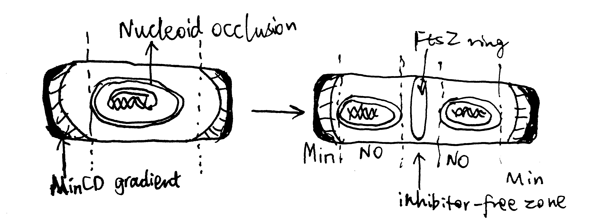
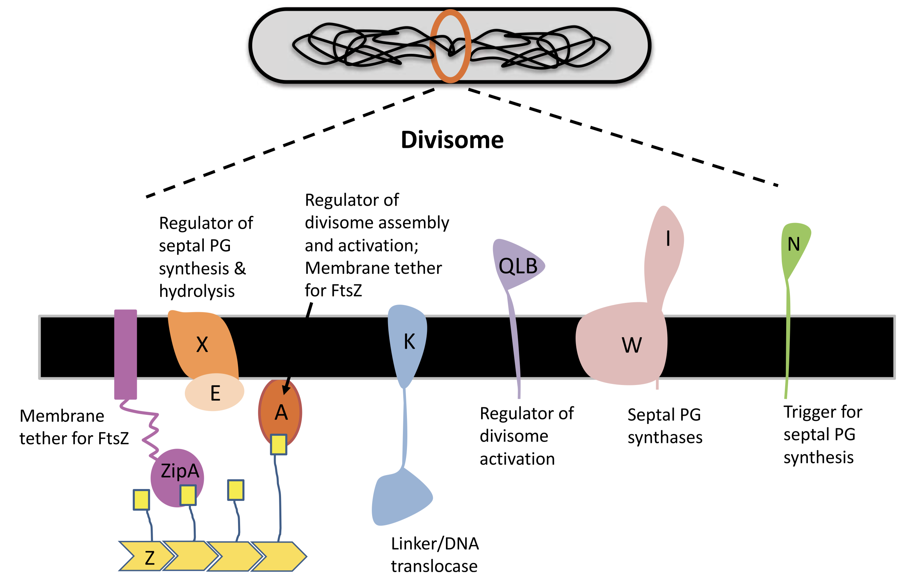

# Introduction 

The modes of bacterial cell division vary, but the most common one is binary fission [@Stahl-2019a], and its mechanism, especially in rod-shaped model organisms *Escherichia coli* and *Bacillus subtilis*, has been studied extensively. Despite the characterisation of most proteins required for divisome, their coordination at the molecular detail remain largely unclear [@Tsang-2015]. The question of how bacteria divide is further complicated by variations in proteins involved, and even in the physical nature, among different bacterial species [@Eswara-2017]

This essay introduces FtsZ as a highly conserved protein involved in septum formation and its regulation in model organsisms, and gives examples on diviations from these rules that mainly comes from studies on nonmodel organisms. 

# Preparation for Cell Division

The chromosome must be replicated once and only once prior to cell devision, and it must be ensured that each daughter cell receives one copy of the chromosome. 

## Chromosome Replication

Chromosome replication is principally regulated by DnaA in *E. coli*. DnaA initiates replication by binding its active, GTP-bound form (DnaA-ATP) to *OriC*. Its inactivation upon initiation of replication ensures one round of replication per cell cycle[^dnaa]. Such mechanisms include competition for *OriC* binding by SeqA, repression of *dnaA* expression (also by SeqA), and inactivation of DnaA-ATP by the ATPase HdaA. 

[^dnaa]: Some fast-growing bacteria may afford multiple rounds of replication on a single chromosome, and this makes it possible for their division to outpace DNA replication.

## Chromosome Segregation {#segregation}

Segregation of chromosomes and plasmids is achieved while they are being replicated by using the Par system in some bacteria such as the budding bacteria *Caulobacter crescentus*, as illustrated in Figure \@ref(fig:cc-par). popZ proteins anchors the chromosome at its *parS* sequence (near *oriC*) to the old pole, which is mediated by parB. As replication starts, more parB binds to *parS* sequence of the newly synthesised chromosome, and is pulled to the new cell pole by the ATPase activity of ParA. 

```{r cc-par, echo=FALSE, fig.cap="The Par system segregates replicated chromosomes in Caulobacter crescentus.", out.width="100%"}
knitr::include_graphics('../img/cc-par.jpg')
```

The mechanism of chromosome segregation in *E. coli*, which lacks Par, is not well characterised.

# FtsZ and the Z-ring

Central to almost all bactrial division is the FtsZ protein. FtsZ is a homolog of tubulin found in most bacteria and some archaea. Like tubulin, FtsZ is a GTPase and can polymerise into filaments. During cell division, FtsZ filaments assemble into a ring (Z-ring) at the site where the septum forms. The FtsZ ring then recruits other proteins of the divisome, allowing division to proceed. The Z-ring contracts as the bacterium divides, forming an invagination which finally divides the bacterium in two. 

The GTPase activity accounts for the rapid turnover dynamics of the FtsZ filaments that form the Z-ring. It has also been proposed that FtsZ's GTPase activity energises the constriction of the ring and the invagination of the cell membrane and the cell wall, but this notion is challenged by the observation of mutants that are severely impoaired in GTP hydrolysis still capable of dividing, and mathematical modelling that shows force generation could be achieved independenly of GTPase activity, but instead with hydrolysis [@Adams-2009].

## Z-ring Placement

The site of cell division in rod-shaped bacteria is usually at the centre of the cell, which is dependent on the corrent placement of the Z-ring. As shown in Figure \@ref(fig:no-min), this is typically achieved using two mechanisms, nucleoid occlusion (NO), and the Min system, which are well characterised in *E. coli* and *B. subtilis*. It should be noted, however, that there is increasing evidence showing Z-ring positioning may be determined by other factors, and Min and NO systems may primarily function to ensure the efficient utilisation of this site. Such evidence include the observation of precise midcell Z-ring formation in Min- and Noc-null *B. subtilis* by @Rodrigues-2012.

### The Min system 

The MinC, MinD and MinE proteins interact to prevent Z-ring formation at the poles [@Ghosal-2014; @Ramm-2019]. MinC is the effector of the system owing to its inhibitory effect on FtsZ ring assembly. MinD is an ATPase which recruit MinC to the membrane. MinCD complex together inhibit Z-ring formation. MinE is an ATPase-activating protein which has an anti-MinCD domain and a topological specificity domain (which confines its anti-MinCD activity only at midcell). The three proteins MinCDE form an oscillation cycle from pole to pole (driven by MinDE), causing the time-averaged concentration of MinCD complexes to be lowest at the midcell, which favours Z-ring formation there. *B. subtilis* also has a Min system but it is not involved in the placement of the Z-ring.

### Nuclear Occlusion

Nuclear occlusion prevents Z-ring formation atop of nucleoids. It is mediated by SlmA in *E. coli* and Noc in *B subtilis*. Neither are normally essential in their respective organisms, but both are synthetically lethal with mutatations of Min, due to chaotic FtsZ assembly.

According to @Adams-2015, Noc has a sequence-specific DNA-binding domain and a membrane-associating domain. Noc is thought to oligomerise using their two dimerisation domains, bind to DNA at specific sequences, and then insert into the inner leaflet of the cytoplasmic membrane. 

```{r no-min, echo=FALSE, fig.cap="Negative regulation by nuclear occulation and the Min system ensures formation of the FtsZ ring in E coli.", out.width="100%"}

```

 
## Other Key Proteins in the Divisome

A fully functional divisome requires a combination of proteins in addition to the FtsZ ring. Most of these proteins have close association with the Z ring. In *E. coli*, It was thought that the recruitment of these proteins appears to have a linear dependecy pathway which starts with FtsA/ZipA and ends with FtsN, but a recent review by @Du-2017 shows evidence for the noon-sequential assembly of the divisome. 

### ZipA and FtsA

ZipA is acts to tether the FtsZ ring to the cytoplasmic membrane. It is not widely conserved outside of Gammaproteobacteria, and, in *E. coli*, its necessity in cell division is bypassed by a gain-of-function mutation in FtsA. FtsA, which is more widely conserved in bacteria, also anchors the Z ring to the membrane and coordinates its initial assembly [@Adams-2009].

FtsA is related to actin, and, like actin, it binds ATP and  is found to reversibly polymerise into corkscrew-like helices in *Streptococcus pneumoniae*. Its ATPase activity is reported in *B. subtilis* but not in *S. pneumoniae*. Mutagenesis studies suggest that nucleotide binding may be required for FtsA's ability to interact with itself and with FtsZ, [@Pichoff-2007] but its exact role is unknown.

FtsA differs from actin in that it is missing the 1B domain and it has an unrelated subdomain called 1C. The 1C domain is involved in recruiting downstream components of the divisome to the Z ring.

### Downstream Proteins Recruited by the FtsZ Ring

Upon assembly of the FtsZ ring, other downstream proteins, notably those involved in peptidoglycan biosynthesis, are recruited to form the divisome. 

FtsI, also known as penicillin binding protein 3 (PBP3), is one such protein in *E. coli*. It is required specifically for peptidoglycan synthesis at the septum [@Chen-2001]. Its recruitment is dependent on FtsK, which appears to be a bifunctional protein, with the C-terminal domain facilitating segregation of chromosome and the N-terminal domain carrying out a necessary, but undefined, function in septum development.

A summary of the divisome components is shown in Figure \@ref(fig:ffts-components)

```{r ffts-components, echo=FALSE, fig.cap="Components of the divisome.", out.width="100%"}

```

### FtsN

In *E. coli*, FtsN is the last component of recruited to the divisome. Once it arrives at the Z ring, the divisome begin to actively synthesising septal peptidoglycan to divide the cell. It has been suggest that FtsA-FtsN interaction may trigger cell constriction in a positive feedback loop [@Tsang-2015], but the exact mechanism remain elusive.

# Alternative Strategies for Bacterial Cell Division

## Alternative strategies of Binary Division 

Binary division means dividing a bacterial cell into daughter cells with equal volume and physiology, which requires the FtsZ ring to form at the midcell. Apart form the NO and Min systems described above, there are other strategies to achieve this.

```{r binary-division-alternative, echo=FALSE, fig.cap="Alternative strategies of Binary Division", out.width="100%"}
knitr::include_graphics('../img/binary-division-alternative.jpg')
```

### *Caulobacter crescentus*

The budding bacteria *C. crescentus* uses the MipZ gradient to regulate FtsZ ring placement (Figure \@ref(fig:binary-division-alternative) A). MipZ is translocated from the old pole to the new pole during chromosome replication and segregation, by directly interacting with the ParB-*parS* complex (see section \@ref(segregation)). MipZ displaces FtsZ from polar regions, thus permitting ring formation only at midcell.

### *Campylobacter jejuni* and Magnetotactic Bacterium

The amphitrichous [^amphi] bacteria *Campylobacter jejuni* uses the ATPase FlhG, which is a MinD/ParA homologue and a known regulator of flagellar number, to locate the Z ring placement, by expelling FtsZ from the two longitudinal poles where flagella grow.

[^amphi]: one flagellum at each pole

By constrast, in the monotrichohus magnetotactic bacterium of the *Gammaproteobacteria* class, flagellum formation in the daughter cell is dictated by the septum (Figure \@ref(fig:binary-division-alternative) B and C).

### *Agrobacterium Tumefaciens*

Most bacteria that exhibit binary division elongate their cells from the middle or at several locations perpenticular to the long axis (e.g. in *E. coli*, which is mediated by MreB). However, *Agrobacterium Tumefaciens*, which elongates unidirectionally, can still achhive binary division. As shown in Figure \@ref(fig:binary-division-alternative) D, after division, FtsA and FtsZ stay at the newly formed growth pole and facilitate polar growth. Upon elongation, they relocate to the midcell to initiate division. 

## Positive Regulation in *Myxococcus xanthus* 

The NO and Min systems described above are both negative regulatory mechanisms, where regions of low activity of relevant proteins allows for foramtion of FtsZ ring. There is evidence in some nonmodel organisms of positive regulation, where FtsZ ring formation is promoted by presence of certain proteins. This is exemplified by the deltaproteobacterium *M. xanthus*, in which the ParA-like protein PomZ localises to midcell in an FtsZ-independent manner before FtsZ ring formation. 

## Cell Division without FtsZ

In some species of Mycoplasma (which are well known for their small genomes), the FtsZ homologue is absent [@Lluch-Senar-2010]. Although the cell division mechanisms in these organisms remain elusive, they lead to reassessments on the role of FtsZ in FtsZ-dependent cell division. For example, as reviewed by @Xiao-2016, it is likely that the main driving force for membrane invagination and constriction is not directly provided by FtsZ, but by the peptidoglycan synthesis. 

# Concluding Remarks

There is an extensive repertoire of cell division strategies based on distinct families of proteins in the domain of bacteria. The lack of universal conservation and the ease of horizontal gene transfer among bacteria make cell division a suboptimal target of antibiotics. Indeed, most available antibiotics related to bacterial cell division target cell wall synthesis, and there is little progress made on developing drugs that interferes with other components of bacterial divisome.

# References

