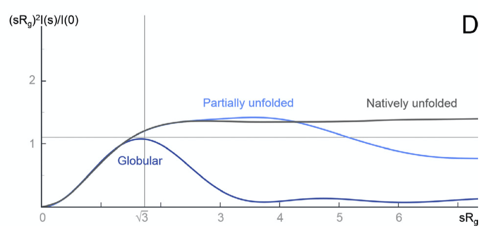

```{r setup, include=FALSE}
knitr::opts_chunk$set(out.width = '100%')
```

# Circular Dichorism (CD)

Reference: @Ranjbar-2009; @Kelly-2005;@Whitmore-2008 

Circular dichorism measures the difference in absorption of left-hand and right-hand circularly polarised light by optically active (chiral) molecules (usually biological macromolecules). It serves as a rapid way to assess structural information on proteins, carbohydrates, nucleic acids, pharmaceuticals, liquiud crystals, etc., in the solution state.

## Physical Principles

Electromagnetic waves (EM waves) has an electrical (E) component and a magnetic (M) component perpendicular to each other and both are perpendicular to the axis of propagation. Usually, only the E component is depicted for simplicity.

Most light sources have E components in all orientations, and when they pass through a slit, they become plane polarised, and can be represented by a simple sinusoidal wave. Adding up two plane polarised light perpendicular to each other produces interesting resultant waves, which can be visualised with **plotly** in R [@Sievert-2018a] (which is an uncommon use 'invented' by me[^plotly]). Assuming we are superposing two sinusoidal waves of the same amplitude and frequency with various phase differences, we can then compute the pattern of the resultant wave as a function of the phase difference:

[^plotly]: suprisingly, this graphing library originally not designed for math plotting worked pretty well, and is much easier to use (and more powerful in terms of interactivity) than other professional math plotting libraries. I even [used **plotly** to plot proteins](../bioinformatics/visualizing-protein-structures-using-plotly.html) and it worked quite decently!)

```{r message=FALSE, warning=FALSE}
library(plotly)
library(tibble)

calc_waves <- function(phase_diff = 0){
  # compute y and z values for given x values of the waves 
  # first arbitrarily choose evenly-spaced points on the x_axis
  x_axis = x=seq(1,20,0.1) 
  # compute the y, z values of the first sin wave on the xy plane
  sin1 <- tibble(x=x_axis,y=sin(x),z=0)
  # compute the y, z values of the second sin wave on the xz plane, 
  # taking the phase difference into account
  sin2 <- tibble(x=x_axis,y=0,z=sin(x + phase_diff))
  # compute the axes of the resultant wave
  # each y and z value is the sum of corresponding values in the 2 component waves
  resultant <- tibble(x=x_axis, y = sin1$y+sin2$y, z = sin1$z+sin2$z)
  
  return(list(sin1, sin2, resultant))
} 

plot_waves <- function(wave_list, components = c('sin1', 'sin2'), resultant = 'resultant'){
  # plotting
  plot_ly() %>% 
    add_trace(x=~x, y=~y, z=~z, name=components[1], data = wave_list[[1]], type='scatter3d', mode='lines') %>% 
    add_trace(x=~x, y=~y, z=~z, name=components[2], data = wave_list[[2]], type='scatter3d', mode='lines') %>% 
    add_trace(x=~x, y=~y, z=~z, name=resultant, data = wave_list[[3]], type='scatter3d', mode='lines')
}
```

When phase difference is zero, the resultant wave is also sinusoidal, and the plane in which it resides is oriented at 45$^\circ$ to each component wave, as shown in Fig. \@ref(fig:si) (*this is an interactive HTML widget so you can rotate, drag and zoom! Unfortunately it cannot be rendered in LaTeX, so please visit ../tutorial/three-biophysical-methods.html if you are reeading the LaTeX PDF output*).

```{r si, fig.cap='0 phase difference results in a sinusoidal wave', message=FALSE, warning=FALSE}
calc_waves(phase_diff=0) %>% plot_waves()
```

As shown in \@ref(fig:lh), When the phase difference is $\pi/2$, the resultant wave is helical and is said to be **circularly polarised** (for other phase differences, the pattern is helical but ellipised.

```{r lh, fig.cap='Formation of left circularly polarised wave.', message=FALSE, warning=FALSE}
L <- calc_waves(phase_diff=pi/2)
plot_waves(L, resultant = 'resultant: left circularly polarised')
L <- L[[3]] # the third tibble represents the resultant, which will be used later
```

Note the handedness of the resultant wave: when the phase difference is $\pi/2$, it is left-handed and it becomes right-handed when the phase difference is $-\pi/2$. The latter is drawn in Fig. \@ref(fig:rh).

```{r rh, fig.cap='Formation of right circularly polarised wave. ', message=FALSE, warning=FALSE}
R <- calc_waves(phase_diff=-pi/2)
plot_waves(R, resultant = 'resultant: right circularly polarised')
R <- R[[3]]
```

As shown in Fig. \@ref(fig:plane-polarised) If we add up the left and right circularly polarised light, the resultant is a plane polarised light. Thus it can be said that a plane polarised light can be viewed as being made up of two circularly polarised components of equal magnitude and frequency.

```{r plane-polarised, fig.cap='Addition of two identical waves of oppsite handedness results in a plane polarised wave.'}
plot_waves(list(L, R, 
  resultant=tibble(x=L$x, y = L$y+R$y, z = L$z+R$z)),
  components = c('left circularly polarised', 'right circularly polarised'),
  resultant = 'plane polarised')
```

CD measures differential absorption of these components. If the two components are absorbed to the same extent, clearly the resultant will still be planar as shown above. If there is differential absorption, as I simulate in Fig. \@ref(fig:diff-absorb), the resultant wave will be elliptical polarised. Here the R component is absorbed more than the L component, and the resultant ellipsed wave is left-handed. The CD signal (formally $\Delta A=\Delta A_\text{L}-\Delta A_\text{R}$) is generally reported in terms of the ellipticity, $\theta$, of this resultant wave. $\theta=\arctan(b/a)$ where b and a are the minor and major axes of the ellipse. $\theta$ can be easily converted to $\Delta A$ by the simple relationship: $\theta=32.98\Delta A$. The CD spectrum is obtained when the CD signal $\theta$ or $\Delta A$ is measured as a function of wavelength.

```{r diff-absorb, fig.cap='Differential absorption of circularly polarised light. Here 10% of the L component and 30% of the R component is absorbed (90% and 70% transmitted, respectively).'}
L1 <- L %>% mutate(y = 0.9 * y, z = 0.9 * z) # 10% absorption of L
R1 <- R %>% mutate(y = 0.7 * y, z = 0.7 * z) # 30% absorption of R
plot_waves(list(L, R, 
  resultant=tibble(x=L1$x, y = L1$y+R1$y, z = L1$z+R1$z)),
  components = c('left circularly polarised', 'right circularly polarised'),
  resultant = 'elliptical polarised')
```

A CD signal will be observed when a chromophore is chiral (either intrinsically chiral, bonded to a chiral atom, or due to asymmetric enviornment). In proteins, such chromophores include the peptide bond (absorption below 240 nm), aromatic amino acid side chains (absorption in the range 260~320 nm) and disulphide bonds (weak absorptoin around 260 nm). 

## Experimental Setup

The EM wave used in CD is UV, usually with $\lambda$ in the range 170~320 nm. Traditionally Xe arc lamps have been used as the light source of UV, but they can hardly achieve a wavelength below 180 nm. Now, high frequency UV can be generated by modern synchrotrons, and extending of CD data into the far UV region improves reliability of secondary structure prediction (see Section \@ref(ss)).

There are various methods by which the CD effect can be measured in a spectropolarimeter:

- modulation, in which the incident readiation is continuously switched between the L and R ocmponents
- direct subtraction, in whiich the absorbances of the 2 components are measured separately and subtracted from each other
- ellipsometric, in which the ellipticity of the transmitted radiation is measured

The modulation method is most commonly used. The experimental setup is described as follows:

- plane polarised light is split into the L and R components by passage through a modulator subjected to an alternating electric field
- the modulator normally consists of a piezoelectric quartz crystal and a thin plate of isotropic material (e.g. fused silica) tightly coupled to the crystal. 
- the alternating electric field induces structural changes in the quartz crystal; these make the plate transmit circularly polarised light at the extremes of the field
- as the transmitted radiation of switched between L and R components, these are detecred in turn by the photomultiplier. 

## Application of CD {#ss}

Far UV and near UV regions of CD give different information about a protein. 

Absorption in the far UV region (170-250 nm) is mainly due to the $\pi\rightarrow\pi^*$ and $n\rightarrow\pi^*$ transitions in the peptide bonds, which is dependent on $\Psi$ and $\Phi$ torsional angles. Thus different types of secondary structures, such as $\alpha$-helices, $\beta$-sheets, $\beta$-turns, each have their characteristic CD spectrum (Fig. \@ref(fig:cd)). These standard curves can be linearly combined to estimate the proportion of each secondary structure in a protein of interest. 

```{r cd, echo=FALSE, fig.cap='Experimental setup of CD; characteristic curves of some secondary structures'}
knitr::include_graphics('../img/cd.jpg')
```

The spectra in the near-UV region (260-320 nm) arise from the aromatic amino acids, each with a characteristic CD profile. The actual shape of the near UV CD spectrum will depend on the number of each type of aromic amino acid present, their mobility, their residing environment. Thus it can serve as a fingerprint of the of the tertiary structure of a protein.

```{r cd-aromatic, echo=FALSE, fig.cap="The near UV CD spectrum of a dehydroquinase, labelled with contribution from each aromatic amino acid side chain.", out.width="100%"}
knitr::include_graphics('../img/cd-aromatic.png')
```

By combining the far- and near-UV CD spectra, we can obtain a summary of the overall structural features of the protein of interest. Although it gives little insight into the precise 3D structure of the protein, it serves at a rapid way to detect conformational differences between two similar proteins *in solution*. Specifically, it can be used to: 

- monitor the progress of protein folding (especially the detectiion of molten globule-like structures)
- compare the wild type and mutant forms of a protein 
- confirm a modification (tagging) will not affect the protein's native conformation and normal function
- assess thermal stability (unfolding at high temperature)
- show the formation of amyloid $\beta$ protein in Alzheimer disease [@Barrow-1992]

CD can not only be applied to proteins but also to other chiral molecules. Such applications include: 

- determination of nucleic acid conformations (A-RNA, A-DNA, B-DNA, Z-DNA)
- determination of nucleic acid-ligand interactions, e.g. between cationic porphyrins and DNA [@Pasternack-2003]
- conformational study of biomolecular interaction with nanoparticles, where the degree of protein or nucleic acid denaturation is estimated [@Liu-2007]

## Other CD-based Techniques

The experiment described above is the conventional electronic circular dichorism (ECD). During the past decades, many other CD-based techniques have been developed to solve more specific questions. These include magnetic CDs (MCD, magnetic vibrational circular dichroism (MVCD), XMCD), fluorescence detected CD (FDCD), near-infrared CD (NIR-CD), vibrational CDs (VCD, FTIR-VCD), HPLC-CD, stopped-flow CD, and synchrotron radiation CD (SRCD).

# Small-angle X-ray Scattering (SAXS)

Reference: @Kachala-2015, @Kikhney-2015

Small-angle X-ray Scattering (SAXS) detects the X-ray scattering pattern of macromolecules in the solution state. Information about particle shape and size can then be obtained from the angular dependence of scattering. 

SAXS provides low resolution information on the structure, conformation and assembly state of proteins, nucleic acids and various macromolecular complexes. Importantly, it offers powerful means for the quantitative analysis of flexible systems, including intrinsically disordered proteins (IDPs) and multi-domain proteins with flexible linkers.

## Physical Principles

The the X-ray used in SAXS has wavelength of about the same size as the macromolecules in the sample, which allows formation of interference pattern (Fig. \@ref(fig:saxs-principle-1)). 

```{r saxs-principle-1, echo=FALSE, fig.cap="(A) for an array (usually a crystal) of small scatterers whose size is small compared to the wavelength of the incident light, an interference pattern can be observed due to the fixed path differences (and hence phase differences) between any two scatterers; (B) in the solution state of such small particles, their random orientation and movement make scattering to occur in all directions (so that a pattern cannot be observed); (C) when the size of the scatterers is comparable to or greater than the wavelength, angle-dependent scatterings due the nuclei/electrons of pairs of atoms within individual particles can thus be observed (larger angle, larger path difference).", out.width="100%"}

```

## Experimentation and Data Processing

SAXS uses a collimated monochromatic X-ray beam to illuminate the sample, and the intensity of the scattered X-rays a is recorded. The scattering of the pure solvent is also collected and subtracted from the sample solution scattering. The resulting 2D scattering pattern is translated into a 1D *I* vs. *q* relationship (where *I* is intensity and $q = 4\pi\sin(\theta/2)/\lambda$), and the data is transformed and plotted in a variety of ways.

Several parameters can be calculated from SAXS data, including molecular weight, excluded particle volume, maximum dimension $D_\text{max}$ and the radius of gyration $R_g$.

$R_g$ can be directly extracted from SAXS data using the Guinier approximation, which states that, when the incident angle is small (approaching 0), the angular dependence of scattering can be described by the equation $I(q)=I_z\exp(-q^2R_g^2/3)$, where $R_g$ is the radius of gyration of the particle. When $\ln(I(q))$ is plotted against $q^2$ ($\ln(I(q)) = \ln{I_0}-(R_g^2/3)q^2$), $R_g^2/3$ is the slope of the resulting straight line. 

$R_g$ provides a measure of the overall size of the macromolecule. It is the average root-mean-square distance to the centre of density in the molecule weighted by the scattering length density. 

Some plots can emphasised sample flexibility, e.g. a Kranky plot ($IQ^2$ agianst $Q$) can help identify an unfolded protein, as shown in Fig. \@ref(fig:Kratky)

```{r Kratky, echo=FALSE, fig.cap="The Kratky plot", out.width="100%"}

```

$I(q)$ can be considered as a reciprocal space as a Fourier transform of $p(r)$, which is the distribution of distances between pairs of atoms in real space. These two are related to each other by the equation:

$$p(r)=\dfrac{r^2}{2\pi^2}\int_0^\infty\dfrac{q^2I(q)\sin{(qr)}}{qr}ds$$

$p(r)$ can be obtained from experimental data by indirect Fourier transformation. One such distribution is shown in Fig. \@ref(fig:saxs-pr).

```{r saxs-pr, echo=FALSE, fig.cap="Distance distribution function *p(r)* vs. r. Globular compact particles have a more symmetric distribution while unfolded particles have an skewed distribution with an extended tail.", out.width="100%"}
knitr::include_graphics('../img/saxs-pr.png')
```

To produce meaningful results, SAXS requires that the samples to be monodisperse (non-aggregated), which can be verified by dynamic light scattering (DLS) or analytical centrifugation (AUC).

# Analytical Ultracentrifuge (AUC)

Reference: @Harding-2015; @Uchiyama-2018; @Unzai-2018; @Harding-2010

The analytical centrifuge (AUC) is a high speed (up to 60000 rpm) ultracentrifuge equipped with absorbance and interference detection systems, which allow the analysis of the redistribution of macromolecular solute under the influence of a centrifugal field. AUC is a convenient, matrix-free solution technique without requirement for immobilisation, columns, or membranes.

Typical AUC experiments can be classified into two types:

- **sedimentation velocity experiment:** record the *change in concentration distribution* over time (performed at high speed)
- **sedimentation equilibrium experiment:** record the *steady state distribution* of the macromolecular solute following equiilibration of centrifugal and diffusive forces (performed at lower speed)

These two methods can give information about a wide range of parameters of protein-protein interactions, including stoichiometry, reversibility, strength and, in some cases, dynamics.

Apart from protein-protein interactions, AUC is now applied to study interactions of a wider range of macromolecules, such as protein-like carbohydrate assocaition, carbohydrate-protein association (polysaccharide-gliadin), and nucleic acid protein (G-duplexes) interactions.
      
## Choice of Optical System

Depending on the strengths of the interaction probed (and the concentration of the sample), different optical systems are used:

- for weak interactions ($10^{-4}<K_\text{d}<10^{-1}$), higher concentrations (>5 mg/ml) are required and the *Rayleigh interference* optical system is the most appropriate
- for moderate-strength interactions ($10^{-7}<K_\text{d}<10^{-4}$, 0.1~0.5 mg/ml), either *interference* optics or *UV absorption* optics can be used
- for strong interactions ($K_\text{d}<10^{-7}$), *dye-labelled* proteins and *fluorescence optics* are necessary
      
## Experiments

### Sedimentation Velocity (SV)

In the SV experiment, measurements on the absorption ($A$, which is proportional to local concentration) at different radial distances ($r$) from the rotation centre are made at fixed time intervals ($t$), producing a series of s-shaped curves that shift to higher $r$ values as sedimentation proceeds (Fig. \@ref(fig:auc-sv-data).

The spinning rotor generates a sedimentation force on a particle of $m\omega^2r$ ($m$ = particle mass; $\omega$ = angular velocity; $r$ = distance from the centre of rotation). In solution, the particle displaces solvent, so the sedimentation force acts on an effective mass, $m_\text{eff}=m(1-\bar v\rho)$ that is less than $m$ ($\rho$ = solvent density; $\bar v$ = partial-specific volume (in ml/g)). $\bar v$ is usually calculated (for proteins, $\bar v$ lies in the range 0.70-0.75, leading to $(1-\bar v\rho)$ of around 0.27 (in water)). At terminal velocity (acceleration = 0), the sedimentation force is balanced by the frictional force and the velocity can be described by the equation $v=m(1-\bar{v}\rho)\omega^2r/f$, where $f$ is the friction coefficient, which is related to the diffusion coefficient, $D$, by $f=RT/N_\text{A}D$. The equation can thus be arranged to  $v=DM(1-\bar{v}\rho)\omega^2r/RT$. By defining the *sedimentation coefficient* as $s=v/\omega^2r$, the *Svedberg equation* can be written as $s=\dfrac{DM(1-\bar{v}\rho)}{RT}$.

The sedimentation coefficient $s$, which is experimentally determined in SV has the unit Svedberg (S) where 1 S = 10^-13^ seconds. The greater the molecular weight or more compact/spherical (less friction) the macromolecule is, the larger its $s$ value. Usually the experimentally measured $s_\text{exp}$ is standarised to $s_{20, \text{w}}$, which is the value that would have been observed in water at 20$^\circ$C, using the relationship $s_{20, \text{w}}=\dfrac{s_\text{exp}(\eta_\text{exp}(1-\bar{v}\rho_\text{20,w})}{(\eta_\text{20,w}(1-\bar{v}\rho_\text{exp})}$, where $\eta$ and $\rho$ refer to the viscosity and density of the buffer.

The Lamm equation, derived from Svedberg equation and Fick's diffusion laws, describes the time dependence of the concentration: 

$$\frac{\partial c}{\partial t}=D\left[\left(\frac{\partial^2 c}{\partial r^2}\right)+\frac{1}{r}\left(\frac{\partial c}{\partial r}\right)\right]-s\omega^2\left[r\left(\frac{\partial c}{\partial r}\right)+2c\right]$$

Solving this diffential equation leads to $g(s)$, which is the distribution of $s$. SEDFIT is one of the softwares specialised in solving this. SEDFIT can either give the uncorrected $g(s)$ versus $s$ profile, or it can give a distribution, known as $c(s)$ vs. $s$, which has been corrected for diffusion broadening (this assumes all particles have the same frictional ratio $f/f_o$). The $g(s)$ vs. $s$ or $c(s)$ vs. $s$ can further be converted to a molecular weight distribution, $c(M)$ vs. $M$, which is analogous to a mass spectrum (Fig. \@ref(fig:auc-sv-data)). SEDFIT is particularly good at evaluating homogeneity/heterogeneity of a prepation. Where the solution is heterogeneous, it can estimate the proportion of each sedimenting species and ascertain whether there is a reversible equilibrium. 

```{r auc-sv-data, echo=FALSE, fig.cap="Schematic of data processing in SV experiments. The raw data collected is a series of curves recorded at fixed intervals, each showing the variation of the absorbance with the distance from the rotation centre. By solving the Lamm equation, this is transformed to a *g(s)* vs. *s* plot, or *c(s)* vs. *s* plot if it is denoised by SEDFIT. It can be further transformed into a *c(M)* vs. M plot (distribution of molecular weights), assuming constant frictional ratio $f/f_o$", out.width="100%"}
knitr::include_graphics('../img/auc-sv-data.jpg')
```

SV also gives information about the shape. The friction coefficient, $f$, can be easily calculated from the terminal velocity ($v=m(1-\bar{v}\rho)\omega^2r/f$), and the friction ratio, $f/f_o$ (where $f_o=6\pi r\eta$), shows diviation of the molecular shape from the sphere. 

SV can also be applied for interaction analysis, and the simpest case is co-sedimentation. For example, the binding of adenosylcobalamin cofactor to the methylmalonyl-CoA mutase system from *Propionibacterium shermanii* was demonstrated by AUC with UV-absoption system. At a wavelength selected to detect the ligand only, in the presence of the mutase, all ligands sediment at the same rate as the protein, confirming the ligand is 100% bound. 

In SV analysis, the emergence of new peaks at higher concentrations, shifts in the ratios of the peak areas, and/or shifts in peak positions are indicative of protein-protein interactions.

Fig. \@ref(fig:sv-trap) shows an SV experiment which studies the binding between the *Bacillus stearothermophilus* 11-mer protein TRAP (*trp* RNA-binding attentuation protein) and Anti-TRAP (AT). As the TRAP:AT ratio increases froom 1:0 to 1:6, the peak representing TRAP shifts to higher *s*, indicating rapid and reversible binding between TRAP and AT (slow/irreversible interaction would result in separate peaks). The plot also shows that TRAP was saturated with AT at a 1:6 stoichiometry (as increasing ratio to 1:10 did not result in further shifts) and that the TRAP-AT complex was stable to excess AT (no negative feedback loop).

```{r sv-trap, echo=FALSE, fig.cap="SV analysis of TRAP and AT. The TRAP concentratioin was fixed at 0.5 mg/ml, and varying amounts of AT (TRAP's ligand) were added, with molar ratios of TRAP:AT labelled.", out.width="100%"}
knitr::include_graphics('../img/sv-trap.png')
```

# References
