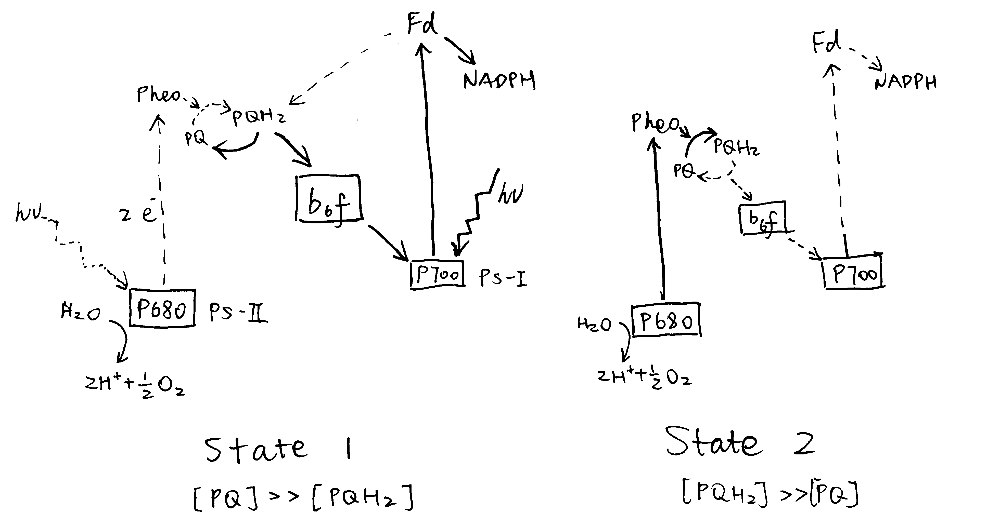

**Why do plants co-ordinate the relative activities of Photosystems I and II and how is this co-ordination achieved?**

# Background

Photosystems I and II are photochemical complexes that harvest light energy to drive endergonic redox reactions. Their operation in series (PS-II then PS-II), known as the Z scheme, results in generation of oxygen from water via photolysis, ATP production via electron transport chain (ETC) and production of NADPH (reduction of NADP^+^), which is essential for providing reducing power in anabolic reactions such as photosynthesis, by ferredoxin-NADP^+^ reductase. PS-I can also operate alone, resulting in cyclic photophosphorylation, generating ATP only.

Each photosystem exists on the thylakiod membrane (PS-II mainly in grana lamellae; PS-I mainly in stroma lamellae) as a  multisubunit pigment-protein complex (or a dimer thereof, in the case of PS-II) comprising a reaction centre (RC) core containing a pair of chlorophyll *a* molecules, which is surrounded by other accessory proteins as well as variable number of antenna complexes ((trimers of) LHC-II/LHC-I; also known as chlorophyll *a/b* light-harvesting complex ) containing accessory pigments (e.g. chlorophylls and carotenoids) that pass light energy to the reaction centre via resonance energy transfer. The reaction centre in PS-II preferentially absorbs red light at wavelength 680 nm and is thus referred to as P680; the reaction centre in PS-I, known as P700, preferentially absorbs far-red light.

The activities of two types of photosystems is determined both by the external factors, i.e. intensity and wavelength of light, as well as the the intrinsic factors which can be regulated by the plant cells, namely the number of PS-II/PS-I cores and the antenna complexes (and hence the amount of accessory pigments) associated with them. Such regulation can affect the absolute activities of PS-II and PS-I as well as their activities relative to each other.

# Why is Coordination between Photosystems I and II Needed

Because the PS-I and PS-II complexes are not physically coupled (so their abundance can differ) and their light absorption properties differ (PS-I prefers longer wavelength), their activities are not directly related and are often different. The activities of the two photosystems relative to each other can be regulated using the mechanisms described in Section \@ref(achieve), but before that, the benefits of this regulation are considered here:

1. **Stoichiometry adjustment.** PS-II and PS-I activities should ideally be equal, in order to maximise the efficiency of light utilisation for production of NADPH in vectorised electron flow, which would otherwise be limited by the slower photosystem. There is a need for this kind of adjustment when there is a change in light quality. Upon illumination by far-red light that preferentially activates PS-I (PS-I light), PS-I activity is greater than PS-II, so PS-II activity shhould be improved relative to PS-I. Conversely, illumination by PS-II light leads to hyperactive PS-II, and its activity should be reduced relative to PS-II. These two states are referred to state 1 and 2, respectively, and state transition is the process by which the plant adjusts relative activity of PS-II and PS-I in response to a change in state.
2. **Protection against photoinhibition.** If PS-II activity exceeds PS-I activity, the rate of production of reactive oxygen species (ROS) is increased. However, recent studies on stn7 mutants argue against this role. Photodamage of PS-II is unavoidable even under nomal conditions, and it is repaired efficiently in healthy plants.
3. **Meeting increased requirement for ATP.** If PS-I activity exceeds PS-II activity, the excess activity in PS-I results in cyclic electron flow (CEF), generating additional ATP. Theoretically, this may be exploited by the plant to meet increased demand for ATP. However, recent work revealed that CEF is controlled by the redox power and is independent of state transition: state 2 is neither sufficient nor required to promote CEF [@Takahashi-2013].

The discussion below, therefore, focuses on the role of photosystem coordination in stoichiometry adjustment.

# How is Coordination between PS-I and PS-II Achieved {#achieve}

## The Role of the Plastoquinone Pool

The oxidative status of the plastoquinone (PQ) pool reflects the relative activity of PS-II and PS-I, and is involved in the signalling pathway of both short-term and long-term coordination (described in Section \@ref(redistribution) and \@ref(transcriptional), respectively).

Upon illumination by PS-I light (in state 1), PS-I activity is greater than PS-II, leading to oxidation of the plastoquinone pool (most plastoquinone molecules are in the oxidised form, PQ). Conversely, the plastoquinone pool becomes reduced upon preferential excitation of PS-II (Figure \@ref(fig:plastoquinone)).

```{r plastoquinone, echo=FALSE, fig.cap="Preferential activation of either PS-I or PS-II causes a shift in the oxidation state of the plastoquinone (PQ) pool.", out.width="100%"}

```

## Reversible Redistribution of LHC-II {#redistribution}

LHC-II plays an important role in the coordination between PS-I and PS-II. The structure of one LHC-II protein has been determined by a combination of electron microscopy and X-ray crystallography (reviewed by @Barros-2009). It contains three membrane-spaning $\alpha$-helices, and binds about 15 chlorophyll *a* and *b* molecules plus a few carotenoids. LHC-II complexes of different subtypes (of which Lhcb1, 2 and 3 are the most common) spontaneously assemble into trimers (can be heterogeneous), which then associate with PS-II and PS-I to increase the efficiency of their corresponding photochemical reaction.

```{r lhcii-conf-change, echo=FALSE, fig.cap="Phosphorylation by STN7 causes conformational changes in LHC-II. Top: stroma; bottom: thylakoid lumen.", out.width="100%"}
knitr::include_graphics('../img/lhcii-conf-change.png')
```

The LHC-II subtypes Lhcb1 and Lhcb2 (but not Lhcb3) can be phosphorylated by a specific protein kinase called STN7 (a.k.a. Stt7) at a threonine residue near the N-terminus [@Mullet-1983]. This happens during transition to state 2, when the STN7 kinase, which is associated with a specific region of the Rieske protein of the cytochrome *b~6~f* complex (Cyt*b~6~f*), is activated upon binding of PQH~2~ to the Q~o~ site of Cyt*b~6~f*. Phosphorylation on LHC-II causes a conformational change (Figure \@ref(fig:lhcii-conf-change)), reduces its affinity to PS-II and increases its affinity to PS-I. The increase in affinity to PS-I is due to not only the conformational change, but also the tight association between the phosphate group and a specific arginine residue in PsaL, a protein that facilitates docking of LHC-II to PS-I core complex. As a result, LHC-II migrates from PS-II towards PS-I, thus enhancing efficiency of PS-I relative to PS-II (Figure \@ref(fig:stn7-tap38-pq-lhcii)). This is supported by the findings that plants without either STN7 [@Bellafiore-2005] or Lhcb1+Lhcb2 [@Andersson-2003] do not undergo state transitions. It was later shown by @Longoni-2015 that only Lhcb2 phosphorylation is relevant to state transition (Lhcb1 phosphorylation causes its exclusion from the complex). The N-terminal region of phosphorylated Lhcb2 interacts with PsaL, PsaH and PsaO proteins, and PsaO bridges PsaA (PSI reaction centre) and Lhcb2 through contacts within the membrane and on the stromal and luminal surface. PsaO is associated with two chlorophyll molecules which facilitates resonance energy transfer from LHC-II to PsaA.

The phosphorylation can be reversed by a specific kinase called TAP38 (a.k.a PPH1). When PS-I is over-excited relative to PS-II, STN7 is inactive, and TAP38 dephosphorylates LHC-II and causes them to return to PS-II (Figure \@ref(fig:stn7-tap38-pq-lhcii)).

```{r stn7-tap38-pq-lhcii, echo=FALSE, fig.cap="Oxidative status of plastoquinone determines the phosphorylation state of LHC-II, which in turn regulates relative activity of PS-I and PS-II.", out.width="100%"}
knitr::include_graphics('../img/stn7-tap38-pq-lhcii.png')
```

<!-- under High light conditions by response to FdH~2~) -->

## Transcriptional Regulation {#transcriptional}

Regulation of relative activity of PS-I and PS-II can also be achieved by controlling the amount of transcription of PS-I genes (e.g. *psaA*) and PS-II genes (*psbA*). 

@Puthiyaveetil-2008 described a sensor kinase called chloroplast sensor kinase (CSK) that couples oxidation state of PQ to transcriptional control of psbA. As shown in Figure \@ref(fig:csk), PS-I light causes the PQ pool to be oxidised, and then CSK, which is activated by PQ (the PQ analogue, DBMIB (2,5-dibromo-3-methyl-5-isopropyl-*p*-benzoquinone) binds to CSK similarly), autophosphorylates itself, and then phosphorylates sigma factor 1 (SIG1) subunit of PEP (RNA polymerase). This results in specific repression of PS-I genes (*psaA*), thus decreasing the stoichiometry of PS-I to PS-I. Conversely, CSK is inactive with a reduced PQ pool under PS-II light, and SIG1 phosphatase removes the repression of PS-I gene transcription, thus increasing the stoichiometry of PS-I to PS-II.

```{r csk, echo=FALSE, fig.cap="Transcriptional control of PS-I genes mediated by PQ, CSK, SIG1 and PEP.", out.width="100%"}
knitr::include_graphics('../img/psi-ii-csk-tx.png')
```

### How does SIG1 phosphorylation confer phhotosystem promoter specificity?

Bacterial sigma factors contain the region 1.1 at the extreme N-terminus. Region 1.1 is a poorly-conserved, acidic region, which is associated with the positively charged catalytic cavity of RNA polymerase in the closed (non-transcribing) conformation. To begin transcription, (negatively-charged) DNA must replace region 1.1, and the efficiency of this replacement depends on how well the -10 and -35 elements of the promoter match the consensus sequence.

Chloroplast SIG1 also has an N-terminal un-conserved region (UCR), but it contains both acidic and basic patches. It is proposed that, in PS-II light, the basic patch and the acidic patch of the un-phosphorylated SIG1 form a complex through electrostatic interactions, thus preventing the association of the acidic patch with the basic catalytic cavity.
In PS-I light, phosphorylation with the basic patch disfavours its complex formation with the acidic patches, thus allowing the acidic patch to associate with the catalytic cavity, where it acts as the gatekeeper and discriminates between strong and weak promoters.

By comparing the -35 and -10 regions of the promoters of *psaA* and *psbA* to the consensus sequence, it can be deduced that *psbA* (PS-II gene) has a stronger promoter and is therefore preferentially transcribed over PS-I under PS-I light, when SIG1 is phosphorylated and the discrimination mechanism is functioning.

# Conclusion

Plants need to coordinate the efficiency of PS-II and PS-I in order to maximise the utilisation of light energy in linear electron flow. Upon change in light quality, activities of PS-II and PS-I are transiently unsyncronised, leading to change in oxidative state of PQ (i.e. accumulation of PQ or PQH~2~). This triggers two mechanisms used to regain the balance. First, PQH~2~ binding to Cyt*b~6~f* activates STN7, which in turn causes phosphorylation of LHC-II and its migration from PS-II to PS-I. Second, PQ activates CSK, which phosphorylates SIG1, causing PS-II genes to be preferentially transcribed.

# References {-}