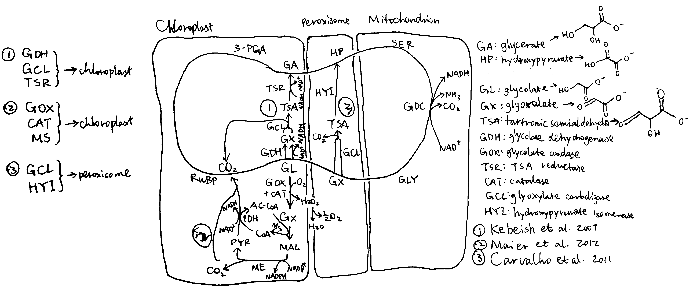

**Discuss the feasibility and desirability of improving photosynthesis in higher plants through the use of photorespiratory bypasses.**

Plants and algae use the Calvin cycle to capture inorganic carbon (as CO~2~) and use ATP and NADPH generated in light reactions to convert it to organic carbon. This process, known as photosynthesis, is the predominant way to replenish organic carbon in the biosphere, and is the basis for human food production. Despite its crucial role, the key enzyme in the pathway that attaches the inorganic CO~2~ to the organic sugar 1,5-bisphosphate (RuBP), called Rubisco, is not efficient, in that it can also use O~2~ instead of CO~2~ as the substrate, which leads to production of one molecule each of 3-PGA and 2-phosphoglycerate (2-PG). Plants use a pathway known as photorespiration to remove the toxic 2-PG and to salvage some (75%) carbon lost from the Calvin cycle by converting two 2-PG to one 3-PGA while releasing CO~2~ (Figure \@ref(fig:pr-bypass-native) ). Photorespiration is one of the major factors contributing to inefficiency of photosynthesis because 1) much CO~2~ released in mitochondria is escaped into the atmosphere and not re-assimilated in the Calvin cycle, resulting in the reduction of the amount of Calvin cycle intermediates; 2) O~2~ directly competes with CO~2~ for Rubisco reaction (in ambient atmosphere and at 25^o^C, 25% of the Rubisco reactions in an average C3 plant uses O~2~); 3) in photorespiration, ammonia is released and needs to be reassimilated at the expense of one molecule of ATP and two reducing equivalents (reduced ferredoxins) per molecule of ammonia; 4) reducing power is dissipated in the oxidation of glycolate using molecular oxygen; 5) ATP is also consumed for phosphorylating glycerate in the final step in the photorespiration pathway (because the phosphate group on 2-PG is removed by phosphatase and is thus not conserved). The total direct energy cost for converting two 2PG to one 3PGA is 3.5 ATP and 2 NADPH. The rate of photorespiration is increased by the ratio of O~2~ concentration to CO~2~ concentration experienced by Rubisco (in C~3~ plants, this is similar to atmospheric ratio), and is thus increased by high temperature, as solubulity of CO~2~ decreases faster than does O~2~ with increasing temperature.

```{r pr-bypass-native, echo=FALSE, fig.cap="The native photorespiration pathway.", out.width="100%"}
knitr::include_graphics('../img/pr-bypass-native.png')
```

Several groups of photosynthetic organisms independently evolved strategies to minimise photorespiration and are thus able to grow in hot and/or CO~2~-deficient conditions. For example, C~4~ and CAM plants uses PEP carboxylase, which uses $HCO_3^-$ instead of CO~2~ as the substrate, to perform an initial carboxylation, which results in production of 4-carbon malate/oxaloacetate that is later used to release CO~2~ for Rubisco reaction. The initial carboxylation and later decarboxylation is separated spatially in C~4~ plants and temporally in CAM plants. In aquatics environments where CO~2~ concentration is low, cyanobacteria and green algae uses bicarbonate pumps to actively increase intracellular CO~2~ ($HCO_3^-$) concentration, and their Rubisco is in close proximity with carbonic anhydrase, which converts $HCO_3^-$ to CO~2~.

The vast majority of land plants (especially crops), however, adopts the C~3~ metabolism scheme, which means they do not actively concentrate CO~2~ and are susceptible to reduction of photosynthesis efficiency by photorespiration. Thus, it has been believed that reduction in photorespiration can improve photosynthesis and hence crop yield.

# Attempts to Inhibit Photorespiration and Improve Specificity of Rubisco

Initial attempts to reduce the effect of photorespiration include inhibition, knock-down and knock-out of the enzymes involved in photorespiration. The relevant genes are identified by screening for mutants that have impaired photorespiratory function. However, most of such mutants exhibited chlorosis and stunted growth. The rationale is simple: reduction of photorespiratory enzyme activity not only does not reduce the production of 2-PG by Rubisco, but also causes the toxic molecules resulted from partial metabolism of 2-PG to accumulate. Also, it has been suggested that photorespiratory enzymes may be also involved in other pathways related to serine biosynthesis and nitrogen metabolism.

Researches that attempted for a Rubisco enzyme with a greater specificity for CO~2~ were also conducted. However, it was found that there is a inverse relationship between specificity and rate of reaction. As adaptations to achieve maximal rate of photosynthesis in different environments, Rubisco with high specificity and low turnover rate are typically found in C~3~ plants that grow under high temperature/low CO~2~, and Rubisco with high turnover and low specificity are generally found in C~3~ plants that grow under lower temperature, as well as in organisms with a CO~2~-concentrating mechanism (C~4~/CAM/algae/cyanobacteria).

# Bypassing Photorespiration

As attempts to improve Rubisco specificity and inhibit photorespiration directly both did not yield much outcome, photorespiratory bypasses becomes the new hotspot for improving photosynthesis. In general, photorespiratory bypasses are 'designed photorespiratory pathways' that aim to minimise energy comsumption and CO~2~ loss to the atmosphere. Successful bypasses usually involve confining photorespiration to less compartments (ideally in chloroplast only), preventing lost of reducing power via oxidase, preventing release of NH~3~, and reducing the number of steps of reactions.

## Implementing The Bacterial Glycerate Pathway

Many bacteria possess a simple and efficient pathway for converting glyoxylate to glycerate. This pathway involves two steps: 1) condensation of two glyoxylate to tartronate semialdehyde (by glyoxylate carboxyligase (GCL)) while releasing CO~2~; 2) reduction of tartronate semialdehyde by tartronate semialdehyde reductase (requiring one NADH) to glycerate. Compared with the native photorespiratory pathway (which converts glyoxylate to glycine in peroxisome and decarboxylates glycine in the mitochondrion), NH~3~ release is prevented and, if this pathway can be implemented in the chloroplast, CO~2~ release is localised to the chloroplast and is more likely to be re-assimilated by Rubisco instead of escaping to the atmosphere.

To implement the pathway in the chloroplast, a targeting sequence (e.g. Arabidopsis Rubisco small subunit (RbcS) or phosphoglucomutase transit peptide sequence) needs to be added to the N terminus of the gene constructs of the desired enzymes. In addition, the enzyme(s) that converts glycolate to glyoxylate also need(s) to be imported to the chloroplast. In normal plants, this conversion is catalysed by glycolate oxidase in peroxisome, and the same enzyme can be targeted to the chloroplast. However, glycolate oxidase is inefficient, as it uses O~2~ as the hydrogen acceptor, which wastes reducing power. In addition, its reaction generates H~2~O~2~, which needs to be broken down by catalase. A more efficient bacterial enzyme, glycolate dehydrogenase (GDH), can be used to replace glycolate oxidase's role. GDH uses NAD^+^ instead of O~2~ as the hydrogen acceptor, which prevents production of toxic H~2~O~2~ and preserves reducing power.

According to the scheme described above, @Kebeish-2007 generated plants transformed with five chloroplast-targeted bacterial genes encoding glycolate dehydrogenase, glyoxylate carboligase and tartronic semialdehyde reductase (Figure \@ref(fig:pr-bypass-3mech), 1). In these plants, some glycolate is successfully converted directly to glycerate in chloroplasts, and reduces, but not eliminate, flux of photorespiratory metabolites through peroxisomes and mitochondria. The transgenic plants grew faster, produced more shoot and root biomass, and [the content of soluble sugars (fructose, glucose and sucrose) increases significantly](https://www.nature.com/articles/nbt1299/tables/1).

```{r pr-bypass-3mech, echo=FALSE, fig.cap="Three photorespiratory bypasses. The loop represents the native pathway.", out.width="100%"}

```

@Carvalho-2011 designed a similar photorespiratory bypass (Figure \@ref(fig:pr-bypass-3mech), 3). It also uses tartronate semialdehyde (TSA) as the intermediate and thus prevents NH~3~ production. However, the CO~2~-releasing TSA synthesis reaction occurs in the peroxisome rather than in the chloroplast and therefore this mechanism does not have the additional benefit of reducing CO~2~ loss. In the peroxisome, TSA is converted to hydroxypyruvate by hydroxypyruvate isomerase (HYI), and the rest is identical to the native pathway. Unfortunately, all plants fail to express HYI, and for those with GCL expressed, chlorosis and stunted growth are exhibited, similar to photorespiration mutants. (I think one statement regarding this piece of research at the end of page 808 of the review written by @Weber-2019 is not appropriate, as HYI was not even expressed)

@Maier-2012 used a completely different approach. Instead of taking shortcuts within the native photorespiratory pathway with 3-PGA being the final product, they introduced glycolate oxidase, catalase and malate synthase into the chloroplast, which, together with pyruvate dehydrogenase and malic enzyme which are natively present in the chloroplast, completely oxidise glycolate into two CO~2~ (Figure \@ref(fig:pr-bypass-3mech), 2), while producing NADPH and NADH. Although this pathway requires more energy than the native pathway to restore the '_status quo ante_' according to the calculation (see @Peterhansel-2013, Table 2), and is shown in computational modelling to result in a 31% _decrease_ in photosynthetic efficiency compared to WT [@Xin-2015], experimental studies on *Arabidopsiis thaliana* surprisingly revealed an increase in biomass in these transgenic plants. A modified version of this approach carried out later on tobacco plants by @South-2019 were shown to be even more successful than Kebeish's approach which was calculated to be the most energy-efficient. The success of Maier's method may be explained by thhe fact that, in hot climates (where sunlight is intense), ATP and NADPH supply from light reactions is often not limiting, so an improved energy balance in photorespiration does not necessarily improve the rate of carbon fixation. Instead, the benefit brought about by the rapid CO~2~ generation in this bypass is more important. In addition, it is argued that the 'wasteful' dissipation of reducing power by glycolate oxidase may actually be beneficial in avoiding production of reactive oxygen species (ROS) in high light intensity, when the output of light reactions is in large excess. This also explains why higher plants prefer glycolate oxidase rather than glycolate dehydrogenase.

## Inhibition of the Glycolate Transporter

In the two successful photorespiratory bypasses described above, glycolate metabolism inside chloroplast competes with its export via the glycolate exporter PLGG. Therefore, repression of this transporter is expected to increase the flux into the bypasses and thus further increase the efficiency. @South-2019 studied the effect of RNAi inhibition of *PLGG1* in these two methods as well as a 'combined' scheme of the two. The constructs and mechanisms of action are shown in Figure \@ref(fig:pr-bypasses-south-2019). Both AP1 and AP3 (but not AP2) showed significant increase in dry weight biomass, by 13% and 18%, respectively. When the _PLGG1_ RNAi module is added, the benefit of AP1 is lost, while that of AP3 increases to 24% (@Weber-2019 implied, on page 808 when citing this work, that inhibition of _PLGG_ always increases efficiency, which is not correct).

```{r pr-bypasses-south-2019, echo=FALSE, fig.cap="South's (2019) three photorespiratory bypass constructs. AP1: five bacterial genes encoding glycolate dehydrogenase (GDH), glyoxylate carboligase and tartronic semialdehyde reductase (same as Kebeish (2007)); AP2: glycolate oxidase (GOX), malate synthase and catalase (CAT) (same as Maier (2012)); AP3: same as AP2, except that GOX+CAT is replaced by GDH.", out.width="100%"}
knitr::include_graphics('../img/pr-bypasses-south-2019.png')
```

Elimination of the AP1 enhancements by the _PLGG1_ RNAi module implies that this introduced pathway 'may not have had sufficient kinetic capacity to handle the full glycolate flux under high rates of Rubisco oxygenation', according to @South-2019. This is in accordance with the aforementioned statement that the efficiency of photorespiratory bypasses in accelerating carbon fixation does not depend on energy economy (conservation of ATP and NADPH), but instead on the rate of conversion of 2-PG into TCA cycle intermediates (CO~2~ and/or 3-PGA). That is to say, the real culprit for photorespiration-induced reduction in carbon fixation activity is not loss of energy in the form of ATP and NADPH, but is likely to be the inefficiency of removing 2-PG, as well as the low CO~2~:O~2~ ratio. Thus, in South's AP3 construct where 2-PG is efficiently cleared up and CO~2~ is produced in a large amount, the most prominent  increase in carbon fixation and biomass is observed.

# Conclusion

Photorespiration has long been a target for improving photosynthesis and crop yield. Several photorespiratory bypasses, which provide alternative, more efficient pathways to complement or replace the native pathway, have proved successful for this goal in model plants. Much is yet to be known about the mechanisms by which these bypasses accelerates photosynthesis, but recent experiments suggests that, in contrast to the traditional view that photorespiration is energy-wasting and should be avoided, increasing the flux through the photorespiration pathway might instead speed up carbon fixation. Also, conclusion obtained from computational modelling should be viewed with care, at least in photorespiratory studies, as the seemingly sensible assumptions they make often results in significant deviations from the experimental results.

# References