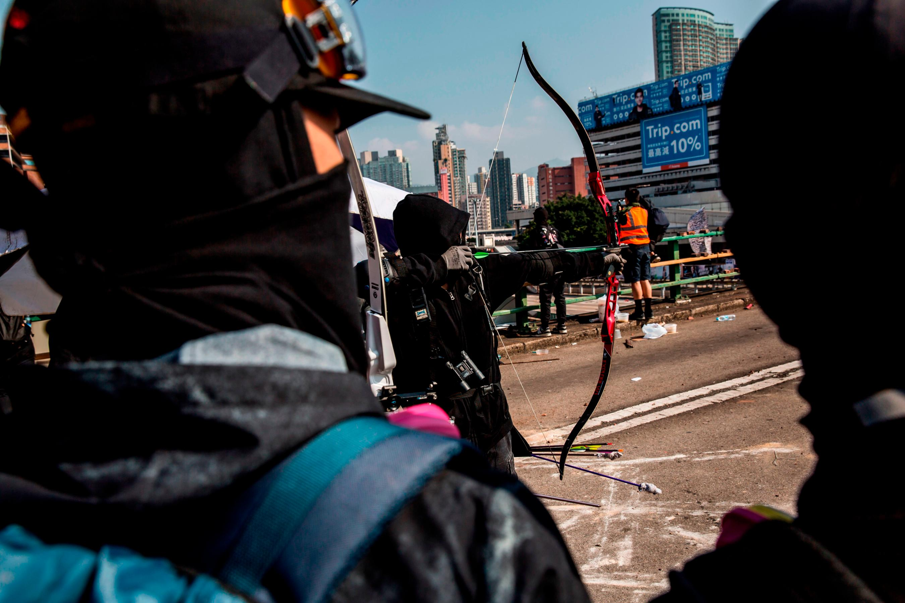
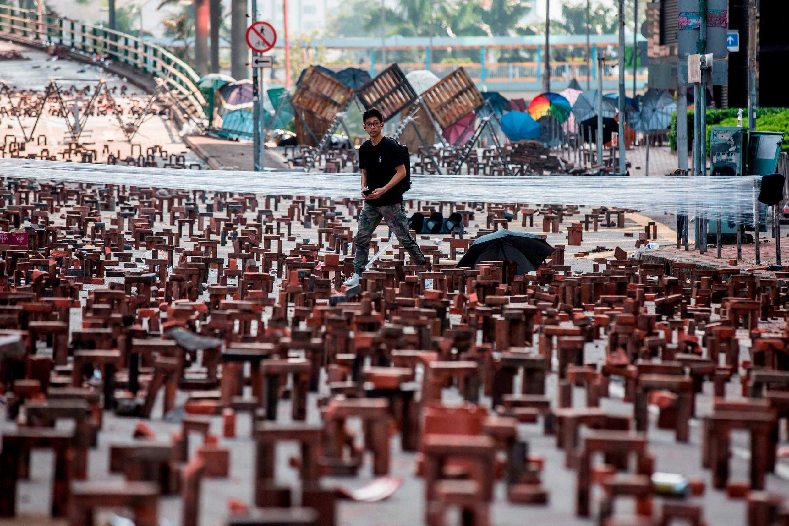
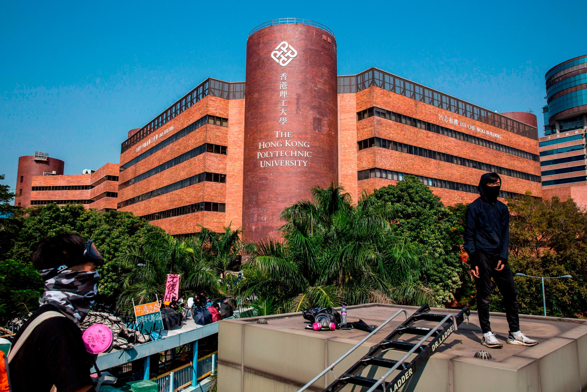
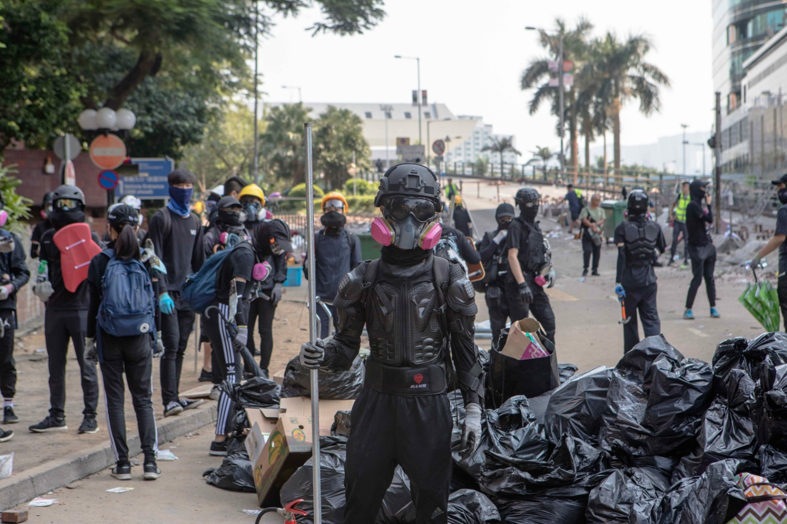
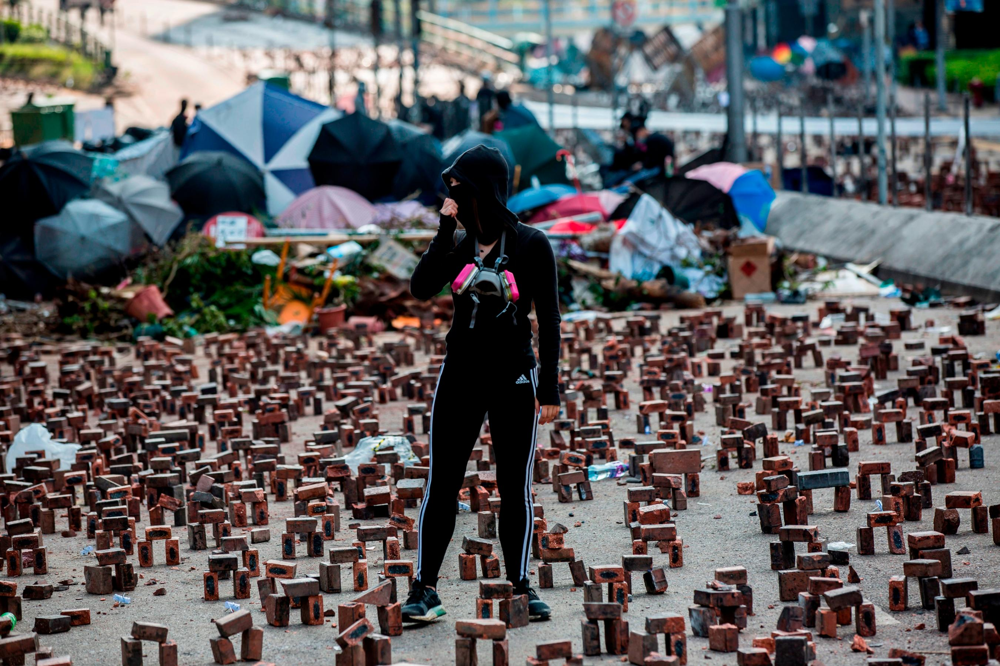
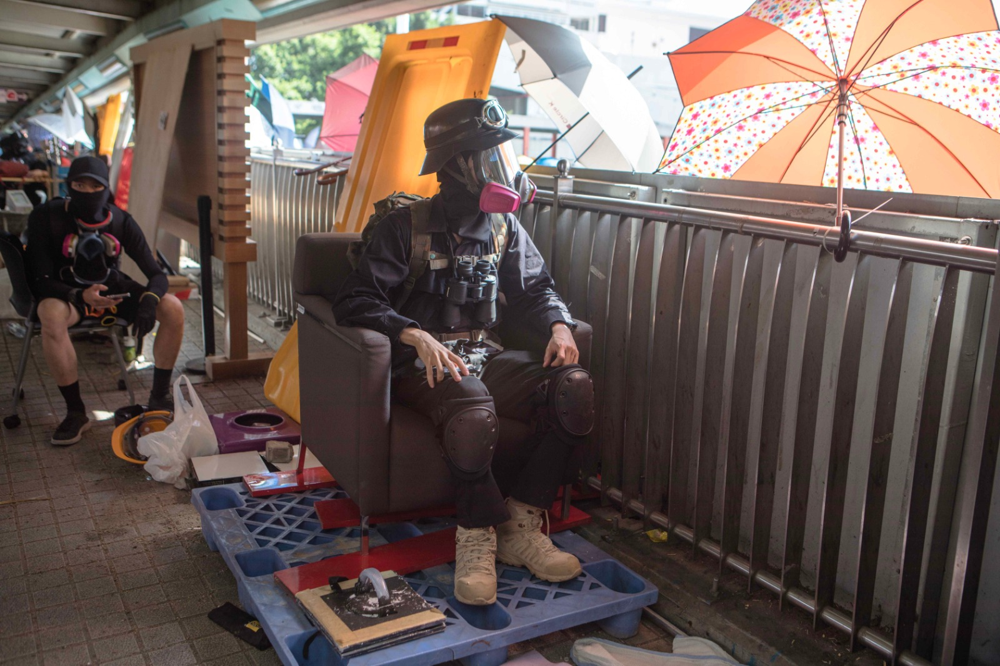
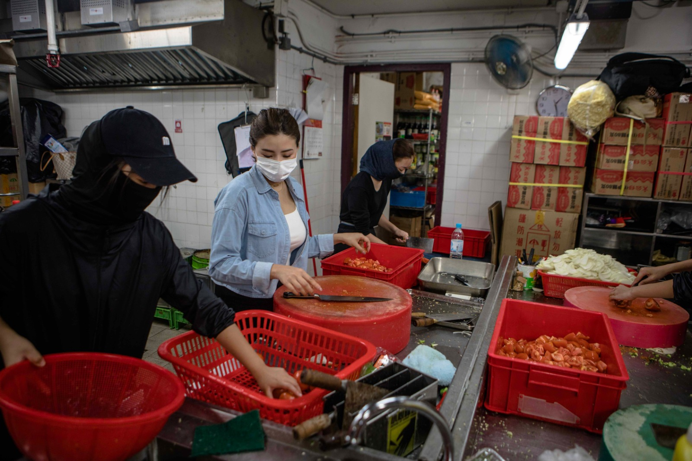

Published: 2019-11-15 13:05:10+00:00; modified: 2019-11-16 02:52:34+00:00

A protester uses a bow and arrow while standing on a barricaded street outside The Hong Kong Polytechnic University in Hong Kong on November 15, 2019. 

A man walks through bricks placed on a barricaded street outside The Hong Kong Polytechnic University in Hong Kong on November 15, 2019. 

A demonstrators sits on a makeshift watchtower while occupying the No. 2 Bridge during a protest at the Chinese University of Hong Kong (CUHK) in Hong Kong on November 15, 2019. 

Protesters stand on an overhead walkway next to a barricaded street outside The Hong Kong Polytechnic University in Hong Kong on November 15, 2019. 

Protesters stand guard at the entrance to Hong Kong Polytechnic University (PolyU) on November 15, 2019. 

A protester (C) stands amongst bricks placed on a barricaded street outside The Hong Kong Polytechnic University in Hong Kong on November 15, 2019. 

A protester watches for police at Hong Kong Polytechnic University (PolyU) on November 15, 2019. 

People prepare food for protesters at Hong Kong Polytechnic University (PolyU) on November 15, 2019. 

Hong Kong (CNN)

Less than 164 feet (50 meters) from a Chinese People's Liberation Army (PLA) base, student protesters are building a fortress.

Black-clad, masked protesters man the walls of Hong Kong Polytechnic University (PolyU) in Kowloon's Hung Hom district, some peering through binoculars and others holding bows and arrows.

The roads leading to the technical college are barricaded with makeshift brick walls clumsily cemented in place. A huge pile of plastic sacks filled with rubbish and doused in petrol lies ready to be set alight if police approach. 

Chunks of bricks piled into mini, Stonehenge-like formations and pieces of rubber hose jammed with nails litter the roads between barricades. The floor is drenched in petrol. 

"We stay here to protect the university in case the police come," said one masked protester at the entrance to the campus.  

After more than five months of political unrest, traffic disruptions and increasing levels of violence, universities across Hong Kong have emerged as the latest battleground. Over the past week, protesters, many of them students themselves, have returned to take control of the campuses and transform them into fortified protest camps with stockpiles of weapons and food. 

On Friday afternoon, the atmosphere outside the PolyU entrance was tense, with alert protesters holding Molotov cocktails. Students here are concerned the police could come and crack down at any time. On Thursday, police fired tear gas near the university after protesters threw debris onto a nearby road, blocking it to traffic. 

Paranoia is high. There are bag checks at the door and even different areas for men and women to be searched. Press are told not to take photos of people's faces -- identification could lead to arrests. No protesters who spoke to CNN were willing to give their full names. 

"We are scared of police spies," said an 18-year-old protester monitoring who comes in and out. "We have already seen police dress like us so we want to check bags and to make sure it's a protester and not police."

Campus under 'siege'

The PolyU occupation comes after some of the most intense fighting in the city since demonstrations began in June.  

At the Chinese University of Hong Kong (CUHK), in the far northeast of the New Territories, hundreds of riot police fired more than 1,567 canisters of tear gas during a chaotic and ultimately suspended clearance operation of a bridge over a main road Tuesday. Protesters responded with a barrage of petrol bombs.

Police say they are only trying to stop protesters from throwing objects onto roads and disrupting traffic. They have labeled occupied universities a "breeding ground for criminals and rioters" and a "weapons factory." 

Many protesters felt the police operation was an unwarranted encroachment and a threat to academic freedom and moved to occupy other prestigious universities, including PolyU. They accused police of laying "siege" to the university.

For a few days, police appeared reticent to return to the universities and kept their distance. On Friday night, protesters suddenly evacuated CUHK, bringing the four-day occupation to an end. 

When CNN visited on Friday night after the protesters' departure, food was still warm, fires were still burning, and the once-bustling campus felt like a ghost town. It wasn't clear whether they were moving to PolyU -- or elsewhere. 

Emotions running high

Unlike CUHK, which is situated in a remote part of Hong Kong and only accessible via a few roads, PolyU is a strategic base. It's located in the key transport hub of Hung Hom and overlooks the Cross-Harbour Tunnel -- one of the busiest and most crucial links between Kowloon and Hong Kong Island. 

For the second straight day on Friday, the tunnel was closed to traffic after protesters burned and vandalized toll booths and dropped debris onto the road. 

"We don't want citizens to go to work so it stops the economy," said the 18-year-old protester. Frustrated that the Hong Kong government won't give in to their five demands, their tactic now is disruption and destruction. 

Hong Kong's Chief Executive Carrie Lam said recently that it was "wishful thinking" to believe escalating violence would make the government yield to protesters' demands. But faced with continued government inaction, the protesters here say they have no other option.

"It's reasonable the government should respond to us," said a 22-year-old protester who goes by the name Edison. "But they just give excuses. We have to do something."

Edison is guarding a bridge that hangs over the main highway leading to the tunnel. Boxes of freshly-made petrol bombs and baskets of stones are placed strategically along the walkway. Eggs and balloons have been filled with flammable liquid or paint to be thrown during a potential showdown with police. 

A few dozen protesters, some who have stayed here for two nights, are lounging or keeping watch over the now-deserted highway. Two protesters wearing heavy protective gear walk past with bows and arrows slung over their shoulders.

What started off as a protest over a now-suspended extradition bill to China has now grown to five demands including an independent police inquiry and greater democracy. But underpinning the whole movement is the feeling that protesters are running out of time to protect the freedoms Hong Kong already has -- freedom of speech, freedom of assembly, an independent judiciary -- before the city becomes fully under the control of the Chinese central government in 2047.  

"Honestly I'm so scared but I have no way to escape," said Edison. "I fear China greater than the Hong Kong police. China does not have democracy and freedom."

In the last week, the protests have escalated to a level not seen before, with a 70-year-old man dying after being hit on the head by a brick and another man in critical condition after being set on fire following a dispute with protesters. A male protester was also left in critical condition after being shot by a police officer Monday. 

"It's upsetting and it makes me angry," said one female protester who was manning the bridge over the road toward the tunnel. "We don't want anybody to get hurt."

Highly organized operation

Some in Hong Kong say the movement has gone too far, that the now daily disruptions to normal life are taking its toll and the violence has gotten out of hand. But for all the government's claims that moderate citizens are abandoning the movement, this does not seem to be taking place -- at numerous lunchtime protests throughout this week, white collar and other workers joined mostly younger frontline protesters in making their dissent heard. 

This support was on show at PolyU as well, where huge amounts of supplies donated by supporters were being ferried into the campus where it is sorted and distributed in a highly-organized operation.

The canteen has been turned into protest headquarters, with long tables laden with helmets, gas masks, medical supplies and food. Like a supermarket, signs hang from the ceiling directing people to different items. There are mountains of instant noodles, piles of wet wipes and tissues and even a box of inhalers for asthma sufferers.

People have split themselves into sub-divisions, with some sorting through the supplies, others replenishing stocks. In the kitchens, volunteers prepare chickens, bread pork chops and cut tomatoes. Others take turns washing the many dishes. Those inside say the food was all donated. 

It's lunchtime and dozens of people have lined up waiting for food at the canteen, which is manned by volunteers, protesters and supporters. One man dressed in a suit has volunteered to help out in the kitchen on his lunch break. A retired school principal is cooking the food. "I know how to cook so they all listen to me," he said.

Protesters have always maintained theirs is a leaderless movement, designed to protect any figurehead from legal action. But the level of coordination at the universities is verging on the professional. 

"We don't have leaders, we make connections and go on forums," one protester said.

Out in the courtyard is a map of the university campus with instructions for how to offer skills and services over Telegram groups. 

"Everyone has access (to the forums)," said one protester. "If we see that we need something we will put it on the group and others respond."

While the more hardcore protesters seem set on digging in, no one knows how long they will occupy this campus -- or the multiple others across the city -- or if police will come to clear them out. 

"We don't have a consensus as to what will happen tomorrow," said one protester. "But for now we understand that we will stay here defending." 

CNN's Isaac Yee and James Griffiths contributed reporting.