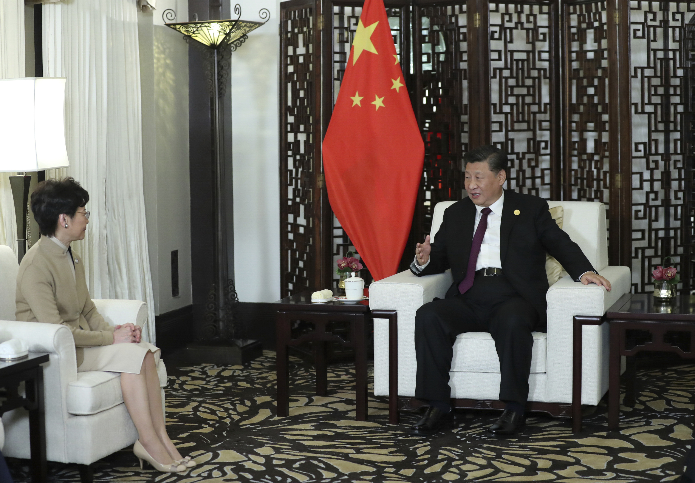
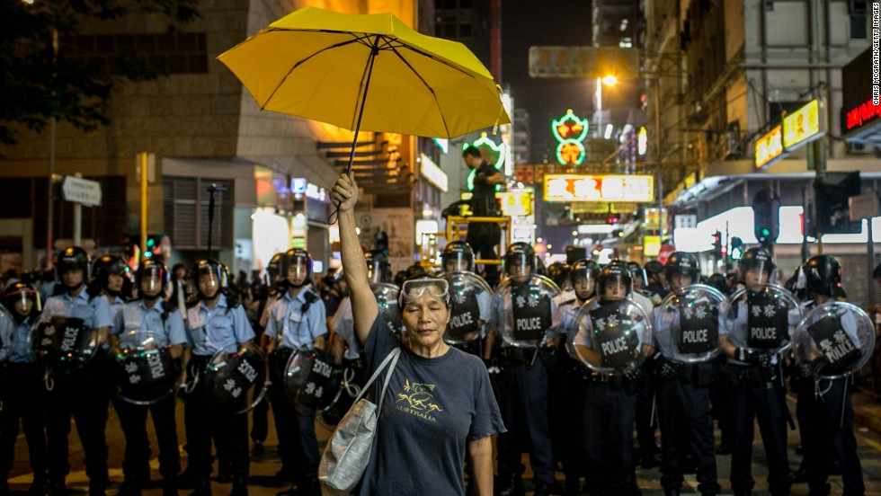
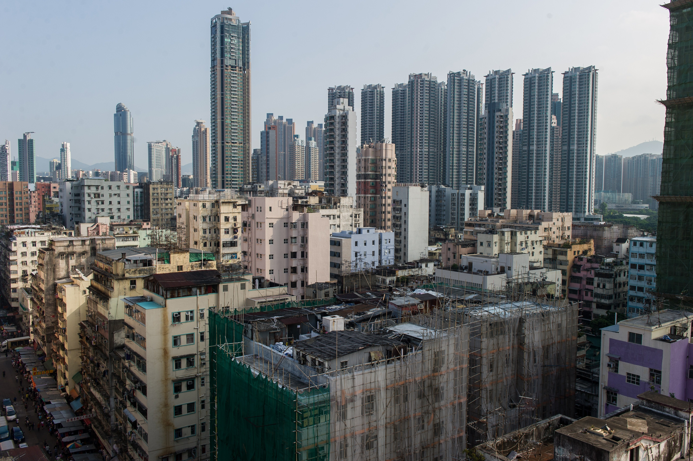
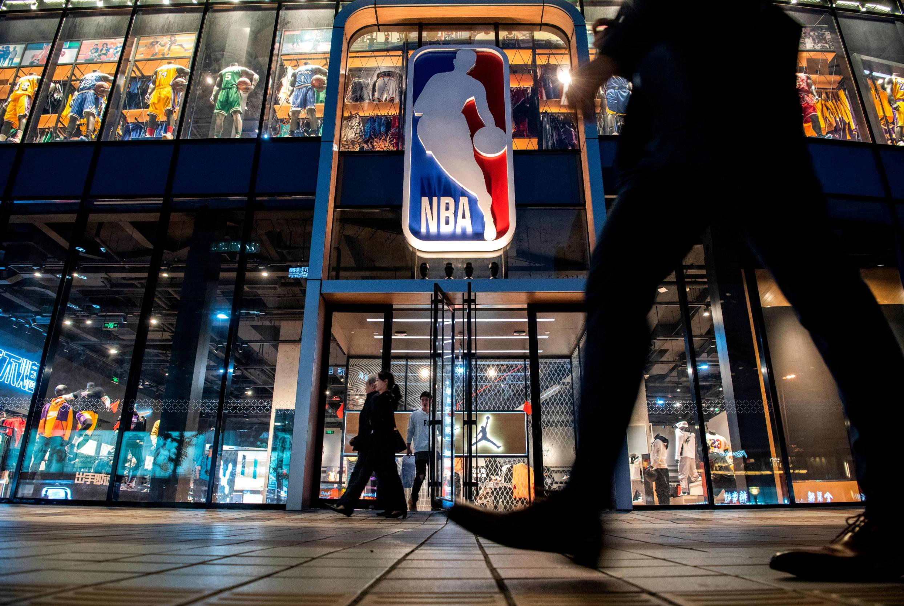

Published: 2019-11-16 01:25:20+00:00; modified: 2019-11-18 13:20:19+00:00

Chinese President Xi Jinping and Hong Kong Chief Executive Carrie Lam in Shanghai on November 4, 2019.

A pro-democracy activist holds a yellow umbrella in front of a police line on November 25, 2014 in Hong Kong. 

Hong Kong falls into recession after a decade

How one tweet snowballed into the NBA's worst nightmare

 (CNN)

Hong Kong has been rocked by pro-democracy, anti-government protests for more than five months now, with escalating violence and anger on all sides. What began as peaceful mass marches has exploded into the city's biggest political crisis in modern times.

It's also become a geopolitical mess with worldwide implications. Companies, brands, politicians and celebrities -- even LeBron James -- have been caught in the crossfire. Nobody is quite sure where the protests are headed, but there's no clear end in sight.

Here's everything you need to know about the Hong Kong protests.

Why are people protesting?

The protests began in June with one main objective -- for the government to withdraw a controversial bill that would have allowed extradition of fugitives to mainland China. Critics worried Beijing could use the bill to prosecute people for political reasons under China's opaque legal system.

Unlike other cities in China, which are tightly governed by the authoritarian central government, Hong Kong is a semi-autonomous city with its own legal and political systems. 

Protesters feared the bill would allow China to encroach on these rare freedoms. As the stand-off with the government stretched on, peaceful mass marches increasingly descended into violent clashes with police -- and the movement quickly grew to include five major demands:

Fully withdraw the extradition bill

Set up an independent inquiry to probe police brutality

Withdraw a characterization of early protests as "riots"

Release those arrested at protests

Implement universal suffrage in Hong Kong

The broader demands reflect a long-standing call for full democracy, which Hong Kong does not have -- its leader is chosen by a tiny election committee dominated by pro-establishment, pro-Beijing voters.

By the time Hong Kong's leader, Carrie Lam agreed to the first demand, withdrawing the bill, it was too late to quell the movement's momentum.

How did this spin out of control?

This began with peaceful marches. Now, two protesters have been shot with live rounds, a man was set on fire, and another man died after being hit with a brick during clashes.

Long-standing allegations of police neglect, as well as several violent incidents have added fuel to the fire and pushed the city further into chaos. 

On July 21, a mob violently attacked protesters in a subway station, injuring at least 45 people. Protesters accuse the police of inaction during the attack, and many saw this as a sign that the police force couldn't be trusted to protect the people.

Protesters have also become more extreme in their vandalism, setting fires in subway stations and smashing shop windows -- drawing criticism of senseless destruction from those who oppose the movement, and even some supporters. 

Rampant misinformation and conspiracy theories online have also added to the polarization and widespread sense of fear. Violent confrontations have taken place during some protests, and people accused of being "infiltrators" have been savagely beaten. 

What has the government said?

Hong Kong Chief Executive Carrie Lam did publicly apologize early on in the summer, saying the unrest was "caused by the deficiencies of the (Hong Kong) government."

But since then, she and other official bodies have taken a harder line. Nearly every week, the police condemn "rioters," and call for law and order. Lam warned that the protests were bringing Hong Kong "to the brink of no return," and that the government would not concede to protesters' demands.

"If there is any wishful thinking that by escalating violence the (Hong Kong) government will yield to pressure to satisfy protesters' so-called demands, I'm making this clear that will not happen," she said.

What is China's role in all this?

Hong Kong's relationship with mainland China is a key element in untangling this mess. Hong Kong was a British territory until it was handed over to Chinese control in 1997 -- but the handover agreement gave the city protected special freedoms of press, speech, and assembly for at least 50 years.

These freedoms stand in stark contrast to China's strict censorship and Chinese President Xi Jinping's tight grip on power, which have seen dissidents jailed and interrogated in secret prisons.

This is what we mean when we say Hong Kong is semi-autonomous. The city is part of China -- but it has its own currency, language, legal system, identity and culture. This model of governance is called "one country, two systems." And this is why protesters here are desperate to protect their freedoms -- because they fear becoming just another Chinese city under Xi's rule.

Now, young protesters say China's encroachment on Hong Kong's autonomy is a violation of the "two systems" agreement. Many want to achieve full democracy before 2047, the pre-handover agreed date when Hong Kong could in theory become fully integrated with China. Some are even calling for full independence from the mainland.

This strong anti-China sentiment is why protesters have targeted Chinese-owned businesses -- for instance, they smashed the ATMs at Bank of China locations. They have also boycotted restaurants that expressed pro-China stances.

What has China said?

Beijing has taken a firm rhetorical stance, saying the protests "showed signs of terrorism." Xi has demanded an end to the violence, saying the "radical" protests had trampled the city's rule of law and that "stopping the violence and restoring order" was Hong Kong's most "urgent task."

He has also praised the city's police force and Lam's leadership "in severely punishing the violent criminals in accordance with the law." These comments appear to dispel rumors that Beijing was looking to replace Lam, instead sending a clear message -- Lam is here to stay.

The central Chinese government hasn't done much in terms of actual action, largely letting Hong Kong leaders deal with the crisis -- but the threat of Chinese military intervention has hung over the movement for months.

The Chinese military has a presence in Hong Kong -- about 6,000 People's Liberation Army soldiers are housed in barracks in the city. In August, the garrison commander warned that violence by protesters "should not be tolerated," raising concerns that Beijing could use the troops to crack down on protests.

However, it is not clear if Beijing has a red line, and what it would take for protesters to cross it before provoking a Chinese military response.

Didn't Hong Kong protest in 2014, too?

Yes, but not like this. During the 2014 Umbrella Revolution, protesters occupied the city's financial center, demanding democratic electoral reform and protesting against increasing Chinese influence -- but the scale and severity are different this time around.

The Umbrella Revolution lasted 79 days, or a little over two and a half months. The ongoing protests have now passed the five month mark. The Umbrella Revolution saw police deploy pepper spray. Now, people are facing lethal force -- a protester shot by police and the man set on fire are both in critical condition at the hospital.

The roots of the current unrest can be traced back to that summer five years ago, both in the radicalizing effect it had on a whole generation of young Hong Kongers and in the government's failure to take action. The protest movement finally collapsed in December 2014, but the underlying frustrations continued simmering -- until they finally exploded this June.

How have the protests impacted Hong Kong?

Five months of violence and vandalism have caused the city's economy to tank, and Hong Kong officially entered a recession in October.

Retail and tourism numbers are plunging, people are losing their jobs, and small businesses have been forced to close. The government has implemented measures to support the impacted businesses, including slashing rents at properties they lease out.

The economic downturn could eventually recover -- but the social divide and protesters' mistrust in the government could take much longer to heal, if possible at all.

How does this affect the rest of the world?

Hong Kong is a global financial hub -- so a hit to its economy affects business worldwide as well. Experts warned early on that if the unrest continues, international companies could look to pull out of Hong Kong and relocate their branches elsewhere.

There has been no substantive indication that Beijing is planning to deploy troops, but as fear of PLA intervention has spread throughout the city, experts have warned that such a crackdown could be disastrous for Hong Kong. The stock market would likely crash, followed by the housing market. A mass exodus could follow, and other countries could see migrants incoming from Hong Kong. Many Hong Kongers hold foreign passports, a legacy of 1997, and it is easy for them to move overseas. 

On a more abstract level, some people have framed the unrest as a tug-of-war between Chinese authoritarianism and the Western ideals of freedom and democracy. This narrative oversimplifies some of the nuances at play -- but it's also perhaps why the movement has gained traction in the US, where bipartisan lawmakers approved a bill supporting the protesters.

Why are people talking about the NBA? South Park? Versace?

Many brands and companies have gotten caught in the middle. Those who sympathize with the protesters face Chinese fury and financial backlash; those who try to placate China draw accusations of cowardice from protest supporters, both in Hong Kong and internationally.

For example, an NBA team general manager tweeted in support of the protests. The NBA apologized, drawing intense domestic criticism for appearing to bow to Chinese pressure -- then it reaffirmed its support for freedom of expression, incensing China and losing valuable Chinese partnerships. Basketball stars like LeBron James and Shaquille O'Neal have also spoken out about the issue.

Meanwhile, television show "South Park" satirized Hollywood's sensitivity to Chinese government censors -- then, the show creators explicitly called out the NBA in a mock "apology" afterward.

Brands like Vans, Nike, Versace, Coach, and Givenchy have also come under fire for offending either China or the protesters.

What's next?

The reality is, it's unclear. The protests look to be growing smaller -- at least, compared to the mass marches in June that drew hundreds of thousands of people -- but they're also getting uglier. The lack of a major mass march is also partly due to government restrictions on transport and police refusing approval for such an event, so it's difficult to judge how much, if at all, this is due to shrinking support. 

The police has arrested over 4,000 people since June 9, when the protests began. The youngest arrested so far is 11 years old.

With both the protesters and the government unwilling to give ground, it's uncertain how or when the conflict can end. For now, residents are bracing for further economic loss, and some have already decided to leave.